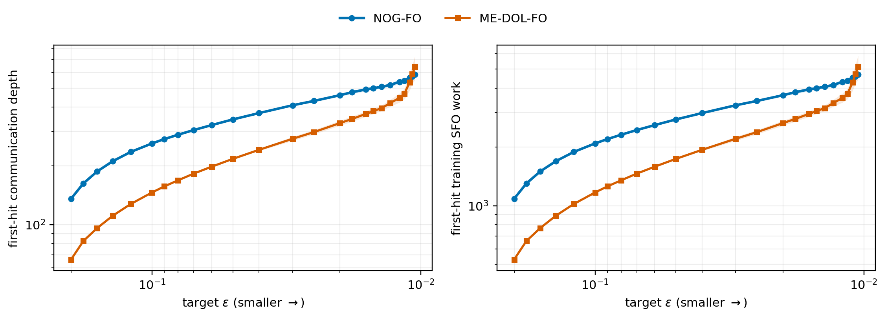
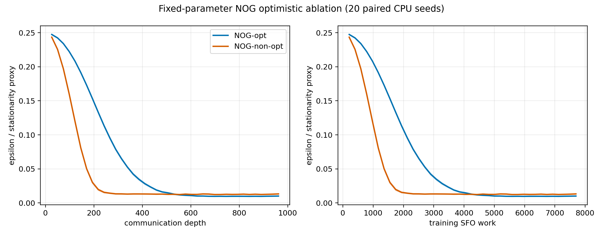
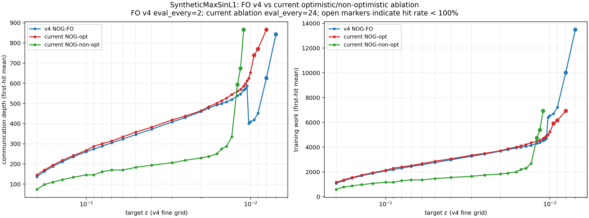
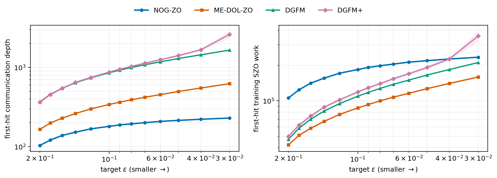
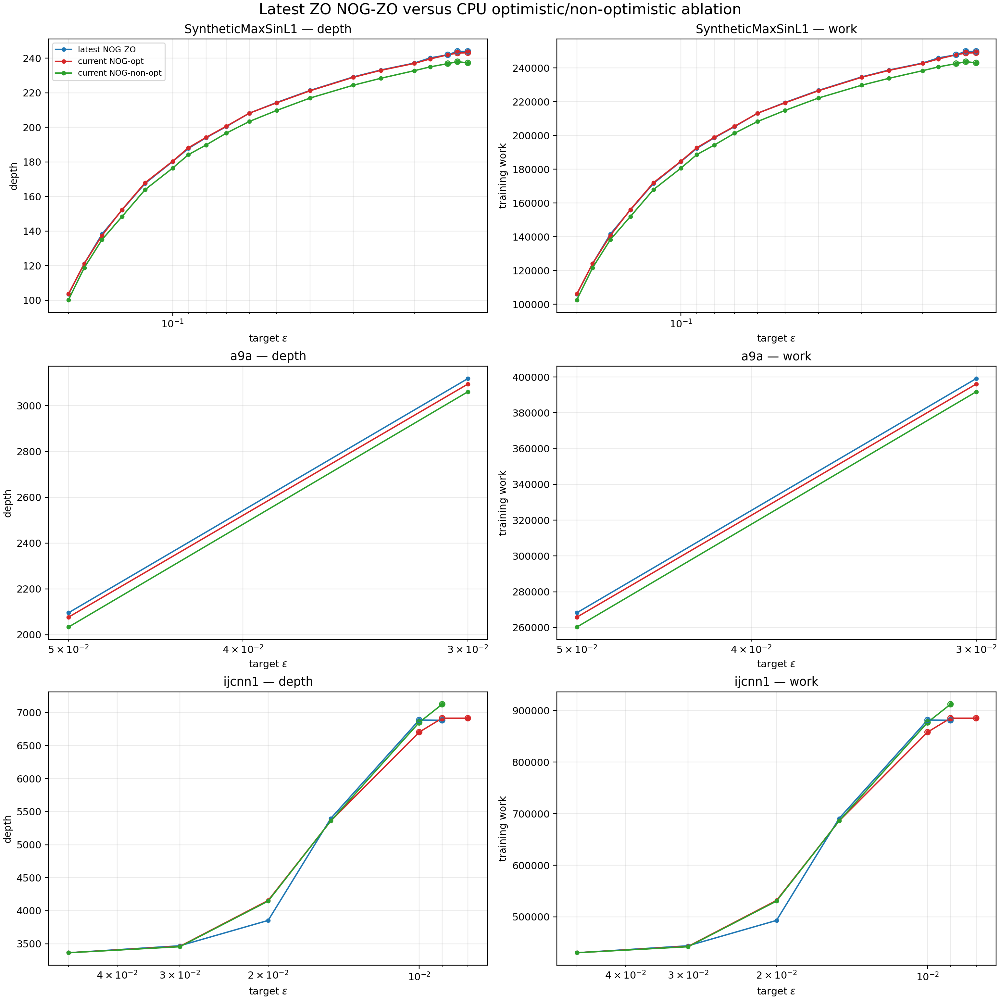
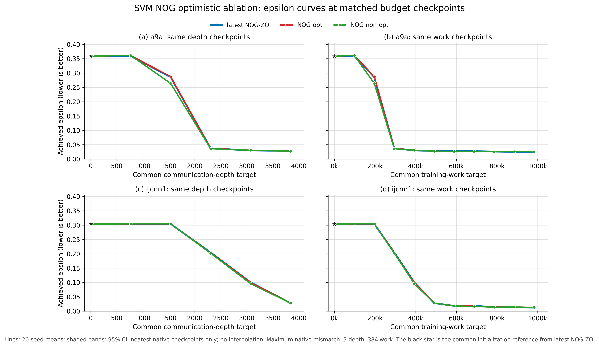

# NOG 实验汇报：FO、ZO 与 optimistic / non-optimistic 消融

更新时间：2026-08-25

包含：

1. SyntheticMaxSinL1 上最新的 FO v4 主实验；
2. SyntheticMaxSinL1 上 FO 的 NOG-opt / NOG-non-opt 配对消融；
3. SyntheticMaxSinL1 和 SVM 上最新的 ZO 主实验；
4. SyntheticMaxSinL1、a9a、ijcnn1 上 ZO 的 NOG-opt / NOG-non-opt 配对消融。

所有曲线都是均值曲线，不删除不利 seed。除特别说明外，epsilon 命中要求连续两个 evaluation checkpoint 达标。

## 一、先给结论

- `NOG-opt` 使用论文理论中的标准 optimistic NOG 更新；`NOG-non-opt` 只用于消融，删除历史梯度修正项。
- 在 SyntheticMaxSinL1 的 FO 消融中，NOG-non-opt 在中等 epsilon（0.2 到 0.015）反而下降更快；NOG-opt 只有在最严格的 epsilon=0.01 仍能命中，而 non-opt 在固定预算内无法命中。
- 在 SyntheticMaxSinL1 的 ZO 消融中，NOG-non-opt 在 epsilon=0.05、0.03、0.02、0.015 都略早于 NOG-opt；两者都不能稳定达到 epsilon=0.01。
- 在 SVM 的 ZO 消融中，a9a 的 non-opt 略好，ijcnn1 三条曲线大部分重合，没有稳定的 optimistic 优势。
- 因此，当前实验不支持“optimistic 修正是 NOG 实际优势来源”的经验结论；但这不否定 NOG 理论公式或理论复杂度结果。它说明 optimistic 修正的有限预算收益依赖目标函数、噪声和参数。
- 当前最清晰的整体结论是：NOG 在 `SyntheticMaxSinL1` 上表现出通信深度优势；在 SVM 上存在平台期，same-depth 下不占优，same-work 下只在 ijcnn1 的最新正式结果中领先。

## 二、两个 NOG 版本的定义

标准 optimistic NOG（本报告记为 `NOG-opt`）使用：

$$
\Delta_t=\Pi\left(\Delta_{t-1}-2\eta g_{t-1}+\eta g_{t-2}\right).
$$

其中 $g_{t-1}$ 和 $g_{t-2}$ 是最近两次 oracle 梯度估计，$\Pi$ 是投影操作。该实现对应论文理论部分的 NOG 算法。

non-optimistic 消融使用：

$$
\Delta_t=\Pi\left(\Delta_{t-1}-\eta g_{t-1}\right).
$$

它只删除 optimistic correction，不改变 oracle、初始化、batch、$M$、$\eta$、evaluation bank、work 或 communication-depth 账本。

两种版本都使用两次初始化 oracle；第一次更新时两种公式基本一致，差异从后续梯度历史开始出现。

## 三、实验总览

| 实验 | 函数/数据 | 方法 | pilot seeds | formal seeds | 主要参数 | 运行环境 |
|---|---|---|---|---|---|---|
| FO v4 主实验 | SyntheticMaxSinL1 | NOG-FO、ME-DOL-FO | 100–104 | 0–19 | NOG-opt：M=2，eta=1.0；batch schedule=8，最严格 epsilon 区域切换到16 | CPU |
| FO 消融 | SyntheticMaxSinL1 | NOG-opt、NOG-non-opt | 600–604 | 620–639 | M=2，eta=1.0，smooth_B=1，data_B_total=8 | CPU |
| ZO 主实验（Synthetic） | SyntheticMaxSinL1 | NOG-ZO、ME-DOL-ZO、DGFM、DGFM+ | 100–104 | 0–19 | NOG：M=2，eta=0.01，smooth_B=8，data_B_total=64 | 历史主结果环境记录为 CUDA |
| ZO 主实验（SVM） | a9a、ijcnn1 | NOG-ZO、ME-DOL-ZO、DGFM、DGFM+ | search 400–404；validation 500–504 | 0–19 | a9a：M=1，eta=9e-5；ijcnn1：M=1，eta=1e-4；data_B_total=64 | CPU |
| ZO 消融 | SyntheticMaxSinL1、a9a、ijcnn1 | NOG-opt、NOG-non-opt | 700–704 | 720–739 | Synthetic：M=2，eta=0.01；a9a：M=1，eta=9e-5；ijcnn1：M=1，eta=1e-4 | CPU |

主实验和消融的 formal seeds 完全分离。所有正式预算为 `983,040` training work；evaluation work 单独记录，不计入 training work。

## 四、FO v4 主实验

目标函数是 SyntheticMaxSinL1：

$$
F(x;\xi)=\max_r\sin(a_{\xi,r}^{\top}x+b_{\xi,r})+\lambda\lVert x\rVert_1.
$$

设置为 $d=100$、$n=4096$、$R=1$、$\lambda=10^{-3}$，8 个 logical workers。正式实验使用 20 个 formal seeds，参数在 formal 前由 pilot 冻结。

主图使用 20-seed 均值曲线和 95% 置信区间。最新 FO 图中，NOG-FO 在较小 epsilon 区域的 communication-depth 曲线趋势优于 ME-DOL-FO；在最严格展示阈值 epsilon=0.0105 时：

| 方法 | 平均首次命中 depth | 平均 training work |
|---|---:|---:|
| NOG-FO | 587.2 | 4,697.6 |
| ME-DOL-FO | 642.9 | 5,143.2 |

图源：`results/paper_experiments_20260824/figures/fo_first_hit_depth_work.png`。

### FO v4 主图和 FO 消融的关系

FO v4 主实验的 NOG 参数是 `M=2, eta=1.0`；pilot 选择的 data batch 在大部分 epsilon 区域为8，在最严格的 epsilon 区域切换到16。FO 消融为了让 opt/non-opt 严格逐点可比，固定使用 `data_B_total=8`，不再使用低 epsilon 的 batch 切换。

因此，FO 消融主要回答“optimistic correction 是否带来优势”，不能与 FO v4 主图简单理解为完全相同的 batch schedule。

## 五、FO optimistic / non-optimistic 消融

这组实验固定 SyntheticMaxSinL1、8 workers、960 rounds、evaluation every 24，并让 opt/non-opt 共享 problem seed、partition seed、oracle 随机流、初始化 oracle 和 work/depth 账本。

正式任务共 40 个，NOG-opt 和 NOG-non-opt 各 20 个，全部成功；paired 审计通过，非有限 epsilon 行数为0。

| epsilon | NOG-opt 命中 | NOG-opt 平均 depth | NOG-non-opt 命中 | NOG-non-opt 平均 depth |
|---:|---:|---:|---:|---:|
| 0.20 | 20/20 | 146.0 | 20/20 | **74.0** |
| 0.10 | 20/20 | 267.2 | 20/20 | **146.0** |
| 0.05 | 20/20 | 358.4 | 20/20 | **183.2** |
| 0.03 | 20/20 | 418.4 | 20/20 | **206.0** |
| 0.02 | 20/20 | 464.0 | 20/20 | **230.0** |
| 0.015 | 20/20 | 513.2 | 20/20 | **273.2** |
| 0.01 | 20/20 | **653.6** | 0/20 | censored at 962.0 |

图源：`results/nog_optimism_ablation_20260825/analysis/trajectory_depth_work.png`。

下面这张图把 FO v4 的最新 NOG-FO 与本次固定参数的 NOG-opt / NOG-non-opt 直接放在同一张图中。它适合汇报“当前消融相对于历史 v4 标准 NOG 的位置”，但需要注意：FO v4 的 evaluation interval 为2，而当前消融为24；空心点表示命中率低于100%，因此它不是严格相同 checkpoint 密度下的公平主比较图。

图源：`v4_vs_optimism_ablation_comparison/v4_vs_current_epsilon_depth_work.png`。

解释：non-opt 在中等精度区间下降更快，但在 epsilon=0.01 的固定预算内完全没有形成连续两次命中；opt 虽然前期较慢，却能够继续下降到更严格阈值。这说明 optimistic 修正可能改善后期精度，但并没有在整条有限预算轨迹上普遍占优。

## 六、ZO 主实验

### 6.1 SyntheticMaxSinL1

最新标准 NOG-ZO 使用 `M=2, eta=0.01, smooth_B=8, data_B_total=64`，8 workers，formal seeds 0–19。对应的 NOG-ZO 与 ME-DOL-ZO、DGFM、DGFM+ 主图如下：

图源：`results/paper_experiments_20260824/figures/zo_first_hit_depth_work.png`。

在 epsilon=0.05 / 0.03 / 0.02，最新 NOG-ZO 的平均首次命中 depth 分别为 214.4 / 229.2 / 237.2；对应 training work 为 219,545.6 / 234,700.8 / 242,892.8。该主实验是当前 NOG 在通信深度上最有利的实验场景。

### 6.2 SVM

目标为 capped-$\ell_1$ hinge-loss SVM。a9a 维度为123，ijcnn1 维度为22；8 workers，CPU-only，evaluation 使用共同 fixed bank，formal work 上限为983,040。

最新 batch-retuned NOG-ZO 参数：

| 数据集 | M | eta | smooth_B | data_B_total |
|---|---:|---:|---:|---:|
| a9a | 1 | 9e-5 | 1 | 64 |
| ijcnn1 | 1 | 1e-4 | 1 | 64 |

最新正式结果（epsilon 均值，same training work=983,040）：

| 数据集 | NOG-ZO | ME-DOL-ZO | DGFM | DGFM+ |
|---|---:|---:|---:|---:|
| a9a | 0.02517 | 0.01923 | **0.01588** | 0.02617 |
| ijcnn1 | **0.01233** | 0.01479 | 0.01496 | 0.02071 |

same communication depth 约3840时，NOG-ZO 在 a9a 和 ijcnn1 都不领先；same work 时，a9a 由 DGFM 最好，ijcnn1 由 NOG-ZO 最好。

## 七、ZO optimistic / non-optimistic 消融

这次消融共 120 个正式 CPU 任务：3 个数据集 × 2 个方法 × 20 个 seeds，全部成功。paired `problem_seed`、`partition_seed`、`method_seed`、iteration、depth 和 training work 全部一致。

### 7.1 SyntheticMaxSinL1

| epsilon | latest NOG-ZO depth | NOG-opt depth | NOG-non-opt depth |
|---:|---:|---:|---:|
| 0.05 | 214.4 | 214.2 | **209.8** |
| 0.03 | 229.2 | 229.0 | **224.4** |
| 0.02 | 237.2 | 237.0 | **232.8** |
| 0.015 | 244.0 (55%) | 243.0 (60%) | **238.0 (70%)** |
| 0.01 | 0% | 0% | 0% |

### 7.2 SVM

| 数据集 | epsilon | latest NOG-ZO depth | NOG-opt depth | NOG-non-opt depth |
|---|---:|---:|---:|---:|
| a9a | 0.05 | 2,095.8 | 2,076.6 | **2,033.4** |
| a9a | 0.03 | 3,118.2 | 3,094.2 | **3,060.6** |
| a9a | 0.02 | 0% | 0% | 0% |
| ijcnn1 | 0.05 | 3,363.0 | 3,363.0 | 3,363.0 |
| ijcnn1 | 0.03 | 3,468.6 | 3,459.0 | **3,454.2** |
| ijcnn1 | 0.02 | **3,852.6** | 4,155.0 | 4,145.4 |
| ijcnn1 | 0.015 | 5,398.2 | 5,359.8 | 5,359.8 |
| ijcnn1 | 0.01 | 35% | 25% | 30% |

图源分别为：

- `zo_optimism_ablation_20260825/zo_ablation_vs_latest_all_datasets.png`；
- `zo_optimism_ablation_20260825/svm_nog_opt_nonopt_equal_budget_epsilon.png`。

### 7.3 ZO 消融结论

- SyntheticMaxSinL1：non-opt 在中等 epsilon 下略快，opt 与 latest NOG-ZO 基本重合。
- a9a：non-opt 略早达到 epsilon=0.05 和0.03，但三种 NOG 都无法在预算内达到 epsilon≤0.02。
- ijcnn1：epsilon=0.02 时 latest NOG-ZO 最好；epsilon=0.01 时 opt 的条件命中 depth 较低，但命中率只有25%，不能据此声称稳定优势。
- 所以在 ZO 真实 SVM 上，optimistic correction 没有显示出稳定收益；SVM 的前期平台期也没有被 optimistic 更新消除。

## 八、完整结果位置

本报告引用的实验目录：

- FO 主实验：`results/paper_experiments_20260824/`；
- FO 消融：`results/nog_optimism_ablation_20260825/`；
- ZO 主实验（Synthetic）：`outputs/distributed_zo/zo_theory_validation/` 和 `results/paper_experiments_20260824/`；
- SVM 主实验：`results/advisor_cpu_batch_retuned_svm/`；
- ZO 消融：`zo_optimism_ablation_20260825/`。

ZO 消融目录中还包含 `protocol.json`、`completion_formal.json`、原始 formal CSV、`threshold_first_hit.csv`、`analysis_audit.json`、复现命令和 SHA256 manifest，可用于逐项核对。
