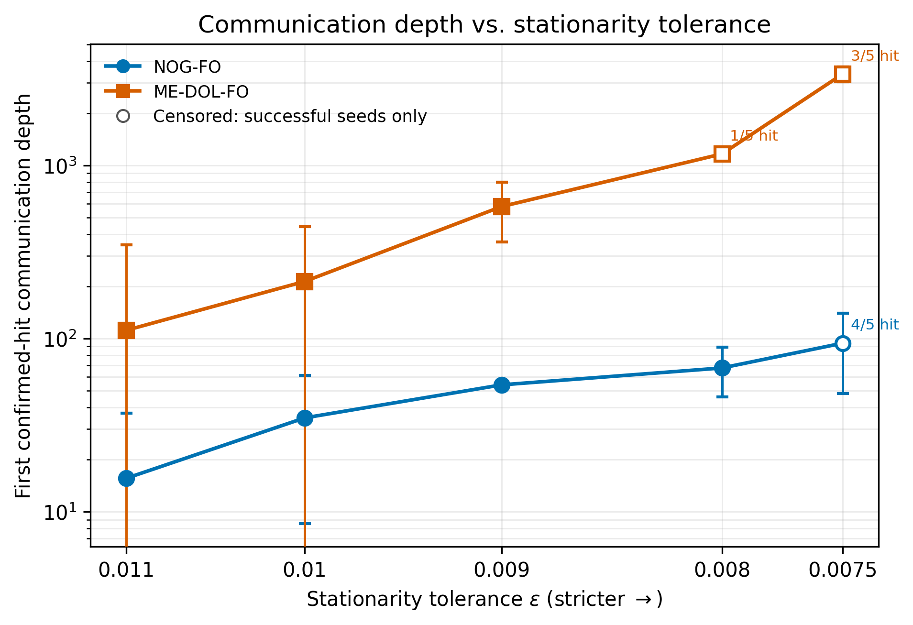
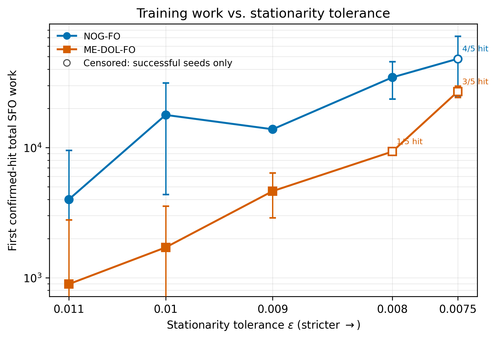
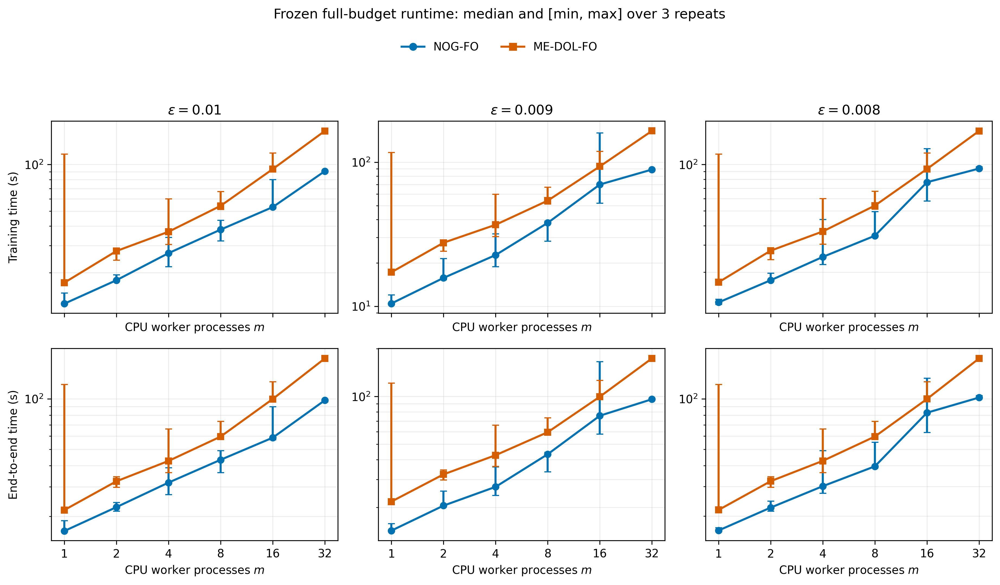
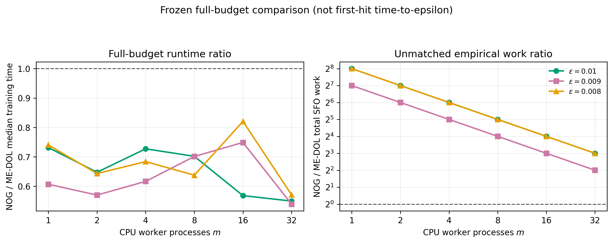

# NOG First-Order Distributed Experiment

> 本文档是面向当前项目参与者的内部实验说明，重点记录已经完成的
> **NOG-FO vs ME-DOL-FO** 实验。文档中的 “distributed” 表示使用真实、独立的
> CPU worker processes 和 PyTorch Gloo collectives；它不是单进程 sequential
> simulation，也不是 multi-node/GPU benchmark。

当前状态：**Step 1–8 已完成**。Formal accuracy、runtime scaling、审计、绘图和最终
结果包均已生成；完整测试为 **39/39 passed**。

## 目录

- [1. 实验解决什么问题](#1-实验解决什么问题)
- [2. 最重要的结论](#2-最重要的结论)
- [3. 仓库结构](#3-仓库结构)
- [4. 代码与算法逻辑](#4-代码与算法逻辑)
- [5. 实验设置](#5-实验设置)
- [6. 环境与运行方式](#6-环境与运行方式)
- [7. 输出文件说明](#7-输出文件说明)
- [8. Formal accuracy 结果](#8-formal-accuracy-结果)
- [9. Runtime/scaling 结果](#9-runtimescaling-结果)
- [10. 如何解释这些结果](#10-如何解释这些结果)
- [11. 审计、恢复与可靠性](#11-审计恢复与可靠性)
- [12. 尚未完成的实验](#12-尚未完成的实验)

---

## 1. 实验解决什么问题

论文研究 nonsmooth nonconvex stochastic optimization。当前 FO 实验比较：

- **NOG-FO**：论文提出的 NOG，使用 stochastic first-order oracle（SFO）；
- **ME-DOL-FO**：已有工作的 first-order baseline。

目标是考察：为了到达相同的 empirical $(2\delta,\epsilon)$-stationarity
threshold，NOG 是否需要更小的 communication depth，同时报告实际 training SFO
work、hit rate 和 runtime，避免只展示对 NOG 有利的通信指标。

论文 Section 5 中采用的理论口径是：

| Method | Oracle | Communication | Work |
|---|---|---:|---:|
| ME-DOL | SFO | $O(\delta^{-1}\epsilon^{-3})$ | $O(\delta^{-1}\epsilon^{-3})$ |
| NOG | SFO | $O(d^{1/3}\delta^{-1}\epsilon^{-5/3})$ | $O(\delta^{-1}\epsilon^{-3})$ |

理论预测 NOG 改善 communication dependence，而两者具有相同的 asymptotic work
order。当前实验固定 $d=100$ 和 $\delta=0.1$，epsilon 范围也较窄，因此只能验证
**qualitative communication-depth advantage**，不能拟合或宣称验证
$\epsilon^{-5/3}$、$\epsilon^{-3}$、$d^{1/3}$ 或 $\delta^{-1}$ 的
asymptotic exponent。

### 整体实验流程

~~~text
Correctness: real CPU processes == deterministic simulator
                         |
                         v
Pilot seeds 100–102 -> grid/refinement -> freeze config per epsilon
                                              |
                      +-----------------------+----------------------+
                      |                                              |
                      v                                              v
Formal accuracy, seeds 0–4, m=8                    Runtime benchmark, seed 0
30 tasks -> audit -> thresholds -> figures         96 tasks -> audit -> scaling
                      |                                              |
                      +-----------------------+----------------------+
                                              v
                            joint Step 7 + Step 8 final report
~~~

Pilot seeds 与 formal seeds 严格隔离。正式 seeds 不参与 hyperparameter selection。

---

## 2. 最重要的结论

1. 在 NOG-FO 和 ME-DOL-FO 都达到 **5/5 confirmed hits** 的
   $\epsilon=0.011,0.010,0.009$ 上，NOG 的 mean communication depth 分别少
   **7.15x、6.14x、10.71x**。
2. 同三个 threshold 上，NOG 的 finite training SFO work 分别是 ME-DOL 的
   **4.47x、10.43x、2.99x**。因此实验支持 communication advantage，但不支持
   finite-work advantage。
3. $\epsilon=0.008$ 时 NOG 为 5/5 hit、ME-DOL 为 1/5；$\epsilon=0.0075$
   时 NOG 为 4/5、ME-DOL 为 3/5。这些结果 right-censored，不能使用 hit-only
   ratio 作无条件比较。
4. 在真实 CPU-process repeated runtime benchmark 中，所有设置都是 $m=1$
   最快。当前 single-host CPU/Gloo 环境**没有 positive strong scaling**。
5. NOG 完成自己的 frozen full budget 所需 median training time 是 ME-DOL 的
   **0.539–0.821x**，但两种 workload 没有 empirical-work matching，所以这不是
   work-matched time-to-epsilon speedup。

最稳妥的论文表述是：

> NOG-FO's empirical communication-depth advantage is consistent with the
> improved communication dependence predicted by the theory.

不应写成 “the experiments verify the $\epsilon^{-5/3}$ rate”、“same work in
practice” 或 “NOG scales linearly with the number of workers”。

---

## 3. 仓库结构

### 3.1 当前 FO 实验核心代码

| 文件 | 作用 |
|---|---|
| [src/synthetic/run_synthetic.py](src/synthetic/run_synthetic.py) | 定义 SyntheticMaxSinL1、ball sampling 和 projection |
| [src/distributed/common.py](src/distributed/common.py) | problem/seed/data shard、SFO estimator、统一 evaluation 和 work accounting |
| [src/distributed/cpu_process.py](src/distributed/cpu_process.py) | 创建真实 OS processes、初始化 Gloo、all-reduce、rank timing 和失败清理 |
| [src/distributed/cpu_fo_algorithms.py](src/distributed/cpu_fo_algorithms.py) | NOG-FO 与 ME-DOL-FO 的 rank-local 实现 |
| [src/distributed/cpu_fo_tasks.py](src/distributed/cpu_fo_tasks.py) | atomic partial、SHA256 identity、resume/recovery、failure evidence |
| [src/distributed/cpu_fo_correctness.py](src/distributed/cpu_fo_correctness.py) | 对比真实 process runner 与 deterministic simulator |
| [src/distributed/cpu_fo_pilot.py](src/distributed/cpu_fo_pilot.py) | pilot grid、budget extension、Pareto selection、NOG batch refinement 和 config freeze |
| [src/distributed/cpu_fo_formal.py](src/distributed/cpu_fo_formal.py) | formal manifest 和 5-seed accuracy tasks |
| [src/distributed/cpu_fo_formal_analysis.py](src/distributed/cpu_fo_formal_analysis.py) | formal artifact/work/depth 审计和 confirmed-hit summary |
| [src/distributed/cpu_fo_formal_figures.py](src/distributed/cpu_fo_formal_figures.py) | Step 7 accuracy/depth/work figures |
| [src/distributed/cpu_fo_formal_report.py](src/distributed/cpu_fo_formal_report.py) | Step 7 paper/advisor result package |
| [src/distributed/cpu_fo_runtime.py](src/distributed/cpu_fo_runtime.py) | runtime protocol、task order、warm-up/repeats、resume 和 timing records |
| [src/distributed/cpu_fo_runtime_analysis.py](src/distributed/cpu_fo_runtime_analysis.py) | runtime artifact audit、repeat expansion、speedup/efficiency summary |
| [src/distributed/cpu_fo_runtime_figures.py](src/distributed/cpu_fo_runtime_figures.py) | Step 8 runtime/scaling figures |
| [src/distributed/cpu_fo_runtime_report.py](src/distributed/cpu_fo_runtime_report.py) | Step 7 + Step 8 联合最终结果包 |
| [tests/](tests/) | process equivalence、accounting、manifest tampering、resume、figures 和 report tests |

### 3.2 配置文件

| 配置 | 用途 |
|---|---|
| [configs/distributed_cpu_fo_correctness.yaml](configs/distributed_cpu_fo_correctness.yaml) | 小规模 process/simulator correctness matrix |
| [configs/distributed_cpu_fo_pilot.yaml](configs/distributed_cpu_fo_pilot.yaml) | 正式 problem、pilot grids、seeds、budgets 与 evaluation protocol |
| [configs/distributed_cpu_fo_profile.yaml](configs/distributed_cpu_fo_profile.yaml) | runtime planning 前的短 profile |
| [configs/distributed_cpu_fo_runtime.yaml](configs/distributed_cpu_fo_runtime.yaml) | frozen runtime workers、repeats、warm-up 和 task-order protocol |

### 3.3 旧 simulation 代码

src/distributed/algorithms.py、run_distributed_baselines.py、run_pilot.py、
summarize_results.py 以及 configs/distributed_baselines_d100.yaml 等文件包含较早的
sequential/logical simulation，包括 NOG-ZO、ME-DOL-ZO、DGFM 和 DGFM+ 的探索
代码与结果。

这些代码**没有进入当前真实 CPU-process formal pipeline**，因此本 README 的正式
结论不包含 SZO、DGFM 或 DGFM+。它们只能作为历史 prototype，不能和当前 FO
results 混合引用。

---

## 4. 代码与算法逻辑

### 4.1 Synthetic problem

每个 sample 的 objective 为

$$
F(x;\xi)=\max_{r\in[R]}\sin(a_{\xi,r}^{\top}x+b_{\xi,r})
          +\lambda\lVert x\rVert_1.
$$

$\max$ 与 $\ell_1$ 带来 nonsmoothness，$\sin$ 带来 nonconvexity。Formal
experiment 使用 $d=100,n=4096,R=4,\lambda=0.001$。

### 4.2 First-order randomized-smoothed oracle

对每个 smoothing sample $u\sim\mathrm{Unif}(\mathbb B)$，代码在
$x+\delta u$ 上对随机 data mini-batch 求 gradient，然后对 smooth_B 个
smoothing samples 取平均。当前 $\delta=0.1$。

NOG 的 distributed mean oracle 流程是：

1. 每个 rank 只从自己的 deterministic data shard 采样；
2. 每个 rank 计算 local smoothed SFO estimator；
3. Gloo all-reduce(SUM) 后除以 worker count，得到 complete-graph exact mean；
4. 一次 mean oracle 计一次 communication round，并按实际 samples 累加 SFO work。

### 4.3 NOG-FO

实现位于函数 _run_nog_fo_rank。初始化 $x_0=0$，先计算两个 mean oracles。每次
iteration 使用 optimistic projected update：

$$
\Delta_t=\Pi_{\delta/M}
  \left(\Delta_{t-1}-2\eta g_{t-1}+\eta g_{t-2}\right),
\qquad
y_t=x_{t-1}+s_t\Delta_t,\quad s_t\sim U[0,1].
$$

随后令 $x_t=x_{t-1}+\Delta_t$，在 $y_t$ 计算新的 distributed mean oracle。
每 $M$ 次 iteration 构成一个 block，evaluation point 是 block 内 $y_t$
的平均 $\bar y$。

因为开始时额外计算两个 mean oracles，checkpoint 的 NOG communication depth 为
iteration + 2。在 fixed-total-batch 设置下，NOG total training work 不随
worker count 改变，per-worker work 近似按 $1/m$ 分配。

### 4.4 ME-DOL-FO

实现位于函数 _run_me_dol_fo_rank。每个 epoch 重置 local online-learning state，
每个 inner iteration：

1. 在 $\ell_2$ ball 内做 projected online gradient action；
2. 构造 local $x$ 和随机 interpolation point $w$；
3. 对 action 与 $x$ 做 exact-mean all-reduce；
4. 每个 rank 在自己的 $w$ 上计算一个 local SFO sample；
5. epoch evaluation point 是所有 ranks 的 epoch-average $w$。

代码中的

$$
D=\frac{c\delta}{4T\sqrt m},\qquad \eta_{\mathrm{online}}=D/\sqrt T,
$$

其中 $T=\mathrm{epoch\_length}$，$c=\mathrm{theory\_multiplier}$。
ME-DOL 每个 rank 每次 iteration 使用一个 SFO call，所以 total work 随 $m$
线性增加；它不是 fixed-total-work strong-scaling workload。

### 4.5 Seed、partition 与 paired comparison

对 formal seed $s$：

- problem_seed = 100000 + s；
- partition_seed = 200000 + s；
- problem 和 data partition 在 methods 之间共享；
- method/worker-specific training RNG 使用稳定 SHA256 seed；
- rank/call RNG 使用 stateless rank_schedule；
- evaluation 使用只依赖 problem seed 的 fixed sample bank。

因此同一 formal seed 下两种方法面对相同 problem 与 partition，同时 training
randomness 相互隔离。Evaluation 不会扰动 training RNG stream。

### 4.6 Stationarity evaluation

共同的 centralized evaluation 使用 eval_smooth_B=64、eval_data_B=128，即每个
checkpoint 使用 8192 个 evaluation SFO calls 来估计

$$
\mathrm{stat\_proxy}=\left\|\widehat{\nabla}f_\delta(x)\right\|.
$$

Evaluation work 单独记录在 eval_work，不计入论文比较中的 training work。只有连续
两个 checkpoints 都满足 stat_proxy <= epsilon 才算 confirmed hit，first-hit
位置记为第一个满足条件的 checkpoint。

这里“达到同一个 stationary point”表示达到相同 problem、$\delta$ 和 empirical
stationarity threshold，不表示两个算法得到完全相同的 parameter vector。

### 4.7 Process、timing 与 failure handling

- 每个 worker 是 torch.multiprocessing 通过 spawn 创建的独立 OS process；
- backend 为 Gloo，complete-graph mean 由 exact all-reduce 实现；
- 每个 rank 只使用一个 intra-op thread，避免 $m$ 个 rank 各自创建大 thread pool；
- training_time、communication_time、evaluation_time 取所有 ranks 的最大值；
- end_to_end_time 由 parent process 计时，包含 spawn、evaluation 和 serialization；
- rank 失败或 timeout 时，parent 会 terminate/kill siblings，并记录
  alive_after_cleanup；
- task 通过 atomic JSON、config/task SHA256 和 manifest 实现安全 resume。

---

## 5. 实验设置

### 5.1 Common formal setting

| 项目 | 设置 |
|---|---|
| Device | CPU |
| Distributed backend | Gloo |
| Topology | complete graph / exact mean |
| Problem | SyntheticMaxSinL1 |
| Dimension | $d=100$ |
| Samples | $n=4096$ |
| Max components | $R=4$ |
| L1 coefficient | $\lambda=0.001$ |
| Smoothing radius | $\delta=0.1$ |
| Evaluation interval | 48 iterations |
| Evaluation bank | 64 × 128 = 8192 SFO calls/checkpoint |
| Formal worker count | $m=8$ |
| Pilot seeds | [100,101,102] |
| Formal seeds | [0,1,2,3,4] |
| Confirmed hit | 2 consecutive checkpoints |
| W&B | disabled；结果全部保存在本地 |

虽然机器上存在 GPU，本轮实验为了真实模拟多个 worker processes，使用的是 CPU/Gloo；
GPU 没有参与当前 FO formal evidence。

### 5.2 Pilot grid

Pilot 只使用 seeds 100–102：

- NOG：M=[4,8,12,16,24]，eta=[0.03,0.1,0.3,1.0]；
- NOG batch refinement：smooth_B=[1,2,4,8]；
- ME-DOL：epoch_length=[6,12,24]，theory_multiplier=[0.3,1,3,10]；
- budgets：960、1920、3840 rounds；
- selection：confirmed-hit rate、Pareto depth/work/time、严格的 advancement gate；
- formal config hash：
  25dc7fe50e1c3205798f1ddb5cc8e9804e8f3135fde794bbd3cdbb16684a66de。

不同 epsilon 允许从 pilot 中选择不同配置；这不是一组 universal hyperparameters 的
epsilon-scaling experiment。

### 5.3 Frozen formal configurations

| epsilon | NOG-FO | ME-DOL-FO |
|---:|---|---|
| 0.011 | M=4, eta=1, smooth_B=4, data_B_total=64；960 rounds | epoch_length=6, theory_multiplier=10；1920 rounds |
| 0.010 | M=4, eta=1, smooth_B=8, data_B_total=64；960 rounds | epoch_length=12, theory_multiplier=10；1920 rounds |
| 0.009 | M=4, eta=1, smooth_B=4, data_B_total=64；960 rounds | epoch_length=12, theory_multiplier=10；1920 rounds |
| 0.008 | M=8, eta=1, smooth_B=8, data_B_total=64；960 rounds | epoch_length=12, theory_multiplier=10；1920 rounds |
| 0.0075 | M=8, eta=1, smooth_B=8, data_B_total=64；960 rounds | epoch_length=24, theory_multiplier=10；3840 rounds |

这 10 个 method-epsilon pairs 去重后是 6 个 unique configs，乘以 5 个 formal seeds，
共 30 个 formal accuracy tasks。

### 5.4 Runtime protocol

| 项目 | 设置 |
|---|---|
| Epsilon | [0.010,0.009,0.008] |
| Workers | [1,2,4,8,16,32] |
| Benchmark seed | 0 |
| Warm-up | one update unit，24 tasks，不进入统计 |
| Measured repeats | 3 |
| Physical measured runs | 72 |
| Expanded rows | 108 method-epsilon-worker-repeat rows |
| Task order | alternating workers + rotating config order |
| Retry | 最多 2 attempts |

ME-DOL 在三个 epsilon 上使用同一个 frozen config，因此物理上只测一次再按 epsilon
展开。Runtime 使用完整 frozen budgets，不使用 first-hit early stopping。

---

## 6. 环境与运行方式

所有命令都应在仓库根目录执行。

### 6.1 环境

~~~bash
conda activate NOG
pip install -r requirements.txt
~~~

当前关键依赖包括 Python、PyTorch 2.1.2、NumPy、Pandas、PyYAML 和 Matplotlib。
当前环境没有安装 pytest，测试使用标准库 unittest。

### 6.2 最快的完整性检查

这一步不重新训练，只验证代码和已有 artifacts：

~~~bash
python -m unittest discover -s tests -v

python -m src.distributed.cpu_fo_formal_analysis \
  --config configs/distributed_cpu_fo_pilot.yaml
python -m src.distributed.cpu_fo_formal_figures
python -m src.distributed.cpu_fo_formal_report

python -m src.distributed.cpu_fo_runtime_analysis
python -m src.distributed.cpu_fo_runtime_figures
python -m src.distributed.cpu_fo_runtime_report
~~~

最后两个完成凭证应分别显示 status=complete：

- [outputs/distributed_cpu_fo/step7_final/step7_completion.json](outputs/distributed_cpu_fo/step7_final/step7_completion.json)
- [outputs/distributed_cpu_fo/step8_final/step8_completion.json](outputs/distributed_cpu_fo/step8_final/step8_completion.json)

### 6.3 Correctness check

~~~bash
python -m src.distributed.cpu_fo_correctness \
  --config configs/distributed_cpu_fo_correctness.yaml
~~~

它在 $m=1,2,8$ 上检查两种方法的真实 process trajectory 是否与 deterministic
simulator 一致，同时检查 PID/rank/shard、finite metrics、depth 和 work。

### 6.4 从头执行 pilot

以下 phases 必须按顺序运行。已经存在且 SHA256 验证通过的 partials 会自动 resume，
不会无条件重复计算。

~~~bash
python -m src.distributed.cpu_fo_pilot \
  --config configs/distributed_cpu_fo_pilot.yaml --phase prepare

python -m src.distributed.cpu_fo_pilot \
  --config configs/distributed_cpu_fo_pilot.yaml --phase coarse
python -m src.distributed.cpu_fo_pilot \
  --config configs/distributed_cpu_fo_pilot.yaml --phase analyze

python -m src.distributed.cpu_fo_pilot \
  --config configs/distributed_cpu_fo_pilot.yaml --phase extend1920
python -m src.distributed.cpu_fo_pilot \
  --config configs/distributed_cpu_fo_pilot.yaml --phase analyze1920

python -m src.distributed.cpu_fo_pilot \
  --config configs/distributed_cpu_fo_pilot.yaml --phase extend3840
python -m src.distributed.cpu_fo_pilot \
  --config configs/distributed_cpu_fo_pilot.yaml --phase analyze3840

python -m src.distributed.cpu_fo_pilot \
  --config configs/distributed_cpu_fo_pilot.yaml --phase refine-nog-batch
python -m src.distributed.cpu_fo_pilot \
  --config configs/distributed_cpu_fo_pilot.yaml --phase analyze-refinement
~~~

最后应生成：

- [selected_config_by_epsilon.yaml](outputs/distributed_cpu_fo/pilot/selected_config_by_epsilon.yaml)
- [pilot_final_report.json](outputs/distributed_cpu_fo/pilot/pilot_final_report.json)

### 6.5 Formal accuracy

先 prepare manifest；确认 task 数和时间估计后再 run：

~~~bash
python -m src.distributed.cpu_fo_formal \
  --config configs/distributed_cpu_fo_pilot.yaml --phase prepare

python -m src.distributed.cpu_fo_formal \
  --config configs/distributed_cpu_fo_pilot.yaml --phase run

python -m src.distributed.cpu_fo_formal_analysis \
  --config configs/distributed_cpu_fo_pilot.yaml
python -m src.distributed.cpu_fo_formal_figures
python -m src.distributed.cpu_fo_formal_report
~~~

Formal run 共 30 tasks。Analysis 只接受 frozen config hash、task manifest、partial hash、
seed/rank/work/depth 等全部通过审计的结果。

### 6.6 Runtime benchmark

~~~bash
python -m src.distributed.cpu_fo_runtime --phase prepare
python -m src.distributed.cpu_fo_runtime --phase run

python -m src.distributed.cpu_fo_runtime_analysis
python -m src.distributed.cpu_fo_runtime_figures
python -m src.distributed.cpu_fo_runtime_report
~~~

当前机器上 96 个 runtime tasks 的实际 sequential wall time 为
4917.24 s = 81.95 min。其中包含 24 个短 warm-ups 和 72 个 measured runs。
已有结果再次运行时会先验证并 resume，不会重新启动通过验证的 tasks。

如果想把新实验写到另一个目录，请对同一阶段的所有命令统一传递
--output-root，并在 downstream 阶段同步传递对应的 --pilot-root、--formal-root、
--step7-root 或 --runtime-root；不要让新结果与当前 hash-verified artifacts 混在
同一目录。

---

## 7. 输出文件说明

~~~text
outputs/distributed_cpu_fo/
├── correctness/          # process/simulator correctness artifacts
├── pilot/                # pilot grids、extensions、refinement、frozen config
├── profile/              # short runtime profile
├── formal_accuracy/
│   ├── raw/              # 30 formal task partials/manifests
│   ├── formal_results.csv
│   ├── threshold_per_seed.csv
│   ├── threshold_summary.csv
│   ├── method_comparison.csv
│   ├── work_accounting_audit.csv
│   └── formal_audit_report.json
├── figures/              # Step 7 PNG/PDF
├── step7_final/          # accuracy/depth/work paper/advisor package
├── runtime/
│   ├── raw/              # 96 runtime task artifacts
│   ├── raw_repeats.csv
│   ├── runtime_summary.csv
│   ├── speedup_summary.csv
│   ├── method_runtime_comparison.csv
│   ├── runtime_audit_report.json
│   └── figures/          # Step 8 PNG/PDF
└── step8_final/          # Step 7 + 8 joint final package
~~~

最适合直接阅读的文件：

- [Formal accuracy 完整报告](outputs/distributed_cpu_fo/step7_final/FINAL_RESULTS.md)
- [Runtime 联合完整报告](outputs/distributed_cpu_fo/step8_final/FINAL_RUNTIME_RESULTS.md)
- [可直接发给学长的消息](outputs/distributed_cpu_fo/step8_final/advisor_message.md)
- [论文 assets 使用建议](outputs/distributed_cpu_fo/step8_final/asset_recommendations.md)

---

## 8. Formal accuracy 结果

### 8.1 Confirmed-hit table

Mean ± sample std 只在成功 seeds 上计算；† 表示 right-censored。Censored 行不报告
无条件 depth/work ratio。

| epsilon | NOG hit | ME hit | NOG depth | ME depth | ME/NOG depth | NOG total work | ME total work | NOG/ME work |
|---:|---:|---:|---:|---:|---:|---:|---:|---:|
| 0.011 | 5/5 | 5/5 | 15.6 ± 21.5 | 111.6 ± 236.1 | **7.15x** | 3,994 ± 5,495 | 893 ± 1,889 | 4.47x |
| 0.010 | 5/5 | 5/5 | 34.8 ± 26.3 | 213.6 ± 228.7 | **6.14x** | 17,818 ± 13,461 | 1,709 ± 1,830 | 10.43x |
| 0.009 | 5/5 | 5/5 | 54.0 ± 0.0 | 578.4 ± 218.4 | **10.71x** | 13,824 ± 0 | 4,627 ± 1,747 | 2.99x |
| 0.008 | 5/5 | 1/5† | 67.6 ± 21.5 | 1,164.0 ± 0† | — | 34,611 ± 10,991 | 9,312 ± 0† | — |
| 0.0075 | 4/5† | 3/5† | 94.0 ± 46.0† | 3,368.0 ± 337.1† | — | 48,128 ± 23,530† | 26,944 ± 2,697† | — |

Formal audit 覆盖 30/30 tasks、1,130 trajectory rows、50 method-epsilon-seed rows；
problem/config/task hashes、rank/PID/shards、finite metrics、monotonic depth/work/time 和
analytical SFO accounting 全部通过。

### 8.2 Communication depth

Filled marker 表示 5/5 hit；hollow marker 表示只在成功 seeds 上计算的 censored
conditional mean。三个 mutual-full-hit epsilon 上，NOG consistently 使用更小的
communication depth。这是当前最强、最适合进入论文正文的结果。

### 8.3 Training SFO work

这张图必须和 depth 图一起解释：虽然 NOG 的 depth 更小，但当前 tuned configs 下
finite SFO work 更高。理论给出相同 asymptotic order，不意味着有限 epsilon 和具体
constant/batch 下的 work 数值应当相同。

其他 trajectory 图：

- [Stat proxy vs depth](outputs/distributed_cpu_fo/figures/stat_proxy_vs_depth.png)
- [Stat proxy vs work](outputs/distributed_cpu_fo/figures/stat_proxy_vs_work.png)

---

## 9. Runtime/scaling 结果

### 9.1 Runtime vs worker processes

每个点是 3 个 measured repeats 的 median，error bars 是完整 observed [min,max]，
没有删除 long-tail measurements。上排为 training time，下排为 end-to-end time。

所有 methods 和 epsilon 都是 $m=1$ 最快。NOG 的 $m=32$ training speedup
$T_1/T_{32}$ 只有 0.118–0.139x，即实际比 $m=1$ 慢约 7.2–8.5 倍。
Communication/training-time fraction 从 $m=1$ 的约 0.9–1.3% 增加到 $m=32$
的约 13.7–14.8%。

这说明 single-host CPU/Gloo process overhead 超过了 local parallelism 收益；
不能把该结果外推到 multi-node 或 GPU collectives。

### 9.2 m=8 full-budget comparison

为和 formal accuracy 的 $m=8$ 对齐：

| epsilon | Accuracy status | NOG training | ME training | NOG/ME time | NOG/ME end-to-end | NOG/ME work |
|---:|---|---:|---:|---:|---:|---:|
| 0.010 | both 5/5 | 37.96 s | 54.10 s | 0.702 | 0.728 | 32.067 |
| 0.009 | both 5/5 | 37.93 s | 54.10 s | 0.701 | 0.726 | 16.033 |
| 0.008 | NOG 5/5; ME 1/5† | 34.49 s | 54.10 s | 0.638 | 0.664 | 32.067 |

### 9.3 Runtime ratio 与 work mismatch

左图小于 1 表示 NOG 更快完成自己的 frozen full budget；右图大于 1 表示 NOG 使用
更多 total SFO work。两幅图必须成对展示，不能只截取左侧 runtime ratio。

跨全部 runtime settings：

- NOG/ME median training-time ratio：0.539–0.821；
- NOG/ME end-to-end ratio：0.553–0.828；
- NOG/ME full-budget SFO-work ratio：4.008–256.533。

Wall-clock cost 同时受 update structure、batch vectorization、communication depth、
process synchronization 和 Python/PyTorch implementation 影响。SFO work 只计
oracle samples。因此这些数值支持 implementation-level full-budget runtime
difference，但不支持“相同 finite work 下 NOG 更快”。

其他 runtime diagnostics：

- [NOG negative strong-scaling diagnostic](outputs/distributed_cpu_fo/runtime/figures/nog_strong_scaling_speedup.png)
- [Communication fraction](outputs/distributed_cpu_fo/runtime/figures/communication_fraction_vs_workers.png)
- [完整 runtime table](outputs/distributed_cpu_fo/runtime/runtime_summary.md)

---

## 10. 如何解释这些结果

| 问题 | 当前答案 |
|---|---|
| NOG 到达相同 empirical threshold 的 communication depth 是否更小？ | 是。三个 mutual-full-hit epsilon 上少 6.14–10.71x |
| NOG 的 finite SFO work 是否更小或近似相同？ | 否。当前 tuned configs 下 NOG 使用更多 finite work |
| NOG 是否到达完全相同的 parameter vector？ | 未要求；比较的是相同 problem、delta 和 stationarity threshold |
| 增加 CPU workers 是否加速？ | 否。当前 single-host Gloo 环境中两种方法都是 m=1 最快 |
| NOG 是否更快完成 frozen full budget？ | 是，但 workload 未 work matched，也不是 first-hit time-to-epsilon |
| 是否验证了 Section 5 的 asymptotic exponents？ | 否。epsilon/d/delta 覆盖不足 |

### 支持的结论

- 三个 mutual-full-hit thresholds 上存在稳定的 NOG communication-depth advantage；
- 该现象与论文 predicted communication improvement **定性一致**；
- 当前实现中 NOG 更快完成自己的 unmatched frozen full budget；
- 当前 single-host CPU-process benchmark 没有 positive strong scaling。

### 不支持的结论

- empirical verification of $\epsilon^{-5/3}$、$\epsilon^{-3}$、
  $d^{1/3}$ 或 $\delta^{-1}$；
- NOG 在 finite work 上与 ME-DOL 相同或更优；
- work-matched time-to-epsilon speedup；
- positive multi-worker scaling；
- 将 single-host CPU/Gloo 结果外推到 multi-node/GPU；
- 在 right-censored epsilon 上报告 unconditional ratio。

---

## 11. 审计、恢复与可靠性

### Formal accuracy

- 30/30 tasks passed；
- 6 unique frozen configs；
- 5 formal seeds；
- 1,130 checkpoints；
- 30/30 analytical work audits passed；
- 0 formal task failures。

### Runtime

- 96/96 tasks complete；
- 24 warm-ups + 72 measured runs；
- 24/24 settings 的 3-repeat trajectories 完全一致，最大 numerical difference 为 0；
- runtime 实际墙钟时间 81.95 min；
- 曾有 1 次 NOG $m=16$ process launch failure，16 个 child processes 全部清理，
  alive_after_cleanup=[]，retry 成功；
- failure evidence 被保留，没有从结果中隐藏；
- 最终 runtime failures 为 0。

### Hash chain

最终 [step8_completion.json](outputs/distributed_cpu_fo/step8_final/step8_completion.json)
同时锁定：

- paper PDF hash；
- Step 7 completion hash；
- runtime task manifest hash；
- runtime analysis completion hash；
- runtime figure manifest hash；
- 4 个 Step 8 final deliverables 的 hashes。

如果 raw CSV、figure 或 report 被意外改动，后续验证会因 SHA256 mismatch 而停止。

---

## 12. 尚未完成的实验

当前约定的 FO experiment 已完成，但以下内容尚未进入 formal pipeline：

- NOG-ZO vs ME-DOL-ZO；
- DGFM 与 DGFM+ 的真实 CPU-process formal comparison；
- 多组 $\delta$、dimension 或更宽 epsilon range；
- multi-node 或 multi-GPU scaling；
- real-data experiment。

下一步默认先把
[step8_final/advisor_message.md](outputs/distributed_cpu_fo/step8_final/advisor_message.md)
和推荐的 depth/work figures 发给学长。只有收到新的研究需求后，再决定是否扩展
ZO/baselines/scales；不根据当前 formal seeds 事后追加有利配置。

更详细的逐步实施历史见 [plan.md](plan.md)，论文理论内容见
[NeurIPS_NOG.pdf](NeurIPS_NOG.pdf)。
