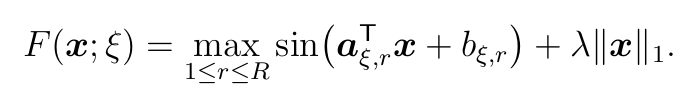
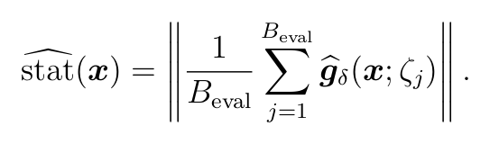
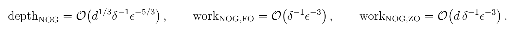
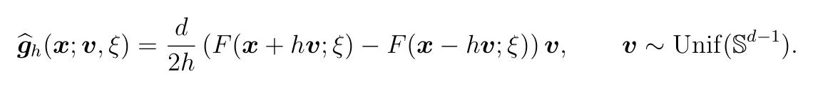
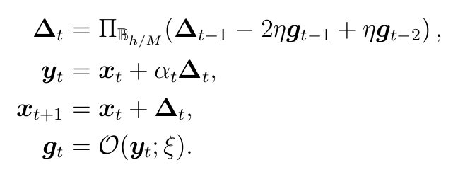

# NOG：高并行非光滑非凸优化

本仓库实现并评估 Nonconvex Optimistic Gradient（NOG）的 first-order（FO）和
zeroth-order（ZO）分布式版本。实验重点不是 wall-clock speed，而是并行算法的两类
复杂度：

- `communication depth`：必须顺序执行的通信/聚合层数；
- `training work`：所有 worker 的训练 oracle 调用总数。

仓库包含算法实现、论文源码、pilot 和 formal 实验、冻结参数、逐 checkpoint 数据、
审计文件、论文图片及 CPU 复现脚本。当前论文主结果来自 `SyntheticMaxSinL1`；a9a 和
ijcnn1 的 SVM 结果作为独立真实数据补充，明确记录算法的适用性边界。

## 0. 当前结论（先看这里）

1. **SyntheticMaxSinL1：** NOG-FO 和 NOG-ZO 的相对 communication-depth 随目标
   `epsilon` 变小而改善，方向与理论中的 depth separation 一致。
2. **总 work：** NOG 与基线处于同一有限实例数量级，但不在每个点都最低；不能把
   depth 优势写成 work 全面优势。
3. **SVM：** 在 a9a、ijcnn1 上联合重选 `batch + M + eta` 后，NOG 前期仍有
   stationarity 平台期；同等 depth 下没有领先，只有 ijcnn1 在同等 work 的终点均值领先。
4. 因此当前论文正文只展示 SyntheticMaxSinL1 的 FO/ZO 曲线；SVM 完整材料保存在
   `svm_cpu_joint_retuning_2026/`，不与 synthetic 主结论混合。

## 1. 快速入口

| 内容 | 路径 |
|---|---|
| 论文实际使用的图片、数据和审计包 | [`results/paper_experiments_20260824/`](results/paper_experiments_20260824/) |
| FO v4 正式结果 | [`results/theory_validation_v4/`](results/theory_validation_v4/) |
| ZO 20-seed formal 结果 | [`zo_experiments/formal/`](zo_experiments/formal/) |
| SVM a9a/ijcnn1 完整结果 | [`svm_cpu_joint_retuning_2026/`](svm_cpu_joint_retuning_2026/) |
| SVM 中文总报告 | [`SVM_CPU_EXPERIMENT_REPORT_CN.md`](SVM_CPU_EXPERIMENT_REPORT_CN.md) |
| FO 实验详细说明 | [`fo_experiments/README.md`](fo_experiments/README.md) |
| ZO 实验详细说明 | [`zo_experiments/EXPERIMENT_DETAILED_EXPLANATION.md`](zo_experiments/EXPERIMENT_DETAILED_EXPLANATION.md) |
| ICLR 论文正文和附录 | [`nog_iclr2027_complete_source/`](nog_iclr2027_complete_source/) |
| 历史实验分支 | [`archive/legacy-experiments`](https://github.com/diaozb/NOG/tree/archive/legacy-experiments) |

## 2. 优化问题和理论目标

### 2.1 SyntheticMaxSinL1

主实验对每个数据样本 `ξ` 使用下图所示的 `SyntheticMaxSinL1` 函数（公式由仓库中的
`docs/readme_equations/objective.tex` 编译生成）：



纯文本形式：`F(x; ξ) = max_r sin(a_{ξ,r}^T x + b_{ξ,r}) + λ ||x||_1`。

固定设置为：

| 参数 | 值 |
|---|---:|
| dimension `d` | 100 |
| 数据量 `n` | 4096 |
| 正弦分支数 `R` | 1 |
| `lambda` | `0.001` |
| feature scale / common offset | `1.0 / 0.25` |
| phase | zero |
| 初始点 | `x0 = 0` |
| 目标 Goldstein 半径 | `delta = 0.1` |
| logical workers | 8 |
| topology | complete graph，精确平均/混合 |

正弦项提供非凸性，`l1` 项提供非光滑性。当前 `R=1`，因此该实验不额外依赖多个
正弦分支之间的 max-switching 非光滑性；这一点是问题设置的边界。

### 2.2 stationarity proxy 与 confirmed hit

每个原生 evaluation checkpoint 使用固定高精度 Monte Carlo bank 估计平滑梯度范数：



proxy 的纯文本定义为
`stat_hat(x) = ||(1/B_eval) sum_j g_delta(x; zeta_j)||`。

主 synthetic 实验使用 `eval_smooth_B=256`、`eval_data_B=512`。evaluation bank 在
同一 seed 的方法之间固定，evaluation work 不计入 training work。只有连续两个有效
checkpoint 都满足 `stat_hat <= epsilon` 时才算 confirmed hit；第一次满足这一条件的
checkpoint 定义 first-hit depth/work。

未命中的 seed 不删除、不替换、不用条件均值伪装为完整 first hit，而按 right-censored
结果保存和解释。

理论主阶的编译版公式如下；它们是论文中的 worst-case reference，不是单一有限实例上
拟合出来的经验等式：



## 3. 算法如何实现

所有实现都从 `x0=0` 开始，worker 持有不重叠的数据 shard。可并行的本地 oracle 计算
不增加 communication depth；只有必须顺序完成的 all-reduce 或 mixing 层增加 depth。

### 3.1 FO/ZO oracle

FO 直接对 stochastic component 求梯度并在 worker 间做平均。ZO 使用下图所示的双点
球面估计器（由 `docs/readme_equations/zo_estimator.tex` 编译生成）：



等价的纯文本形式为 `g_hat_h(x;v,xi)=d/(2h)*(F(x+h v;xi)-F(x-h v;xi))*v`，
`v ~ Uniform(S^(d-1))`。

一次 ZO direction 需要两个 function evaluations，因此 work 账本显式乘以 2；
DGFM+ 的普通 SPIDER difference 同时评价当前位置和参考位置，也按 4 次 SZO calls
计费。

### 3.2 NOG（FO 和 ZO 共用的 block-average 实现）

代码入口为 `src/distributed/cpu_fo_algorithms.py`、`src/distributed/cpu_zo_algorithms.py`
及通用实现 `src/distributed/algorithms.py`。每一轮的核心更新如下；公式由
`docs/readme_equations/nog_update.tex` 编译生成：



其中 `Pi_{B_{h/M}}` 是半径 `h/M` 的投影，`alpha_t` 是固定随机插值，`g_t` 是
FO 或 ZO stochastic oracle。

其中 `M` 是 block length，`h/M` 是 NOG 的更新投影半径，`alpha_t` 是固定随机插值。
每个 block 结束时评价该 block 内 `y_t` 的平均点 `y_bar`。实现显式保存两个初始化
oracle，随后使用最近两个 oracle 的 optimistic combination；因此不会用图上的近似初始
星号替代真正的 `x=0` 评价。

### 3.3 ME-DOL

ME-DOL 在长度为 `epoch_length` 的 epoch 内执行 decentralized online gradient
updates：每个 inner iteration 先产生 action，再混合 action 和当前点，并在 epoch
平均点 `w_bar` 上 evaluation。其 radius 和 learning rate 按冻结的
`theory_multiplier`、epoch length 和 worker 数计算。

### 3.4 DGFM

DGFM 使用 zeroth-order gradient tracking。每轮计算 local estimator，混合
`tracker + gradient - previous_gradient`，再混合参数更新。因此一轮包含 tracker
mixing 和 parameter mixing 两个顺序通信层。

### 3.5 DGFM+

DGFM+ 使用带周期性 large-batch restart 的 SPIDER 型差分估计：restart 轮使用 large
batch，普通轮对当前位置和上一位置使用共同 directions 做 difference，再进行 tracker
和参数混合。restart mixing、tracker mixing、parameter mixing 分别进入 depth 账本。

## 4. depth/work 如何计数

### 4.1 Synthetic 主 ZO 配置

| 方法 | 固定参数 | 每轮 training work | 最大 depth | work cap |
|---|---|---:|---:|---:|
| NOG-ZO | `M=2`, `eta=0.01`, smooth batch=8，global data batch=64 | `2*8*64=1024` | 960 | 983,040 |
| ME-DOL-ZO | epoch=12，multiplier=60，smooth=1，data/worker=16 | `2*1*16*8=256` | 3,840 | 983,040 |
| DGFM | `eta=0.05`，batch=16 | `2*16*8=256` | 7,680 | 983,040 |
| DGFM+ | `eta=0.05`，small/large=8/64，restart=48 | 普通轮 `4*8*8=256`；restart 轮 `2*64*8=1024` | 7,224 | 983,040 |

这里的 work 是所有 worker 的总和，而不是单个 worker 的 batch。最大 depth 由算法的
dependency graph 和 work cap 共同决定；不能只用“训练轮数”替代 depth。

### 4.2 Synthetic 主 FO 配置

| 方法 | 固定参数 | 每层 training work | 最大 depth |
|---|---|---:|---:|
| NOG-FO | `M=2`, `eta=1.0`，smooth batch=1，global batch=8 | 8 SFO calls/layer（另计初始化 oracle） | 约 962 |
| ME-DOL-FO | epoch=6，multiplier=100，每 worker 1 sample/layer | 8 SFO calls/layer | 3,840 |

FO v4 的 pilot schedule 在更小 epsilon 处切换 NOG global batch `8 -> 16`。论文 Figure 1
只保留双方 batch 都为 8 的同质区间，避免把 batch 跳变误解为纯粹的 epsilon scaling。

### 4.3 SVM 配置的计数

SVM 也使用 8 workers、双点 ZO、最大 training work `983,040`，但真实数据的冻结 batch
不同：NOG 在 a9a/ijcnn1 都选择 `M=1`、smooth batch=1、global data batch=64，故每轮
约 `2*1*64*8=1024` SZO calls；ME-DOL 每轮 `256` calls，DGFM 每轮 `256` calls，
DGFM+ 的普通/重启轮分别为 `256/1024`。因此大 batch 会减少固定 work 下的可执行轮数，
不能先验假设 batch 越大 depth 越好。

## 5. 选参、冻结和正式实验流程

所有正式结果遵循 **pilot -> freeze -> formal -> audit -> analysis -> figure** 流程。
formal seeds 禁止参与选参。

### 5.1 FO v4

1. 在 pilot seeds `100--104` 上搜索 NOG global data batch
   `8,16,24,32,40,48,56,64`；`M=2`、`eta=1.0`、smooth batch=1 已固定。
2. 预先固定评分：在 25%、50%、75%、100% work 处取最近原生 checkpoint，计算跨 seed、
   跨时间点的 `mean(log epsilon)`；要求 pilot 5/5 命中，并要求 NOG batch 随 epsilon
   变小不下降。
3. 选择并冻结：`epsilon=0.2 ... 0.0105` 使用 global batch=8；更小探索点使用 batch=16。
4. 运行 formal seeds `0--19`：NOG-FO 和 ME-DOL-FO 共 60 个审计任务，保存逐 seed
   partial、checkpoint、seed/config identity 和 SHA256。
5. 只使用共同 20/20 命中区间制作论文主图。

### 5.2 ZO formal

1. pilot seeds `100--104` 上分别对 NOG-ZO 和三个 baseline 做 dense pilot/refinement，
   所有候选共享最大 work `983,040`。
2. 候选先按 confirmed-hit coverage 筛选，再比较 first-hit depth；depth 接近时比较
   work 和稳定性。该过程在正式轨迹生成前冻结。
3. 最终冻结参数为：

   | 方法 | 参数 |
   |---|---|
   | NOG-ZO | `M=2`, `eta=0.01`, `smooth_B=8` |
   | ME-DOL-ZO | `epoch_length=12`, `theory_multiplier=60` |
   | DGFM | `eta=0.05` |
   | DGFM+ | `eta=0.05` |

4. 运行四种方法 × 20 formal seeds，共 80 tasks；审计显示 `80/80` 完成、48,500 rows、
   `983,040` work cap、seed sets 完全分离。
5. 只对四种方法都 20/20 命中的共同 epsilon 区间进行 paired depth trend；其余点明确
   标记为 right-censored。

### 5.3 SVM 联合重选参

SVM 采用独立的 search/validation/formal seed 协议，不查看 formal 结果调参：

1. 每个数据集搜索 `M={1,2,4}`、`smooth_B={1,2,4,8}`、
   `data_B_total={64,128,256}`；a9a 的 eta 为
   `{9e-6,3e-5,9e-5,3e-4,9e-4}`，ijcnn1 的 eta 为
   `{3e-5,1e-4,3e-4,1e-3,3e-3}`。
2. 每个数据集 `3*5*4*3=180` 个候选，search seeds `400--404`；每个候选完整运行
   `983,040` work，不再使用旧的十分之一预算。
3. 评分点为 25%、50%、75%、100% work 的最近原生 checkpoint，目标是跨时间点和 seed
   的 `mean(log epsilon)` 最小；非有限/发散配置淘汰，分数接近时看最终 epsilon、方差
   和 depth。
4. 对 search 前 3 名使用独立 validation seeds `500--504`；正式 seeds `0--19` 严禁用于
   选参。
5. 冻结结果：a9a `M=1, eta=9e-5, smooth_B=1, data_B_total=64`；ijcnn1
   `M=1, eta=1e-4, smooth_B=1, data_B_total=64`。
6. 运行 NOG 两数据集共 40 个 formal tasks；未改变代码、数据、预算和 evaluation bank
   的三个 baseline 复用原 formal trajectories，并保留 baseline reuse audit。

## 6. 正式结果（关键数字）

### 6.1 FO representative first-hit means

| epsilon | NOG depth/work | ME-DOL depth/work | ME/NOG depth |
|---:|---:|---:|---:|
| 0.2000 | 135.8 / 1,086.4 | 66.3 / 530.4 | 0.488 |
| 0.0500 | 345.7 / 2,765.6 | 217.2 / 1,737.6 | 0.628 |
| 0.0200 | 459.9 / 3,679.2 | 330.9 / 2,647.2 | 0.720 |
| 0.0110 | 566.2 / 4,529.6 | 535.8 / 4,286.4 | 0.948 |
| 0.0105 | 587.2 / 4,697.6 | 642.9 / 5,143.2 | 1.102 |

### 6.2 ZO representative first-hit means

| epsilon | NOG-ZO | ME-DOL-ZO | DGFM | DGFM+ |
|---:|---:|---:|---:|---:|
| 0.200 | 103.4 / 105,881.6 | 165.0 / 42,240.0 | 367.6 / 47,052.8 | 364.0 / 49,856.0 |
| 0.100 | 180.2 / 184,524.8 | 340.2 / 87,091.2 | 855.2 / 109,465.6 | 872.0 / 118,950.4 |
| 0.050 | 214.4 / 219,545.6 | 496.2 / 127,027.2 | 1,296.0 / 165,888.0 | 1,410.0 / 192,076.8 |
| 0.030 | 229.2 / 234,700.8 | 622.8 / 159,436.8 | 1,652.4 / 211,507.2 | 2,609.6 / 355,302.4 |

表中每个单元格为 `depth / training work`，均来自共同 20/20 命中区间。ZO 的 NOG
depth 在这些点均最低，但 NOG work 并非均最低。

### 6.3 SVM 关键结果

在同等 training work=`983,040` 的终点 epsilon 均值为：

| 数据集 | NOG-ZO | ME-DOL-ZO | DGFM | DGFM+ |
|---|---:|---:|---:|---:|
| a9a | 0.02517 | 0.01923 | **0.01588** | 0.02617 |
| ijcnn1 | **0.01233** | 0.01479 | 0.01496 | 0.02071 |

在 common depth 约 3,840 时，NOG 在 a9a 和 ijcnn1 都不领先。SVM 的主要现象是
hinge loss 活跃样本集合长时间变化有限，较小 eta 使 proxy 先平台、后下降；联合增大
batch 并未通过独立 validation 稳定改善平台期。完整数据、图、阈值 first-hit 表和审计
见 [`svm_cpu_joint_retuning_2026/`](svm_cpu_joint_retuning_2026/)。

## 7. 图表如何生成

论文主图不使用柱状图、不插值、不使用对数纵轴隐藏前期点。图中曲线是 20 formal seeds
均值，阴影是 95% t 置信区间，横轴为目标 epsilon，使用共同原生 checkpoint。

```bash
cd /data/diaozb/NOG
/root/miniconda3/envs/NOG/bin/python \
  results/paper_experiments_20260824/scripts/generate_theory_validation_figures.py
```

输入文件：

- FO：`results/theory_validation_v4/analysis/formal_summary.csv`；
- ZO：`zo_experiments/formal/formal_summary.csv`；
- 选定支持：FO `epsilon ∈ [0.0105,0.2]`；ZO `epsilon ∈ [0.03,0.2]`。

输出文件：

- `nog_iclr2027_complete_source/figures/fo_first_hit_depth_work.pdf/png`；
- `nog_iclr2027_complete_source/figures/zo_first_hit_depth_work.pdf/png`；
- 同样的图像副本和数据快照位于 `results/paper_experiments_20260824/`。

SVM 图由 `svm_cpu_joint_retuning_2026/reproduction/plot_retuned_svm_equal_budget.py`
生成，包含完整线性纵轴图和严格 `epsilon=0--0.05` 放大图；放大图会明确说明高于
0.05 的前期点被裁剪，不表示算法从 0.05 开始。

## 8. 复现命令

### 8.1 只复现论文图（推荐）

```bash
cd /data/diaozb/NOG
/root/miniconda3/envs/NOG/bin/python \
  results/paper_experiments_20260824/scripts/generate_theory_validation_figures.py
```

### 8.2 编译当前论文

```bash
cd /data/diaozb/NOG/nog_iclr2027_complete_source
latexmk -pdf -interaction=nonstopmode -halt-on-error \
  -outdir=/tmp/nog_iclr2027_build nog_iclr2027.tex
```

当前版本正文和结论在第 9 页内；量子算法、量子证明和实验完整说明在 `apx.tex` 附录。

### 8.3 FO v4 全流程

以下命令支持 partial resume；正式运行采用 CPU/Gloo：

```bash
cd /data/diaozb/NOG
/root/miniconda3/envs/NOG/bin/python -m src.distributed.theory_validation_runner pilot-batch-grid
/root/miniconda3/envs/NOG/bin/python -m src.distributed.theory_validation_freeze
/root/miniconda3/envs/NOG/bin/python -m src.distributed.theory_validation_runner formal
/root/miniconda3/envs/NOG/bin/python -m src.distributed.theory_validation_audit
/root/miniconda3/envs/NOG/bin/python -m src.distributed.theory_validation_analysis
/root/miniconda3/envs/NOG/bin/python -m src.distributed.theory_validation_report
/root/miniconda3/envs/NOG/bin/python -m src.distributed.theory_validation_package
```

### 8.4 ZO formal 全流程

```bash
cd /data/diaozb/NOG
/root/miniconda3/envs/NOG/bin/python -m src.distributed.zo_formal --dry-run
/root/miniconda3/envs/NOG/bin/python -m src.distributed.zo_formal
/root/miniconda3/envs/NOG/bin/python -m src.distributed.zo_formal_analysis
/root/miniconda3/envs/NOG/bin/python -m src.distributed.zo_theory_interpretation
/root/miniconda3/envs/NOG/bin/python -m src.distributed.zo_anomaly_audit
```

当前论文图只需要使用已经审计的 CSV，不建议为了查看论文曲线重新运行 80 个 formal
tasks。

### 8.5 SVM formal 示例

SVM 的 search、validation、freeze 和 formal 脚本快照位于
`svm_cpu_joint_retuning_2026/reproduction/`。冻结后的单 seed 示例：

```bash
cd /data/diaozb/NOG
/root/miniconda3/envs/NOG/bin/python \
  svm_cpu_joint_retuning_2026/reproduction/run_retuned_nog_formal.py \
  --freeze svm_cpu_joint_retuning_2026/audit/frozen_parameters.json \
  --output /tmp/nog_svm_formal_seed00 --seeds 0 --cpu-threads 1
```

完整 search/validation/freeze/merge/plot 命令见
[`SVM_CPU_EXPERIMENT_REPORT_CN.md`](SVM_CPU_EXPERIMENT_REPORT_CN.md)。

## 9. 审计、完整性和复现实验边界

- FO formal：60/60 tasks 通过审计；
- ZO formal：80/80 tasks、48,500 checkpoint rows，`audit.json` 状态为 `pass`；
- SVM：search、validation、formal seeds 完全分离，四算法×两数据集均保留 20 formal
  seeds；
- formal seeds 为 0--19，pilot seeds 为 100--104；SVM search/validation 使用另行登记的
  400--404/500--504；
- 所有失败、不利和未命中结果保留，不通过删除 seed 或截取有利区间制造结论；
- 各结果目录保存冻结参数、配置、逐 checkpoint CSV、审计 JSON 和 SHA256 manifest；
- `training work` 与 `evaluation work` 分开，FO 和 ZO 的 work 单位不能直接混合；
- 这些实验验证的是固定问题族和有限 epsilon 区间的经验趋势，不是 worst-case 定理的
  精确指数证明；
- 当前论文没有把 SVM 结果作为 SyntheticMaxSinL1 主证据，也没有把 SVM 的失败隐藏。

## 10. 论文源码和引用

论文主文件为：

- [`nog_iclr2027_complete_source/nog_iclr2027.tex`](nog_iclr2027_complete_source/nog_iclr2027.tex)；
- [`nog_iclr2027_complete_source/apx.tex`](nog_iclr2027_complete_source/apx.tex)；
- [`nog_iclr2027_complete_source/nog_iclr2027.bib`](nog_iclr2027_complete_source/nog_iclr2027.bib)。

正文理论保留在前五节，正文实验分为 FO/ZO 两节；量子内容和证明在附录。主实验图、
数据和复现包的 SHA256 记录在
[`results/paper_experiments_20260824/SHA256SUMS`](results/paper_experiments_20260824/SHA256SUMS)。

## 11. 测试

推荐直接使用指定 CPU Python：

```bash
cd /data/diaozb/NOG
/root/miniconda3/envs/NOG/bin/python -m pytest -q
git diff --check
```

工作区中可能存在未提交的本地 raw trajectories、SVM 诊断文件、旧图归档或微信图片；
这些文件不属于当前 `main` 的论文主结果，不能与版本化正式结果混合使用。
