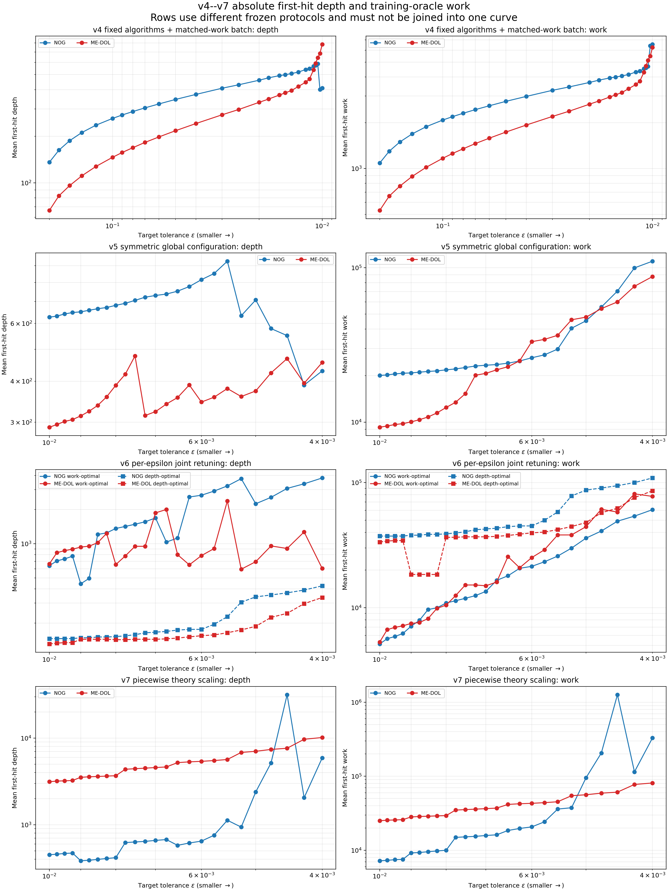
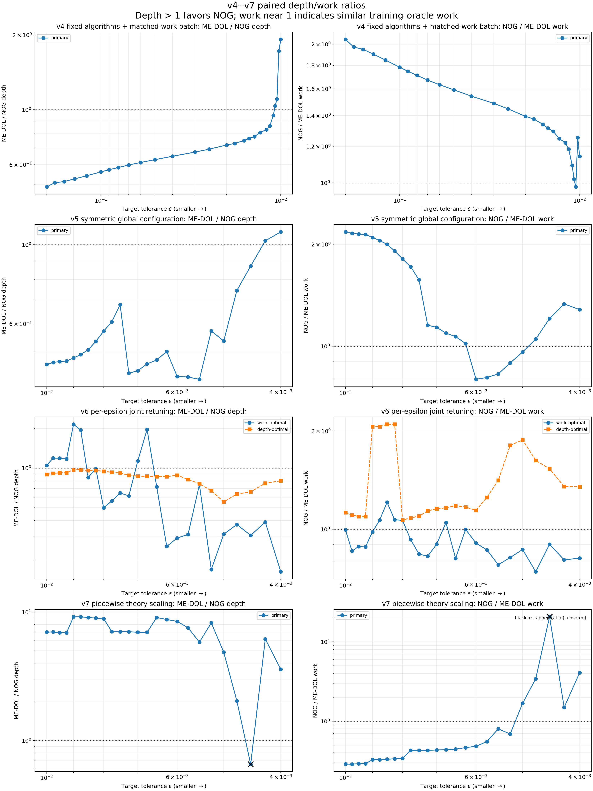
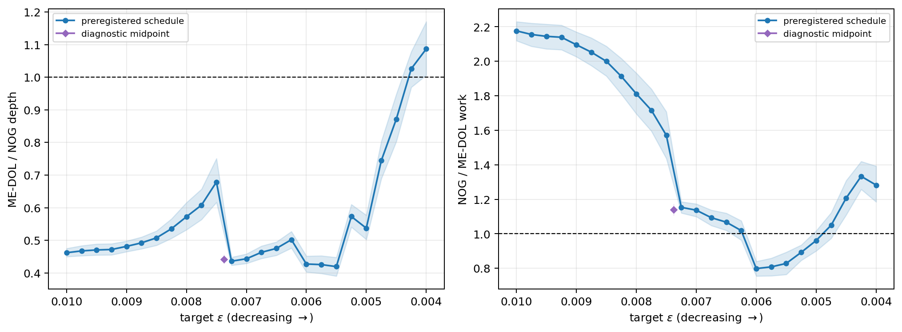
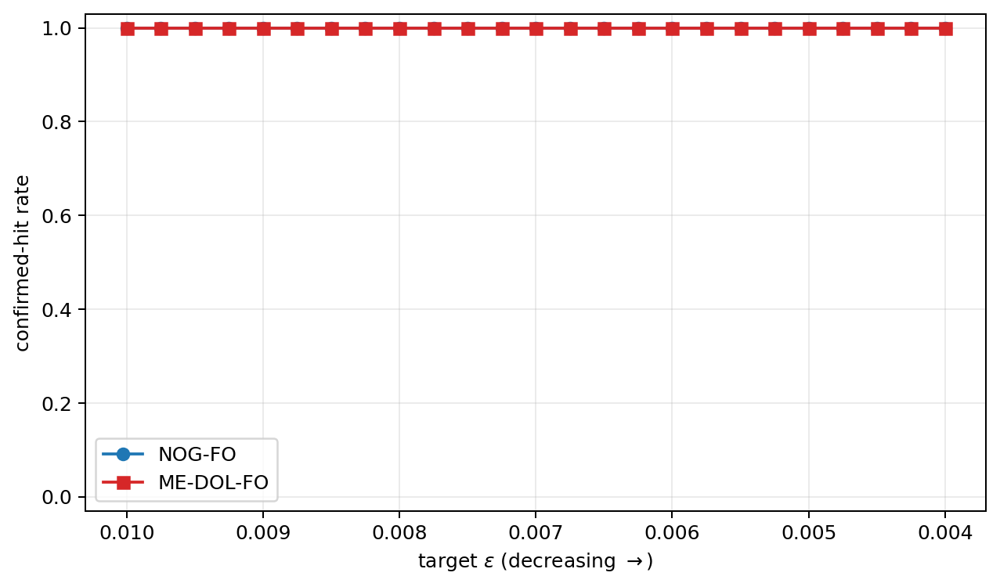
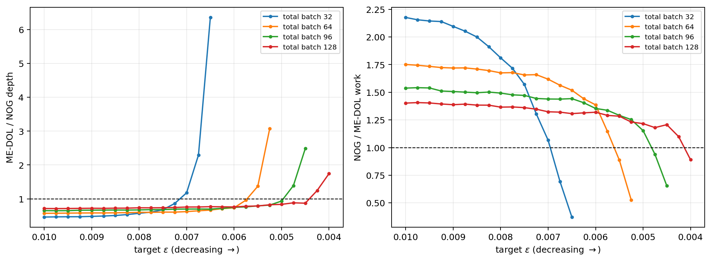
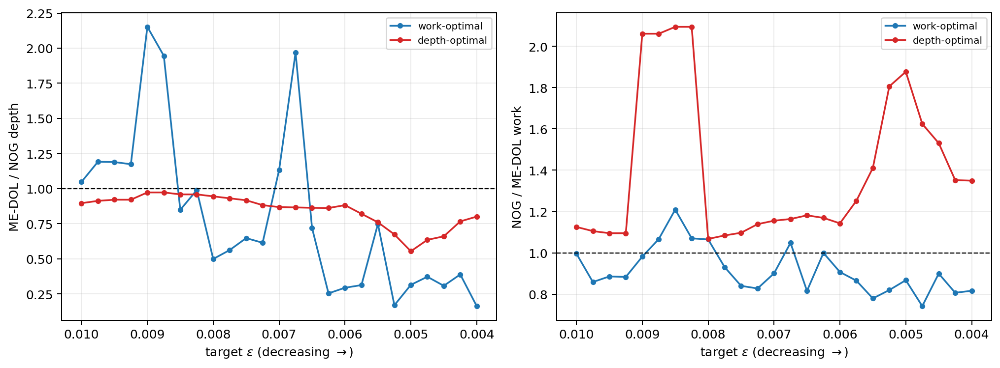

# NOG-FO 与 ME-DOL-FO：v4–v7 实验设定与最终结果图表

本文档并列展示 v4、v5、v6、v7 的实验设定、绝对 first-hit depth、训练 oracle work、`ME-DOL/NOG depth` 比例和 `NOG/ME-DOL work` 比例。

> **重要说明：** 四个版本采用不同的参数选择规则、batch schedule、评估间隔、随机种子和预算。它们只能作为不同实验协议的并列比较，不能首尾拼接为一条同配置的 $\epsilon$-scaling 曲线。README 的论文主结果仍以 v4 为准；v5 是独立对称验证，v6/v7 是探索性实验。

## 1. 指标方向

| 指标 | 定义 | 如何阅读 |
|---|---|---|
| Depth ratio | $D_{\mathrm{ME}}/D_{\mathrm{NOG}}$ | 大于 1 表示 NOG first-hit depth 更低 |
| Work ratio | $W_{\mathrm{NOG}}/W_{\mathrm{ME}}$ | 接近 1 表示双方训练 oracle work 接近 |
| Absolute depth | 20 或 30 个 formal seeds 的 first-hit depth 均值 | 越小越好 |
| Absolute work | 首次命中前累计的训练 oracle 调用均值 | 越小越好；不包含高精度评估 bank 的工作量 |

所有版本都要求连续两个高精度 checkpoint 满足阈值，才确认 first hit。比例采用逐 seed 配对后取均值，因此一般不等于两个绝对均值直接相除。

## 2. 共同问题设定

| 项目 | 设定 |
|---|---|
| 问题 | `SyntheticMaxSinL1` |
| 目标 | $F(x;\xi)=\max_{r\le R}\sin(a_{\xi,r}^{\top}x+b_{\xi,r})+\lambda\lVert x\rVert_1$ |
| 维数 | $d=100$ |
| 数据量 | `n_data=4096` |
| 分支数 | $R=1$ |
| 非光滑系数 | $\lambda=0.001$ |
| Goldstein 半径 | $\delta=0.1$ |
| 并行环境 | 8 个 CPU/Gloo worker，complete topology，精确 all-reduce |
| 评估 bank | `eval_smooth_B=256`, `eval_data_B=512`，每次 checkpoint 使用 131,072 个评估样本 |
| 评估随机性 | 同一 seed 内使用固定且方法独立的 evaluation bank |

## 3. 四版本协议总表

| 版本 | $\epsilon$ 区间 | Formal seeds | NOG 设置 | ME-DOL 设置 | Batch 规则 | 有效评估间隔 | 最大 depth | 参数选择目标 |
|---|---|---|---|---|---|---|---|---|
| v4 primary | 0.2–0.01，27 点 | 0–19 | $M=2,\eta=1$, `smooth_B=1` | $H=6$, multiplier 100 | NOG 8，最后两点 16；ME 8 | NOG 2；ME 6 | NOG 约 962；ME 3840 | 固定算法参数，选择 NOG 单调 batch 使 work 尽量匹配 |
| v4 extended | 0.0095–0.002 | 0–19 | 与 v4 完全相同 | 与 v4 完全相同 | NOG 16；ME 8 | 与 v4 相同 | NOG 15,362；ME 61,440 | 仅扩展预算，不重新调参 |
| v5 | 0.01–0.004，25 点 | 20–39，加确认 seeds 40–49 | $M=4,\eta=2$ | $H=12$, multiplier 200 | 双方独立单调 schedule；NOG 32–256，ME 32–192 | 双方 24 | NOG 15,362；ME 15,360 | 共同 batch 128 上选择覆盖全区间的全局参数，再分别最小化 first-hit work |
| v6 | 0.01–0.004，25 点 | 50–69 | 每个 $\epsilon$ 独立选 $M,\eta,B$ | 每个 $\epsilon$ 独立选 $H$, multiplier, $B$ | 8–256 联合搜索 | 双方 24 | 15,360 | 分别冻结 work-optimal 与 depth-optimal 两套逐点配置 |
| v7 | 0.01–0.004，25 点 | 70–89 | 六段：$M=2\rightarrow4$, $\eta=4\rightarrow3$, batch 16–56 | 六段：$H=6\rightarrow40$, multiplier 12.5，batch 8 | 理论启发的分段 scaling | NOG 按 $M$；ME 按 $H$ | 61,440 | 所有 anchor 5/5 命中后，最小化几何平均 first-hit work |

对应的冻结证据：

- [v4 frozen parameters](results/theory_validation_v4/frozen_parameters.json)
- [v5 frozen parameters](results/low_epsilon_v5_symmetric/frozen_parameters.json)
- [v6 frozen parameters](results/v4_v7_comparison/summaries/v6/frozen_parameters.json)
- [v7 frozen parameters](results/v4_v7_comparison/summaries/v7/frozen_parameters.json)

## 4. 四版本总览图

### 4.1 绝对 first-hit depth 与 work



[PDF 版本](results/v4_v7_comparison/figures/v4_v7_absolute_metrics.pdf)

### 4.2 Paired depth/work ratios



[PDF 版本](results/v4_v7_comparison/figures/v4_v7_ratio_metrics.pdf)

图中每一行使用该版本自己的横轴范围和冻结协议。v6 同时画出 work-optimal 与 depth-optimal；v7 的黑色 `×` 表示该点使用 capped ratio，因为至少一方未全部命中。

## 5. $\epsilon=0.01$ 的直接数值对照

这是四个版本唯一完全重合的阈值，但配置并不相同。

| 版本/口径 | NOG 参数 | ME-DOL 参数 | NOG depth | ME depth | ME/NOG depth | NOG work | ME work | NOG/ME work |
|---|---|---|---:|---:|---:|---:|---:|---:|
| v4 | $M=2,\eta=1,B=16$ | $H=6,m=100,B=8$ | 408.9 | 783.0 | **1.919x** | 6,542.4 | 6,264.0 | **1.140x** |
| v5 | $M=4,\eta=2,B=32$ | $H=12,m=200,B=32$ | 626.8 | 289.6 | **0.462x** | 20,057.6 | 9,267.2 | **2.176x** |
| v6 work-optimal | $M=2,\eta=1,B=8$ | $H=24,m=150,B=8$ | 640.4 | 663.6 | **1.047x** | 5,123.2 | 5,308.8 | **0.996x** |
| v6 depth-optimal | $M=2,\eta=1,B=256$ | $H=12,m=400,B=256$ | 146.0 | 130.8 | **0.896x** | 37,376.0 | 33,484.8 | **1.125x** |
| v7 | $M=2,\eta=4,B=16$ | $H=6,m=12.5,B=8$ | 450.9 | 3,134.4 | **6.986x** | 7,214.4 | 25,075.2 | **0.288x** |

该表直接说明，版本差异不是同一设置下的小幅噪声：例如 ME-DOL 的 multiplier 从 v4 的 100 变成 v7 的 12.5，而 batch 在 v5/v6 中最高可达到 256。

## 6. v4：固定算法参数与 matched-work batch

### 6.1 Primary 代表点

所有 primary 点双方均为 20/20 hits。

| $\epsilon$ | NOG batch | NOG depth | ME depth | ME/NOG depth | NOG work | ME work | NOG/ME work |
|---:|---:|---:|---:|---:|---:|---:|---:|
| 0.20000 | 8 | 135.8 | 66.3 | 0.49x | 1,086.4 | 530.4 | 2.05x |
| 0.10000 | 8 | 260.5 | 146.1 | 0.56x | 2,084.0 | 1,168.8 | 1.78x |
| 0.05000 | 8 | 345.7 | 217.2 | 0.63x | 2,765.6 | 1,737.6 | 1.59x |
| 0.02000 | 8 | 459.9 | 330.9 | 0.72x | 3,679.2 | 2,647.2 | 1.39x |
| 0.01100 | 8 | 566.2 | 535.8 | 0.95x | 4,529.6 | 4,286.4 | 1.09x |
| 0.01050 | 8 | 587.2 | 642.9 | 1.10x | 4,697.6 | 5,143.2 | 0.98x |
| 0.01025 | 16 | 400.4 | 685.2 | 1.72x | 6,406.4 | 5,481.6 | 1.25x |
| 0.01000 | 16 | 408.9 | 783.0 | **1.92x** | 6,542.4 | 6,264.0 | **1.14x** |


### 6.2 扩展预算结果

扩展实验保持 v4 参数和 seeds 不变，仅扩大运行预算。完整命中的两个新增点为：

| $\epsilon$ | NOG hit | ME hit | NOG depth | ME depth | ME/NOG depth | NOG work | ME work | NOG/ME work |
|---:|---:|---:|---:|---:|---:|---:|---:|---:|
| 0.0095 | 20/20 | 20/20 | 418.7 | 1,316.4 | 3.135x | 6,699.2 | 10,531.2 | 0.772x |
| 0.0090 | 20/20 | 20/20 | 451.4 | 3,823.2 | 8.792x | 7,222.4 | 30,585.6 | 0.478x |

从 0.0085 开始出现删失；不能把 capped mean 当作真实 first-hit ratio。


数据文件：

- [v4 absolute summary](results/theory_validation_v4/analysis/formal_summary.csv)
- [v4 paired ratios](results/theory_validation_v4/analysis/formal_ratios.csv)
- [v4 extended summary](results/theory_validation_v4_extended_budget/stage2/analysis/extended_summary.csv)
- [v4 extended ratios](results/theory_validation_v4_extended_budget/stage2/analysis/extended_ratios.csv)

## 7. v5：全区间单配置的对称协议

v5 在 25 个点上双方均为 30/30 hits，但 batch schedule 多次切换。

| $\epsilon$ | NOG batch | ME batch | NOG depth | ME depth | ME/NOG depth | NOG work | ME work | NOG/ME work |
|---:|---:|---:|---:|---:|---:|---:|---:|---:|
| 0.010 | 32 | 32 | 626.8 | 289.6 | 0.462x | 20,057.6 | 9,267.2 | 2.176x |
| 0.009 | 32 | 32 | 650.8 | 313.6 | 0.482x | 20,825.6 | 10,035.2 | 2.096x |
| 0.008 | 32 | 32 | 681.2 | 388.8 | 0.572x | 21,798.4 | 12,441.6 | 1.811x |
| 0.007 | 32 | 64 | 730.0 | 323.2 | 0.444x | 23,360.0 | 20,684.8 | 1.137x |
| 0.006 | 32 | 96 | 815.6 | 345.6 | 0.427x | 26,099.2 | 33,177.6 | 0.799x |
| 0.005 | 64 | 128 | 707.6 | 373.6 | 0.537x | 45,286.4 | 47,820.8 | 0.961x |
| 0.004 | 256 | 192 | 430.0 | 456.0 | 1.087x | 110,080.0 | 87,552.0 | 1.283x |

总体统计：depth ratio 从 0.462 到 1.087，Spearman $\rho=0.373$；work ratio 均值 1.456，范围 0.799–2.176，CV 0.348。预注册综合 verdict 为 **not fully supported**。







数据文件：

- [v5 absolute summary](results/low_epsilon_v5_symmetric/analysis/formal_summary.csv)
- [v5 paired ratios](results/low_epsilon_v5_symmetric/analysis/formal_ratios.csv)
- [v5 complete report](results/low_epsilon_v5_symmetric/analysis/low_epsilon_report.md)

## 8. v6：逐 $\epsilon$ 联合重调参

v6 每个阈值分别选择算法参数与 batch，因此最终曲线是多组配置拼接的结果。所有点双方均为 20/20 hits。

### 8.1 Work-optimal 代表点

| $\epsilon$ | NOG depth | ME depth | ME/NOG depth | NOG work | ME work | NOG/ME work |
|---:|---:|---:|---:|---:|---:|---:|
| 0.010 | 640.4 | 663.6 | 1.047x | 5,123.2 | 5,308.8 | 0.996x |
| 0.009 | 443.6 | 934.8 | 2.152x | 7,097.6 | 7,478.4 | 0.982x |
| 0.008 | 1,362.8 | 655.2 | 0.498x | 10,902.4 | 10,483.2 | 1.065x |
| 0.007 | 1,686.8 | 1,870.8 | 1.132x | 13,494.4 | 14,966.4 | 0.901x |
| 0.006 | 2,675.6 | 786.0 | 0.294x | 21,404.8 | 25,152.0 | 0.907x |
| 0.005 | 2,250.8 | 694.8 | 0.314x | 36,012.8 | 44,467.2 | 0.867x |
| 0.004 | 3,797.6 | 606.0 | 0.163x | 60,761.6 | 77,568.0 | 0.816x |

Work-optimal 的 work ratio 很稳定：均值 0.915、范围 0.742–1.209、CV 0.123；但 depth ratio 的 Spearman 为 -0.77。

### 8.2 Depth-optimal 趋势

| 项目 | 数值 |
|---|---:|
| Depth ratio 起点/终点 | 0.896 / 0.800 |
| Depth-ratio Spearman | -0.847 |
| Work-ratio 均值 | 1.405 |
| Work-ratio 范围 | 1.067–2.094 |
| Work-ratio CV | 0.265 |



数据文件：

- [v6 absolute summary](results/v4_v7_comparison/summaries/v6/formal_summary.csv)
- [v6 paired ratios](results/v4_v7_comparison/summaries/v6/formal_ratios.csv)
- [v6 trend statistics](results/v4_v7_comparison/summaries/v6/formal_trends.json)

## 9. v7：分段理论 scaling

### 9.1 分段参数

| $\epsilon$ 分段 | NOG $(M,\eta,B)$ | ME-DOL $(H,m,B)$ |
|---|---|---|
| 0.01000–0.00925 | $(2,4.0,16)$ | $(6,12.5,8)$ |
| 0.00900–0.00800 | $(2,3.8,24)$ | $(8,12.5,8)$ |
| 0.00775–0.00675 | $(3,3.6,24)$ | $(12,12.5,8)$ |
| 0.00650–0.00550 | $(3,3.4,32)$ | $(16,12.5,8)$ |
| 0.00525–0.00450 | $(3,3.2,40)$ | $(24,12.5,8)$ |
| 0.00425–0.00400 | $(4,3.0,56)$ | $(40,12.5,8)$ |

### 9.2 代表点

| $\epsilon$ | NOG depth | ME depth | ME/NOG depth | NOG work | ME work | NOG/ME work |
|---:|---:|---:|---:|---:|---:|---:|
| 0.010 | 450.9 | 3,134.4 | 6.986x | 7,214.4 | 25,075.2 | 0.288x |
| 0.009 | 384.0 | 3,526.8 | 9.202x | 9,216.0 | 28,214.4 | 0.327x |
| 0.008 | 416.9 | 3,677.2 | 8.888x | 10,005.6 | 29,417.6 | 0.340x |
| 0.007 | 659.9 | 4,569.0 | 6.964x | 15,837.6 | 36,552.0 | 0.434x |
| 0.006 | 647.3 | 5,388.8 | 8.476x | 20,713.6 | 43,110.4 | 0.483x |
| 0.005 | 2,390.8 | 7,036.8 | 4.872x | 95,630.0 | 56,294.4 | 1.682x |
| 0.004 | 5,897.4 | 10,146.0 | 3.589x | 330,254.4 | 81,168.0 | 4.085x |

在 0.0045 上 NOG 仅 16/20 hits，比例使用 capped values；其他表中代表点均为完整 paired hits。v7 的 depth ratio 多数大于 1，但不是随 $\epsilon$ 变小单调增加；NOG batch 增长而 ME batch 固定为 8，使 work ratio 在小阈值处明显上升。

v7 的绝对量和比例显示在本文第 4 节两张总览图的最后一行。

数据文件：

- [v7 absolute summary](results/v4_v7_comparison/summaries/v7/formal_summary.csv)
- [v7 paired/capped ratios](results/v4_v7_comparison/summaries/v7/formal_ratios.csv)
- [v7 trend statistics](results/v4_v7_comparison/summaries/v7/formal_trends.json)

## 10. 最终趋势汇总

| 版本/口径 | Depth ratio 起点 → 终点 | Depth-ratio Spearman | Work-ratio 均值 | Work-ratio 范围 | Work-ratio CV | 完整命中情况 |
|---|---:|---:|---:|---:|---:|---|
| v4 primary | 0.488 → 1.919 | 1.000 | 1.489 | 0.980–2.049 | 0.208 | 27 点均双方 20/20 |
| v5 | 0.462 → 1.087 | 0.373 | 1.456 | 0.799–2.176 | 0.348 | 25 点均双方 30/30 |
| v6 work-optimal | 1.047 → 0.163 | -0.770 | 0.915 | 0.742–1.209 | 0.123 | 25 点均双方 20/20 |
| v6 depth-optimal | 0.896 → 0.800 | -0.847 | 1.405 | 1.067–2.094 | 0.265 | 25 点均双方 20/20 |
| v7 | 6.986 → 3.589 | -0.462 | 1.592 | 0.287–20.695 | 2.572 | 0.0045 存在删失 |

## 11. 如何使用这些图表

- 论文主文如果采用 v4，应写成“固定、pilot-calibrated、approximately matched-work 配置下的定性趋势”。
- v5 可以作为更对称但结论不完全支持的独立复核。
- v6 用于展示逐 $\epsilon$ 联合调参后结果对选择口径非常敏感。
- v7 用于展示按理论分段扩大 $M/H$/batch 后，depth 与 work 之间出现明显权衡。
- 不应只截取有利点，也不应把四个版本连接为一条连续 scaling 曲线。

总览图可由以下脚本重新生成：

```bash
conda run -n NOG python scripts/plot_v4_v7_comparison.py
```
