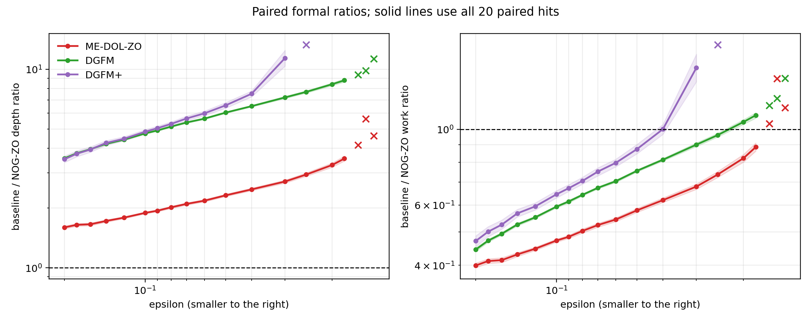
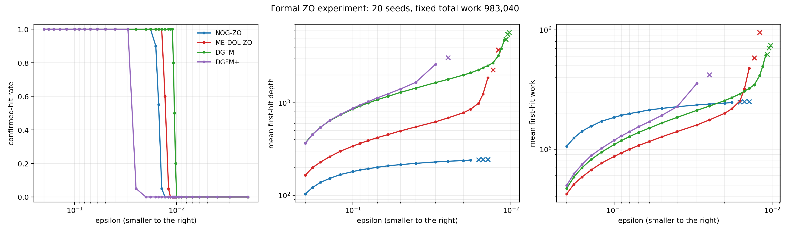
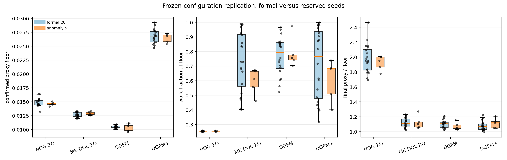
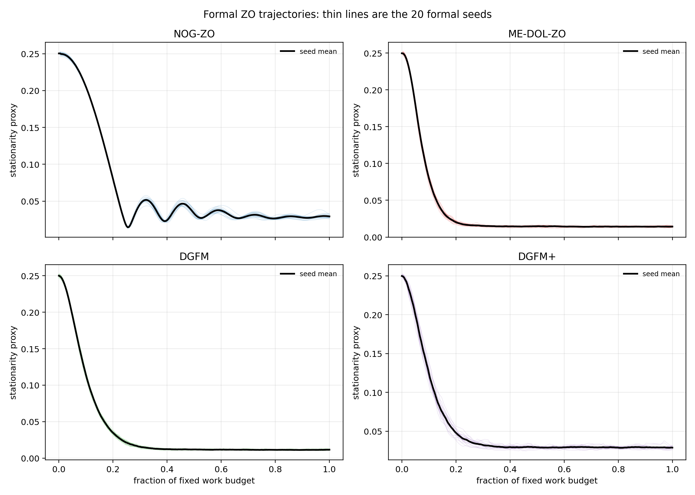
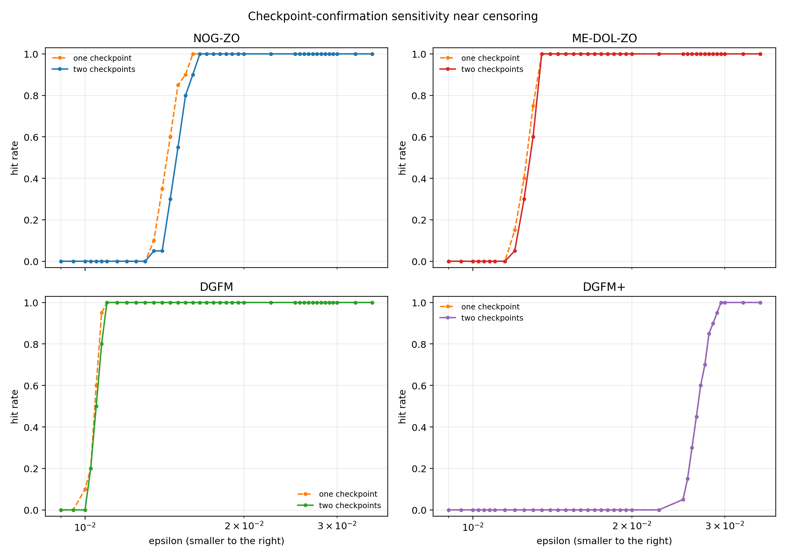
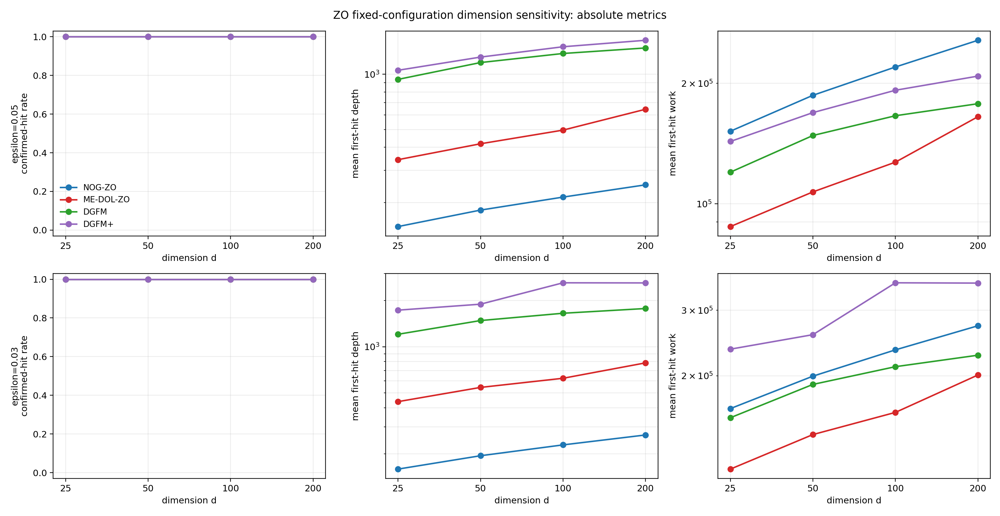
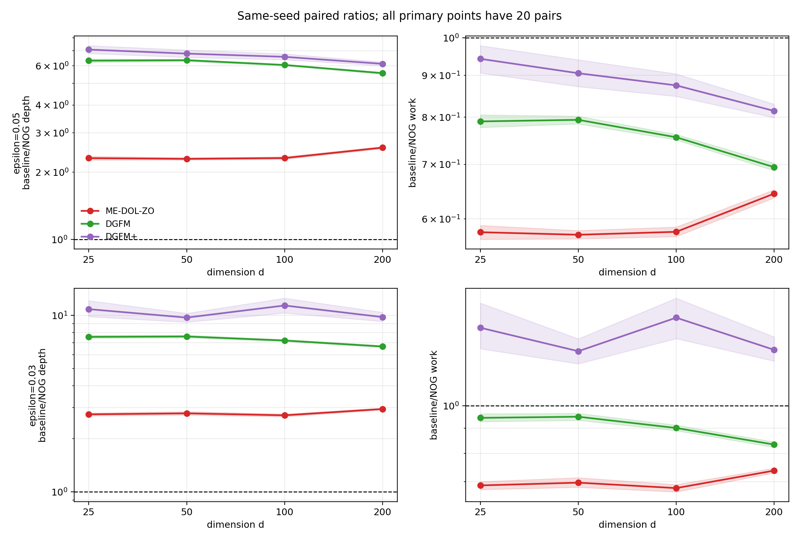
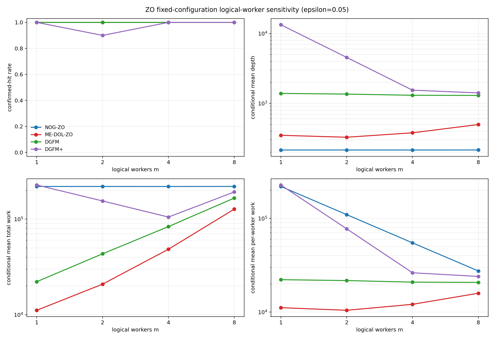
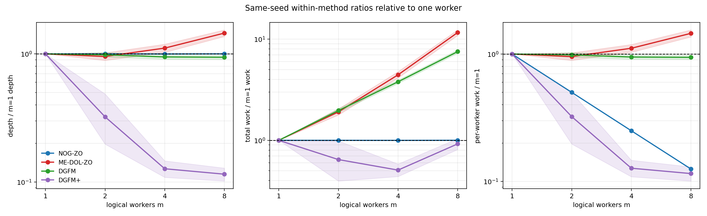

# NOG 分布式零阶（ZO）实验说明

本文档是当前 zeroth-order（ZO）实验的根目录总入口，集中说明实验动机、理论参照、
测试函数、四种算法、参数选择、运行协议、正式结果、异常复核、dimension-scaling、
worker-scaling 以及后续计划。

> 状态快照：2026-08-11。主 epsilon-scaling、理论解释、异常复现和 Steps
> ZO-7A/7B/7C dimension sensitivity、ZO-8A/8B/8C logical-worker sensitivity
> 均已完成；当前没有后台 ZO 实验进程。
> 原始运行目录不提交 Git，经过审计的紧凑结果位于 `zo_experiments/`。

相关入口：

- [完整 ZO 实验计划](ZO_plan.md)
- [ZO 实验目录索引](zo_experiments/README.md)
- [20-seed 正式结果](zo_experiments/formal/README.md)
- [理论对照与论文结论边界](zo_experiments/formal/STEP_ZO_5C_THEORY_COMPARISON.md)
- [异常与删失审计](zo_experiments/formal/STEP_ZO_6A_ANOMALY_AUDIT.md)
- [预留 seed 复现和预算决策](zo_experiments/formal/STEP_ZO_6C_REPLICATION_DECISION.md)
- [20-seed dimension sensitivity 结果](zo_experiments/dimension/README.md)
- [20-seed logical-worker sensitivity 结果](zo_experiments/worker/README.md)
- [论文源文件](nog_iclr2027_complete_source/nog_iclr2027.tex)

## 1. 实验目标与当前结论

实验比较以下四种分布式零阶算法：

1. NOG-ZO；
2. ME-DOL-ZO；
3. DGFM；
4. DGFM+。

核心问题是：当目标精度 epsilon 逐渐减小时，NOG-ZO 是否能以更少的通信依赖深度
达到相同的经验 stationarity threshold。

当前最可靠的结论是：

- 在所有 20 个 formal seeds 都完成配对命中的区间内，ME-DOL-ZO、DGFM 和 DGFM+
  相对 NOG-ZO 的 depth ratio 都随 epsilon 减小单调增加；
- 三条 mean depth-ratio 曲线关于 inverse epsilon 的 Spearman 系数均为 1；
- 该结果定性支持 NOG-ZO 更优的通信深度依赖；
- work ratio 受到 batch、每层查询数和有限常数影响，没有恢复理想渐近关系，只作为
  次要描述结果；
- epsilon 较小时存在右删失，因此不能把少量命中 seed 的条件均值当作无偏比较；
- 实验不证明定理，也不声称恢复精确的 worst-case 指数；
- 在 worker 实验的 epsilon=0.05 下，NOG-ZO 的 mean first-hit depth 和 total work
  在 m=1--8 基本不变，per-worker work 近似按 1/m 下降；
- worker 结果来自逻辑单进程计费，不是实际多进程 wall-clock speedup。

## 2. 理论参照

论文中分布式 ZO 方法的主阶复杂度为：

| 方法 | communication depth | total SZO work |
|---|---:|---:|
| NOG-ZO | $O(d^{1/3}\delta^{-1}\epsilon^{-5/3})$ | $O(d\delta^{-1}\epsilon^{-3})$ |
| ME-DOL-ZO | $O(d\delta^{-1}\epsilon^{-3})$ | $O(d\delta^{-1}\epsilon^{-3})$ |
| DGFM | $O(d^{3/2}\delta^{-1}\epsilon^{-4})$ | $O(d^{3/2}\delta^{-1}\epsilon^{-4})$ |
| DGFM+ | $O(d^{3/2}\delta^{-1}\epsilon^{-3})$ | $O(d^{3/2}\delta^{-1}\epsilon^{-3})$ |

在固定 $d$、$\delta$ 和其他问题常数时，以 baseline/NOG-ZO 为比例方向，理论主阶给出：

| 比例 | depth ratio 对 epsilon 的参考幂次 | work ratio 对 epsilon 的参考幂次 |
|---|---:|---:|
| ME-DOL-ZO/NOG-ZO | $\epsilon^{-4/3}$ | $\epsilon^0$ |
| DGFM/NOG-ZO | $\epsilon^{-7/3}$ | $\epsilon^{-1}$ |
| DGFM+/NOG-ZO | $\epsilon^{-4/3}$ | $\epsilon^0$ |

因此最重要的经验方向是：随着 epsilon 减小，三种 baseline/NOG-ZO depth ratios 应
整体增加。零 work 幂次只表示同一渐近阶，不表示有限实验中的比例必须等于一或严格
不变。

### 2.1 为什么不检验精确指数

本实验冻结一套 pilot 选择的配置，并从每条 anytime trajectory 中提取多个 epsilon
的 first hits。论文定理中的部分参数（例如 NOG-ZO 的 oracle variance 和 batch）
原则上随 epsilon 和 dimension 缩放。因此：

- 当前设计适合检验有限实例上的相对 depth 方向；
- 当前设计不适合把回归斜率解释为定理中的精确指数；
- Big-O 上界本身也不要求在单一有限问题上紧致。

## 3. 测试函数与数据设置

主实验采用可控的有限和 nonsmooth nonconvex 合成问题
SyntheticMaxSinL1：

$$
F(x;\xi)
=
\max_{1\le r\le R}
\sin(a_{\xi,r}^{\top}x+b_{\xi,r})
+\lambda\lVert x\rVert_1.
$$

主设置如下：

| 项目 | 设置 |
|---|---|
| dimension | $d=100$（主 epsilon-scaling） |
| data size | $n=4096$ |
| number of sinusoidal branches | $R=1$ |
| L1 coefficient | $\lambda=0.001$ |
| feature scale | 1.0 |
| common feature bias | 0.25 |
| phase mode | zero |
| initial point | $x_0=0$ |
| target Goldstein radius | 0.1 |
| logical workers | 8 |
| communication topology | complete |
| execution | single-process GPU dependency simulation |

正弦项提供非凸性，L1 项提供 nonsmoothness。由于当前 $R=1$，实验不会额外触发多个
正弦分支之间的 max-switching nonsmoothness；这是本合成问题的重要边界。

当前 ZO 实验模拟算法依赖图和 oracle/communication 计数，不应描述为真实多机
wall-clock speedup 实验。

## 4. 零阶 oracle、depth 和 work

四种方法统一使用 two-point SZO estimator。对方向 $v$ 和数据样本 $\xi$，基本形式为

$$
g(x;v,\xi)
=
\frac{d}{2h}
\left(
F(x+hv;\xi)-F(x-hv;\xi)
\right)v.
$$

计数规则：

- 正负两次函数查询共享同一个方向和数据样本；
- 一个 two-point sample 计为 2 次 SZO function calls；
- 不同 batch samples 使用独立随机性；
- DGFM+ 的普通 variance-reduced difference 同时评估当前位置和上一位置，对应更高
  的单层 work；
- training SZO work 与 evaluation work 分开记录；
- 主结果中的 work 只包含训练查询；
- depth 是算法依赖图上的 communication/oracle depth，不是 wall-clock 时间。

在相同最大 training work 983,040 下，主实验的最大 depth 为：

| 方法 | 最大 depth | 最大 work |
|---|---:|---:|
| NOG-ZO | 960 | 983,040 |
| ME-DOL-ZO | 3,840 | 983,040 |
| DGFM | 7,680 | 983,040 |
| DGFM+ | 7,224 | 983,040 |

这反映了四种方法每个 dependency layer 消耗的 SZO 查询量不同。

## 5. Stationarity proxy 与 confirmed first hit

精确计算 Goldstein subdifferential 到原点的距离在该随机问题上不可行。因此每个
checkpoint 使用独立的高精度 first-order smoothed-gradient Monte Carlo proxy：

| 项目 | 设置 |
|---|---:|
| evaluation smoothing samples | 256 |
| evaluation data samples per smoothing sample | 512 |
| proxy samples per checkpoint | $256\times512=131{,}072$ |
| evaluation seed mode | method-independent fixed bank |
| formal evaluation interval | 每 4 个底层 depth 单位，服从各方法有效 checkpoint 结构 |

对目标 epsilon，只有相邻两个 checkpoints 都满足

$$
\widehat{\operatorname{stat}}(x)\le\epsilon
$$

时才记为 confirmed hit。报告的 first-hit depth/work 是该连续二点中的第一个
checkpoint。

该量应称为 Goldstein stationarity 的高精度经验代理，不能写成精确 Goldstein
subdifferential distance。

## 6. 完整 epsilon 网格

每条 trajectory 复用以下 36 个 thresholds：

$$
\begin{aligned}
\epsilon\in\{&
0.2,0.18,0.16,0.14,0.12,0.1,0.09,0.08,0.07,0.06,\\
&0.05,0.04,0.03,0.025,0.02,0.018,0.016,0.015,0.014,0.013,\\
&0.012,0.0115,0.011,0.01075,0.0105,0.01025,0.01,0.0095,\\
&0.009,0.008,0.007,0.006,0.005,0.004,0.003,0.002
\}.
\end{aligned}
$$

增加 threshold 数量不会重新训练算法，因此其额外成本很小。真正昂贵的是增加 seeds、
预算或重新选择参数。

## 7. Seed 划分与可复现性

| seed 集合 | 数值 | 用途 |
|---|---|---|
| pilot | 100--104 | 参数搜索与局部细化 |
| formal | 0--19 | 主结果，只在冻结后使用 |
| anomaly | 200--204 | 复现低 epsilon 反弹，不并入 formal |
| dimension calibration | 300 | 选择共同 dimension thresholds，不作为论文结果 |

所有 seed 集合互不重叠。相同 seed 下，各方法共享问题实例、数据划分和 evaluation
bank，同时保留独立的方法随机流。

正式输入和结果均保存 SHA256：

- [冻结参数](zo_experiments/frozen_parameters.json)
- [正式审计](zo_experiments/formal/audit.json)
- [分析清单](zo_experiments/formal/analysis_manifest.json)
- [dimension manifest](zo_experiments/dimension_scaling_manifest.json)

## 8. 参数选择与冻结

### 8.1 Pilot 原则

所有候选获得相同最大 training work。候选选择顺序为：

1. 首先考虑 confirmed hit coverage；
2. 再比较 first-hit depth；
3. depth 接近时比较 work；
4. 只在 pilot seeds 100--104 上搜索；
5. formal seeds 在参数冻结前不可见；
6. formal 结果不得用于追溯性重新选择候选。

Pilot 搜索和局部细化后冻结的候选为：

| 方法 | 冻结候选参数 | 其他固定实现参数 |
|---|---|---|
| NOG-ZO | $M=2$, $\eta=0.01$, smooth batch 8 | total data batch 64，smoothing radius 0.05 |
| ME-DOL-ZO | epoch length 12，theory multiplier 60 | smooth batch 1，data batch/worker 16，radius 0.05 |
| DGFM | $\eta=0.05$ | batch size 16，radius 0.1 |
| DGFM+ | $\eta=0.05$ | small/large batch 8/64，restart period 48，restart mixing 1，radius 0.1 |

冻结记录位于
[frozen_parameters.json](zo_experiments/frozen_parameters.json)。这些参数是在指定
搜索网格内的 pilot-selected local choices，不是全局最优参数证明。

### 8.2 公平性

- 四种方法使用相同 worker 数量、问题族、最大 work 和 evaluation bank；
- first-hit ratio 在相同 formal seed 内配对后再求均值；
- formal seeds 不用于调参；
- non-hit 不被删除或替换成虚假有限 first-hit；
- pilot、formal、anomaly 和 dimension calibration 结果分开保存；
- 任何诊断扩展都不能覆盖原始 formal 结果。

## 9. 实验运行流程

### Step ZO-2：实现与计数审计

- 验证 two-point estimator；
- 审计四算法的 SZO work；
- 审计 communication dependency depth；
- 统一目标 Goldstein radius 与内部 smoothing radius；
- 运行 simulator 和计数测试。

### Step ZO-3：规模与运行时间校准

- 测量初始 proxy；
- 确定有信息量的 epsilon 区间；
- 测量不同 work budgets 的运行时间；
- 验证 GPU 单进程模拟和 partial 保存。

### Step ZO-4：Pilot 与参数冻结

- 在 seeds 100--104 上完成粗搜索和局部细化；
- 冻结四个候选；
- 保存输入 summary、配置和 SHA256；
- 在任何 formal trajectory 生成前完成 manifest。

### Step ZO-5：20-seed epsilon-scaling

- 四算法各运行 20 个 formal seeds，共 80 个任务；
- 每任务 work 为 983,040；
- 生成全部 epsilon 的 first-hit、hit rate、paired ratios 和 bootstrap CI；
- 80/80 任务通过参数、seed、depth/work 单调性和最终预算审计。

### Step ZO-6：异常与删失复核

- 从 formal trajectories 定位 raw floor、confirmed floor 和预算位置；
- 用 seeds 200--204 原配置复现；
- 诊断结果不并入主曲线；
- 根据复现结果决定不继续盲目增加相同冻结配置的预算。

### Step ZO-7：Dimension sensitivity

- ZO-7A 在 $d\in\{25,50,100,200\}$、seed 300 上完成 16 个固定配置校准任务；
- ZO-7B 在 $d=25,50,200$ 上运行四算法 × 20 formal seeds，共 240 个新任务；
- $d=100$ 复用已审计的原始 formal trajectories；
- 主共同 thresholds 冻结为 0.05 和 0.03；
- 由于参数不随 dimension 重调，该实验只用于定性 dimension sensitivity。

## 10. 正式 epsilon-scaling 结果

### 10.1 绝对 first-hit depth/work

每个单元格为“hits/20；条件 mean depth；条件 mean work”。条件均值只对命中 seeds
计算，因此 hits 少于 20 时必须结合删失解释。

| epsilon | NOG-ZO | ME-DOL-ZO | DGFM | DGFM+ |
|---:|---:|---:|---:|---:|
| 0.200 | 20/20；103.4；105,881.6 | 20/20；165.0；42,240.0 | 20/20；367.6；47,052.8 | 20/20；364.0；49,856.0 |
| 0.100 | 20/20；180.2；184,524.8 | 20/20；340.2；87,091.2 | 20/20；855.2；109,465.6 | 20/20；872.0；118,950.4 |
| 0.050 | 20/20；214.4；219,545.6 | 20/20；496.2；127,027.2 | 20/20；1,296.0；165,888.0 | 20/20；1,410.0；192,076.8 |
| 0.030 | 20/20；229.2；234,700.8 | 20/20；622.8；159,436.8 | 20/20；1,652.4；211,507.2 | 20/20；2,609.6；355,302.4 |
| 0.020 | 20/20；237.2；242,892.8 | 20/20；780.6；199,833.6 | 20/20；1,993.6；255,180.8 | 0/20；—；— |
| 0.018 | 20/20；240.2；245,964.8 | 20/20；852.0；218,112.0 | 20/20；2,111.6；270,284.8 | 0/20；—；— |
| 0.016 | 18/20；242.0；247,808.0 | 20/20；991.8；253,900.8 | 20/20；2,270.0；290,560.0 | 0/20；—；— |
| 0.015 | 11/20；244.0；249,856.0 | 20/20；1,247.4；319,334.4 | 20/20；2,392.8；306,278.4 | 0/20；—；— |
| 0.014 | 1/20；244.0；249,856.0 | 20/20；1,860.0；476,160.0 | 20/20；2,523.6；323,020.8 | 0/20；—；— |
| 0.013 | 0/20；—；— | 12/20；2,270.0；581,120.0 | 20/20；2,697.2；345,241.6 | 0/20；—；— |

### 10.2 同 seed 配对比例

比例方向统一为 baseline/NOG-ZO。只有 paired hits=20/20 的点进入完整趋势拟合。

| epsilon | ME-DOL depth/work | DGFM depth/work | DGFM+ depth/work |
|---:|---:|---:|---:|
| 0.200 | 1.60 / 0.40 | 3.56 / 0.44 | 3.52 / 0.47 |
| 0.100 | 1.89 / 0.47 | 4.75 / 0.59 | 4.84 / 0.64 |
| 0.050 | 2.31 / 0.58 | 6.04 / 0.76 | 6.58 / 0.87 |
| 0.030 | 2.72 / 0.68 | 7.21 / 0.90 | 11.39 / 1.51 |
| 0.020 | 3.29 / 0.82 | 8.40 / 1.05 | censored |
| 0.018 | 3.55 / 0.89 | 8.79 / 1.10 | censored |

代表点的 bootstrap 95% CI 可在
[formal_ratios.csv](zo_experiments/formal/formal_ratios.csv) 中查看。

### 10.3 趋势统计与理论比较

下表仅使用每个 baseline 的完整 20-pair 区间，并对 20 个 formal seeds 做跨 epsilon
联合 bootstrap：

| baseline | 完整区间 | depth ratio 端点 | 实测 depth slope（95% CI） | 理论参考 |
|---|---|---:|---:|---:|
| ME-DOL-ZO | 0.200 到 0.018 | 1.60 到 3.55 | 0.319 [0.308, 0.331] | 1.333 |
| DGFM | 0.200 到 0.018 | 3.56 到 8.79 | 0.363 [0.357, 0.369] | 2.333 |
| DGFM+ | 0.200 到 0.030 | 3.52 到 11.39 | 0.529 [0.496, 0.561] | 1.333 |

三个实测 slope 区间都严格大于零，支持 ratio 增长方向；但它们都不包含 worst-case
理论参考指数。因此论文中可以写“qualitatively consistent”，不能写“recovers the
exact exponent”。

## 11. 低 epsilon、反弹与删失

### 11.1 Formal hit boundary

- NOG-ZO：epsilon 0.018 为 20/20，0.016 为 18/20，0.015 为 11/20，
  0.014 为 1/20，0.013 为 0/20；
- ME-DOL-ZO：到 0.014 仍为 20/20，0.013 为 12/20；
- DGFM：到 0.011 仍为 20/20，之后逐渐删失；
- DGFM+：0.030 为 20/20，0.025 以下不具备完整命中。

低于完整配对边界的 hit-only ratios 存在 survivor bias，不进入正式 slope。

### 11.2 NOG-ZO 反弹诊断

Formal 20 seeds 的 NOG-ZO confirmed floor 平均出现在约 25.4% work 位置，最终
proxy 平均为 floor 的 1.97 倍。预留 anomaly seeds 200--204 得到：

| 指标 | formal 20 | anomaly 5 |
|---|---:|---:|
| confirmed floor mean | 0.01493 | 0.01463 |
| mean floor work position | 25.4% | 25.4% |
| mean final/floor | 1.97 | 1.92 |
| early-rebound rate | 20/20 | 5/5 |

这说明反弹是当前冻结 NOG-ZO 配置的稳定 late-run behavior，而不是原 20 seeds 的偶然
噪声。继续增加同一配置预算不太可能恢复更小 epsilon；只扩展 baselines 也无法恢复
paired observations。因此当前论文实验不再盲目扩预算。

更多诊断图：

## 12. Dimension calibration 与正式结果

### 12.1 ZO-7A 校准结果

在 seed 300 上复用 d=100 冻结参数：

| dimension | NOG-ZO floor | ME-DOL-ZO floor | DGFM floor | DGFM+ floor |
|---:|---:|---:|---:|---:|
| 25 | 0.01526 | 0.00855 | 0.00616 | 0.01901 |
| 50 | 0.01312 | 0.01118 | 0.00794 | 0.02610 |
| 100 | 0.01469 | 0.01257 | 0.01031 | 0.02740 |
| 200 | 0.01644 | 0.01550 | 0.01278 | 0.02612 |

epsilon 0.05 和 0.03 在四个维度、四种方法上均命中。epsilon 0.02 对 DGFM+ 不具有
跨维度完整 coverage，因此没有被选为四算法共同 primary dimension threshold。

ZO-7A 总运行时间约 47 分钟，完整文件保留在本地
`outputs/distributed_zo/zo_theory_validation/dimension/calibration_fixed_params_work983040/`；
可提交的校准摘要已整理在本节和
[dimension_scaling_manifest.json](zo_experiments/dimension_scaling_manifest.json) 中。

### 12.2 ZO-7B/7C 正式结果

冻结协议：

- dimensions：25、50、100、200；
- d=25、50、200 新运行四算法 × 20 formal seeds，共 240 个任务；
- d=100 复用主 epsilon-scaling 的 80 条已审计 trajectories；
- primary epsilons：0.05、0.03；
- 其他 thresholds 保留，但删失点不用于完整 ratio slope；
- 同一 d=100 冻结参数跨 dimension 使用；
- 只解释 qualitative fixed-configuration dimension sensitivity。

ZO-7B 已完成 240/240 个新任务；ZO-7C 将其与哈希审计通过的 80 个 d=100 tasks
合并，共审计 320/320 个 dimension-method-seed tasks 和 194,000 行轨迹。两个 primary
epsilon 在所有维度和方法上均为 20/20 hits。

主要结果是：NOG-ZO 在 $d=25,50,100,200$ 上都保持比三种 baseline 更低的 first-hit
depth，但 relative dimension slopes 没有恢复 worst-case 理论幂次。6 个
baseline/epsilon depth slopes 中只有 2 个置信区间严格大于零，0 个包含对应理论参考
幂次。因此该结果只能写成 fixed-configuration dimension sensitivity，不能写成精确
dimension-exponent 验证。

[完整 ZO-7C 报告、绝对值、paired ratios、bootstrap CI 和删失表](zo_experiments/dimension/README.md)

## 13. Logical-worker sensitivity

Steps ZO-8A/8B/8C 使用 m=1、2、4、8、四种冻结配置和 20 个 formal seeds。
m=1、2、4 新运行 240 个 tasks，m=8 复用原正式实验的 80 个 tasks；合并后审计
320/320 tasks 和 194,080 行轨迹。primary epsilon 为 0.05，命中总数为 318/320；
两个 non-hits 都来自 DGFM+/m=2，其条件均值按删失结果解释。

NOG-ZO 的结果为：

| workers | hits | mean depth | mean total work | mean per-worker work |
|---:|---:|---:|---:|---:|
| 1 | 20/20 | 214.2 | 219,340.8 | 219,340.8 |
| 2 | 20/20 | 214.2 | 219,340.8 | 109,670.4 |
| 4 | 20/20 | 214.0 | 219,136.0 | 54,784.0 |
| 8 | 20/20 | 214.4 | 219,545.6 | 27,443.2 |

NOG-ZO per-worker first-hit work 的 log-log slope 为 -0.9997，95% bootstrap CI
为 [-1.0011,-0.9984]。这与当前 fixed-global-batch 实现中的 1/m work decomposition
一致，但不能写成真实集群加速。ME-DOL-ZO、DGFM 和 DGFM+ 使用 fixed per-worker
training batches，因此它们的 total first-hit work 不要求随 m 保持不变。

[完整 ZO-8C 报告、same-seed ratios、slopes、终点计费和删失表](zo_experiments/worker/README.md)

## 14. 图表索引

| 图 | 内容 |
|---|---|
| [formal_hit_depth_work.png](zo_experiments/formal/figures/formal_hit_depth_work.png) | 四算法 hit rate、绝对 first-hit depth/work |
| [formal_ratios.png](zo_experiments/formal/figures/formal_ratios.png) | baseline/NOG-ZO paired depth/work ratios |
| [anomaly_proxy_trajectories.png](zo_experiments/formal/figures/anomaly_proxy_trajectories.png) | 20 formal seeds 的完整 proxy 轨迹 |
| [boundary_checkpoint_sensitivity.png](zo_experiments/formal/figures/boundary_checkpoint_sensitivity.png) | 单 checkpoint 与连续二点命中规则比较 |
| [anomaly_replication_comparison.png](zo_experiments/formal/figures/anomaly_replication_comparison.png) | formal 20 与 anomaly 5 的轨迹诊断对照 |
| [zo_pilot_snapshot.png](zo_experiments/figures/zo_pilot_snapshot.png) | 仅用于选参的 pilot snapshot |
| [dimension_hit_depth_work.png](zo_experiments/dimension/figures/dimension_hit_depth_work.png) | 四维度 primary hit/depth/work |
| [dimension_ratios.png](zo_experiments/dimension/figures/dimension_ratios.png) | 四维度 same-seed paired ratios 与95% CI |
| [worker_hit_depth_work.png](zo_experiments/worker/figures/worker_hit_depth_work.png) | 四个 logical-worker 计数下的 hit/depth/work |
| [worker_relative_to_m1.png](zo_experiments/worker/figures/worker_relative_to_m1.png) | 相对 m=1 的 same-seed depth/work/per-worker ratios |
| [worker_terminal_accounting.png](zo_experiments/worker/figures/worker_terminal_accounting.png) | 固定预算的终点 total/per-worker work 和 proxy |

## 15. 运行与复现

建议使用已有 conda 环境 NOG，在仓库根目录运行。

### 15.1 实现审计测试

~~~bash
conda run -n NOG python -m pytest tests/test_distributed_simulation.py
~~~

### 15.2 正式 epsilon-scaling

~~~bash
conda run --no-capture-output -n NOG python -u -m src.distributed.zo_formal
~~~

运行器会验证冻结输入哈希，并通过 partials 自动断点续跑。

### 15.3 正式结果分析

~~~bash
conda run -n NOG python -m src.distributed.zo_formal_analysis
conda run -n NOG python -m src.distributed.zo_theory_interpretation
~~~

### 15.4 异常审计与复现

~~~bash
conda run -n NOG python -m src.distributed.zo_anomaly_audit
conda run --no-capture-output -n NOG python -u -m src.distributed.zo_anomaly_replication
conda run -n NOG python -m src.distributed.zo_anomaly_replication_analysis
~~~

### 15.5 Dimension calibration 与 formal run

~~~bash
conda run --no-capture-output -n NOG python -u -m src.distributed.zo_dimension_calibration
conda run --no-capture-output -n NOG python -u -m src.distributed.zo_dimension_formal
conda run -n NOG python -m src.distributed.zo_dimension_analysis
~~~

ZO-7B 已完成，分析器只读取 raw trajectories，不重新运行或调参。

### 15.6 Worker calibration、formal run 与分析

~~~bash
conda run --no-capture-output -n NOG python -u -m src.distributed.zo_worker_calibration
conda run --no-capture-output -n NOG python -u -m src.distributed.zo_worker_formal
conda run -n NOG python -m src.distributed.zo_worker_analysis
~~~

ZO-8B 已完成；运行器支持断点续跑，分析器不重新训练或调参。

## 16. 结果文件结构

~~~text
zo_experiments/
├── README.md
├── frozen_parameters.json
├── dimension_scaling_manifest.json
├── worker_scaling_calibration_manifest.json
├── worker_scaling_manifest.json
├── pilot_snapshot.csv
├── figures/
│   └── zo_pilot_snapshot.*
├── formal/
│   ├── README.md
│   ├── formal_per_seed.csv
│   ├── formal_summary.csv
│   ├── formal_ratios.csv
│   ├── formal_trends.json
│   ├── audit.json
│   ├── STEP_ZO_5C_THEORY_COMPARISON.md
│   ├── STEP_ZO_6A_ANOMALY_AUDIT.md
│   ├── STEP_ZO_6C_REPLICATION_DECISION.md
│   └── figures/
├── dimension/
│   ├── README.md
│   ├── audit.json
│   ├── analysis_manifest.json
│   ├── dimension_per_seed.csv
│   ├── dimension_summary.csv
│   ├── dimension_ratios.csv
│   ├── dimension_trends.*
│   └── figures/
└── worker/
    ├── README.md
    ├── audit.json
    ├── analysis_manifest.json
    ├── worker_per_seed.csv
    ├── worker_summary.csv
    ├── worker_relative_to_m1.csv
    ├── worker_trends.*
    ├── worker_terminal_summary.csv
    └── figures/

outputs/distributed_zo/zo_theory_validation/
├── pilot/
├── formal/fixed_work_983040/
├── diagnostic/anomaly_seeds_fixed_work_983040/
├── dimension/
│   ├── calibration_fixed_params_work983040/
│   └── formal_fixed_params_eps003_005/
└── worker/
    ├── calibration_fixed_params_work983040/
    └── formal_fixed_params_eps005/
~~~

大型逐 checkpoint CSV 保留在 outputs 下，经过压缩的分析表和论文图保留在
zo_experiments 下。

## 17. 论文可写结论与禁止表述

### 可以写

> Across the complete paired-hit regime, the communication-depth ratios of
> ME-DOL-ZO, DGFM, and DGFM+ relative to NOG-ZO increase monotonically as the
> target accuracy becomes more stringent. This finite-instance trend is
> qualitatively consistent with the improved epsilon dependence of NOG-ZO
> communication complexity.

### 必须同时说明

- 配置在 thresholds 之间冻结；
- stationarity 是 Monte Carlo proxy；
- 小 epsilon 区间受固定预算右删失；
- fixed-configuration dimension 实验不是精确 dimension exponent test；
- work ratios 是次要描述指标；
- worker scaling 是逻辑计费分解，不是实测并行时间。

### 不能写

- 实验证明了 NOG 定理；
- 实验恢复了精确的 5/3、3、4、4/3 或 7/3 指数；
- 所有 epsilon 都具有完整 paired ratios；
- ME-DOL-ZO 或 DGFM+ 的实测 work ratio 为常数；
- pilot-selected 参数是全局最优；
- anomaly seeds 可以与 formal seeds 合并增加样本量；
- 单进程 GPU simulation 等价于真实多机 wall-clock speedup；
- worker scaling 恢复了精确理论 $m$ 指数或证明了真实集群加速。

## 18. 后续实验计划

1. **ZO-9**：可选的多进程等价检查和 a9a/ijcnn1 真实数据实验；
2. **ZO-10**：生成论文正文图、附录表、LaTeX 实验段落和最终可复现包；
3. 将论文中的 FO 与 ZO 结果共同控制在 ICLR 正文 9 页限制内。

Dimension 结果进入论文时必须保留“固定配置敏感性、未恢复精确理论幂次”的结论边界。
