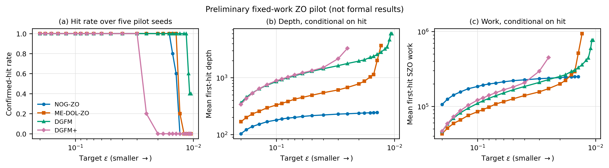
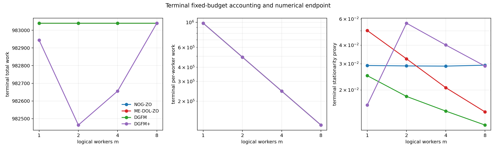
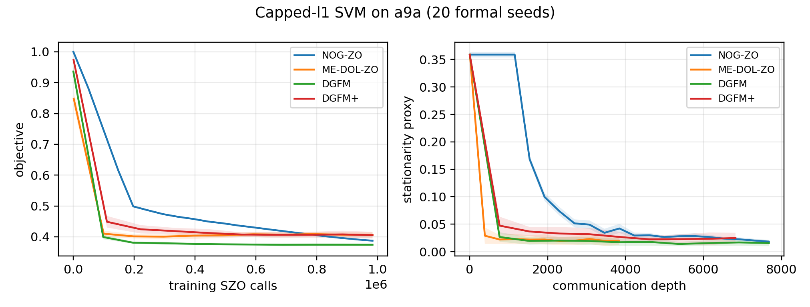
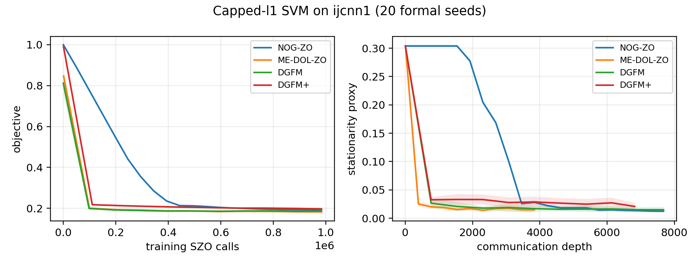

# ZO 全部实验设置、方法与结果汇总

> 更新时间：2026-08-13。本文件由已经审计的 CSV/JSON 自动生成，集中展示当前仓库中所有已完成的 ZO 实验。
> `depth` 表示通信依赖深度，不是 wall-clock 时间；`work` 表示训练阶段的 SZO function calls，评估 work 单独计数。
> 带 † 的均值只在命中的 seeds 上计算，属于右删失条件均值，不能与完整命中结果等价解释。

完整生成命令：

```bash
conda run -n NOG python scripts/generate_zo_all_results.py
```

## 1. 实验目标与理论参照

比较 NOG-ZO、ME-DOL-ZO、DGFM 和 DGFM+。比例方向统一为 `baseline/NOG-ZO`；比例大于 1 表示 baseline 消耗更多 depth 或 work。理论表只给出论文中的主阶，实验用于佐证有限样本趋势，不用于从数据反推定理。

| 方法 | communication depth | total SZO work |
|---|---|---|
| NOG-ZO | $\mathcal{O}(d^{1/3}\delta^{-1}\epsilon^{-5/3})$ | $\mathcal{O}(d\delta^{-1}\epsilon^{-3})$ |
| ME-DOL-ZO | $\mathcal{O}(d\delta^{-1}\epsilon^{-3})$ | $\mathcal{O}(d\delta^{-1}\epsilon^{-3})$ |
| DGFM | $\mathcal{O}(d^{3/2}\delta^{-1}\epsilon^{-4})$ | $\mathcal{O}(d^{3/2}\delta^{-1}\epsilon^{-4})$ |
| DGFM+ | $\mathcal{O}(d^{3/2}\delta^{-1}\epsilon^{-3})$ | $\mathcal{O}(d^{3/2}\delta^{-1}\epsilon^{-3})$ |

| 比例 | 理论 depth ratio | 理论 work ratio |
|---|---|---|
| ME-DOL-ZO/NOG-ZO | $d^{2/3}\epsilon^{-4/3}$ | $\epsilon^0$（常数阶） |
| DGFM/NOG-ZO | $d^{7/6}\epsilon^{-7/3}$ | $d^{1/2}\epsilon^{-1}$ |
| DGFM+/NOG-ZO | $d^{7/6}\epsilon^{-4/3}$ | $d^{1/2}\epsilon^0$（对 $\epsilon$ 为常数阶） |

## 2. 通用实现、计数与评估方法

| 项目 | 设置 |
|---|---|
| SZO estimator | 统一 two-point estimator；一个方向/数据样本对计 2 次 function calls |
| DGFM+ difference | 普通 variance-reduced difference 同时评估当前位置和上一位置，相应 work 被完整计入 |
| training/evaluation | training SZO work 与 evaluation work 分开记录 |
| 主合成问题 | 维度 $d=100$，8 个逻辑 workers，complete mixing graph |
| formal seeds | 0--19，共 20 个；四方法同 seed 配对 |
| formal work cap | 每个 method/seed 983,040 次训练 SZO calls |
| 评估 bank | 256 个平滑样本 × 512 个数据样本 |
| 评估间隔 | 每 4 个底层 depth 单位，并遵守方法自身有效 checkpoint 结构 |
| confirmed first hit | 连续两个 checkpoint 的方法无关 stationarity proxy 均不超过 $\epsilon$ |
| 主要终点 | 同 seed 的 baseline/NOG-ZO first-hit depth ratio |
| 不确定性 | 跨 20 个 paired formal seeds 的 bootstrap 95% CI |

这里的 stationarity proxy 是平滑目标的 Monte Carlo 梯度范数估计，不是精确 Goldstein subdifferential distance。

## 3. 参数选择与冻结

先使用与 formal seeds 不相交的 pilot/calibration seeds 搜索有限候选网格，再冻结参数、配置和输入哈希。formal seeds 只用于最终评估，不参与重新调参。

| 方法 | 主合成实验冻结参数 | 最终 depth 上限 | 最终 work 上限 |
|---|---|---|---|
| NOG-ZO | $M=2$, $\eta=0.01$, `smooth_B=8` | 960 | 983,040 |
| ME-DOL-ZO | `epoch_length=12`, `theory_multiplier=60` | 3,840 | 983,040 |
| DGFM | $\eta=0.05$ | 7,680 | 983,040 |
| DGFM+ | $\eta=0.05$ | 7,224 | 983,040 |



## 4. 主实验：$\epsilon$-scaling（Step ZO-5）

完整 $\epsilon$ 网格：`0.200, 0.180, 0.160, 0.140, 0.120, 0.100, 0.0900, 0.0800, 0.0700, 0.0600, 0.0500, 0.0400, 0.0300, 0.0250, 0.0200, 0.0180, 0.0160, 0.0150, 0.0140, 0.0130, 0.0120, 0.0115, 0.0110, 0.0107, 0.0105, 0.0103, 0.0100, 0.0095, 0.0090, 0.0080, 0.0070, 0.0060, 0.0050, 0.0040, 0.0030, 0.0020`。同一条 anytime trajectory 提取全部阈值，因此增加 $\epsilon$ 点本身不需要重新训练。

### 4.1 全部绝对 first-hit depth/work

单元格格式：`hits/20; mean depth; mean work`。部分命中或未命中用 † 标记。

| $\epsilon$ | NOG-ZO | ME-DOL-ZO | DGFM | DGFM+ |
|---|---|---|---|---|
| 0.200 | 20/20; 103.4; 105,881.6 | 20/20; 165.0; 42,240.0 | 20/20; 367.6; 47,052.8 | 20/20; 364.0; 49,856.0 |
| 0.180 | 20/20; 121.2; 124,108.8 | 20/20; 199.2; 50,995.2 | 20/20; 457.2; 58,521.6 | 20/20; 454.8; 62,169.6 |
| 0.160 | 20/20; 138.2; 141,516.8 | 20/20; 228.6; 58,521.6 | 20/20; 546.4; 69,939.2 | 20/20; 544.4; 74,368.0 |
| 0.140 | 20/20; 152.2; 155,852.8 | 20/20; 261.6; 66,969.6 | 20/20; 640.4; 81,971.2 | 20/20; 646.8; 88,358.4 |
| 0.120 | 20/20; 167.6; 171,622.4 | 20/20; 299.4; 76,646.4 | 20/20; 740.0; 94,720.0 | 20/20; 747.6; 101,990.4 |
| 0.100 | 20/20; 180.2; 184,524.8 | 20/20; 340.2; 87,091.2 | 20/20; 855.2; 109,465.6 | 20/20; 872.0; 118,950.4 |
| 0.0900 | 20/20; 187.8; 192,307.2 | 20/20; 363.6; 93,081.6 | 20/20; 922.8; 118,118.4 | 20/20; 947.2; 129,190.4 |
| 0.0800 | 20/20; 194.0; 198,656.0 | 20/20; 390.6; 99,993.6 | 20/20; 996.8; 127,590.4 | 20/20; 1,028.0; 140,185.6 |
| 0.0700 | 20/20; 200.4; 205,209.6 | 20/20; 420.0; 107,520.0 | 20/20; 1,080.0; 138,240.0 | 20/20; 1,131.6; 154,252.8 |
| 0.0600 | 20/20; 208.2; 213,196.8 | 20/20; 453.0; 115,968.0 | 20/20; 1,173.2; 150,169.6 | 20/20; 1,248.0; 169,996.8 |
| 0.0500 | 20/20; 214.4; 219,545.6 | 20/20; 496.2; 127,027.2 | 20/20; 1,296.0; 165,888.0 | 20/20; 1,410.0; 192,076.8 |
| 0.0400 | 20/20; 221.4; 226,713.6 | 20/20; 549.0; 140,544.0 | 20/20; 1,442.0; 184,576.0 | 20/20; 1,666.0; 226,918.4 |
| 0.0300 | 20/20; 229.2; 234,700.8 | 20/20; 622.8; 159,436.8 | 20/20; 1,652.4; 211,507.2 | 20/20; 2,609.6; 355,302.4 |
| 0.0250 | 20/20; 233.2; 238,796.8 | 20/20; 687.0; 175,872.0 | 20/20; 1,792.8; 229,478.4 | 1/20†; 3,088.0; 420,608.0 |
| 0.0200 | 20/20; 237.2; 242,892.8 | 20/20; 780.6; 199,833.6 | 20/20; 1,993.6; 255,180.8 | 0/20†; —; — |
| 0.0180 | 20/20; 240.2; 245,964.8 | 20/20; 852.0; 218,112.0 | 20/20; 2,111.6; 270,284.8 | 0/20†; —; — |
| 0.0160 | 18/20†; 242.0; 247,808.0 | 20/20; 991.8; 253,900.8 | 20/20; 2,270.0; 290,560.0 | 0/20†; —; — |
| 0.0150 | 11/20†; 244.0; 249,856.0 | 20/20; 1,247.4; 319,334.4 | 20/20; 2,392.8; 306,278.4 | 0/20†; —; — |
| 0.0140 | 1/20†; 244.0; 249,856.0 | 20/20; 1,860.0; 476,160.0 | 20/20; 2,523.6; 323,020.8 | 0/20†; —; — |
| 0.0130 | 0/20†; —; — | 12/20†; 2,270.0; 581,120.0 | 20/20; 2,697.2; 345,241.6 | 0/20†; —; — |
| 0.0120 | 0/20†; —; — | 1/20†; 3,720.0; 952,320.0 | 20/20; 3,236.4; 414,259.2 | 0/20†; —; — |
| 0.0115 | 0/20†; —; — | 0/20†; —; — | 20/20; 3,856.0; 493,568.0 | 0/20†; —; — |
| 0.0110 | 0/20†; —; — | 0/20†; —; — | 20/20; 4,770.4; 610,611.2 | 0/20†; —; — |
| 0.0107 | 0/20†; —; — | 0/20†; —; — | 16/20†; 4,857.0; 621,696.0 | 0/20†; —; — |
| 0.0105 | 0/20†; —; — | 0/20†; —; — | 10/20†; 5,504.0; 704,512.0 | 0/20†; —; — |
| 0.0103 | 0/20†; —; — | 0/20†; —; — | 4/20†; 5,790.0; 741,120.0 | 0/20†; —; — |
| 0.0100 | 0/20†; —; — | 0/20†; —; — | 0/20†; —; — | 0/20†; —; — |
| 0.0095 | 0/20†; —; — | 0/20†; —; — | 0/20†; —; — | 0/20†; —; — |
| 0.0090 | 0/20†; —; — | 0/20†; —; — | 0/20†; —; — | 0/20†; —; — |
| 0.0080 | 0/20†; —; — | 0/20†; —; — | 0/20†; —; — | 0/20†; —; — |
| 0.0070 | 0/20†; —; — | 0/20†; —; — | 0/20†; —; — | 0/20†; —; — |
| 0.0060 | 0/20†; —; — | 0/20†; —; — | 0/20†; —; — | 0/20†; —; — |
| 0.0050 | 0/20†; —; — | 0/20†; —; — | 0/20†; —; — | 0/20†; —; — |
| 0.0040 | 0/20†; —; — | 0/20†; —; — | 0/20†; —; — | 0/20†; —; — |
| 0.0030 | 0/20†; —; — | 0/20†; —; — | 0/20†; —; — | 0/20†; —; — |
| 0.0020 | 0/20†; —; — | 0/20†; —; — | 0/20†; —; — | 0/20†; —; — |


### 4.2 全部 baseline/NOG-ZO depth/work ratios

ratio 先在相同 seed 内计算，再对 paired seeds 求均值。只有 `complete` 行可用于无删失趋势拟合。

#### ME-DOL-ZO/NOG-ZO

| $\epsilon$ | paired hits | depth ratio [95% CI] | work ratio [95% CI] | 状态 |
|---|---|---|---|---|
| 0.200 | 20/20 | 1.596 [1.569, 1.621] | 0.399 [0.393, 0.406] | complete |
| 0.180 | 20/20 | 1.644 [1.619, 1.669] | 0.411 [0.405, 0.417] | complete |
| 0.160 | 20/20 | 1.654 [1.627, 1.681] | 0.414 [0.407, 0.420] | complete |
| 0.140 | 20/20 | 1.719 [1.695, 1.741] | 0.430 [0.424, 0.435] | complete |
| 0.120 | 20/20 | 1.786 [1.766, 1.806] | 0.447 [0.442, 0.451] | complete |
| 0.100 | 20/20 | 1.888 [1.868, 1.907] | 0.472 [0.467, 0.477] | complete |
| 0.0900 | 20/20 | 1.936 [1.915, 1.956] | 0.484 [0.479, 0.489] | complete |
| 0.0800 | 20/20 | 2.014 [1.986, 2.041] | 0.503 [0.496, 0.510] | complete |
| 0.0700 | 20/20 | 2.096 [2.068, 2.121] | 0.524 [0.517, 0.530] | complete |
| 0.0600 | 20/20 | 2.176 [2.147, 2.204] | 0.544 [0.537, 0.551] | complete |
| 0.0500 | 20/20 | 2.314 [2.284, 2.346] | 0.579 [0.571, 0.586] | complete |
| 0.0400 | 20/20 | 2.480 [2.444, 2.517] | 0.620 [0.611, 0.629] | complete |
| 0.0300 | 20/20 | 2.717 [2.668, 2.762] | 0.679 [0.667, 0.691] | complete |
| 0.0250 | 20/20 | 2.946 [2.889, 3.005] | 0.736 [0.722, 0.752] | complete |
| 0.0200 | 20/20 | 3.291 [3.207, 3.370] | 0.823 [0.801, 0.844] | complete |
| 0.0180 | 20/20 | 3.547 [3.449, 3.654] | 0.887 [0.863, 0.912] | complete |
| 0.0160 | 18/20 | 4.153 [3.929, 4.393] | 1.038 [0.979, 1.096] | censored† |
| 0.0150 | 11/20 | 5.632 [4.878, 6.600] | 1.408 [1.226, 1.642] | censored† |
| 0.0140 | 1/20 | 4.623 [4.623, 4.623] | 1.156 [1.156, 1.156] | censored† |
| 0.0130 | 0/20 | — | — | censored† |
| 0.0120 | 0/20 | — | — | censored† |
| 0.0115 | 0/20 | — | — | censored† |
| 0.0110 | 0/20 | — | — | censored† |
| 0.0107 | 0/20 | — | — | censored† |
| 0.0105 | 0/20 | — | — | censored† |
| 0.0103 | 0/20 | — | — | censored† |
| 0.0100 | 0/20 | — | — | censored† |
| 0.0095 | 0/20 | — | — | censored† |
| 0.0090 | 0/20 | — | — | censored† |
| 0.0080 | 0/20 | — | — | censored† |
| 0.0070 | 0/20 | — | — | censored† |
| 0.0060 | 0/20 | — | — | censored† |
| 0.0050 | 0/20 | — | — | censored† |
| 0.0040 | 0/20 | — | — | censored† |
| 0.0030 | 0/20 | — | — | censored† |
| 0.0020 | 0/20 | — | — | censored† |

#### DGFM/NOG-ZO

| $\epsilon$ | paired hits | depth ratio [95% CI] | work ratio [95% CI] | 状态 |
|---|---|---|---|---|
| 0.200 | 20/20 | 3.556 [3.511, 3.602] | 0.444 [0.439, 0.450] | complete |
| 0.180 | 20/20 | 3.773 [3.734, 3.806] | 0.472 [0.467, 0.476] | complete |
| 0.160 | 20/20 | 3.954 [3.919, 3.991] | 0.494 [0.490, 0.499] | complete |
| 0.140 | 20/20 | 4.207 [4.168, 4.247] | 0.526 [0.521, 0.531] | complete |
| 0.120 | 20/20 | 4.415 [4.374, 4.453] | 0.552 [0.547, 0.556] | complete |
| 0.100 | 20/20 | 4.746 [4.713, 4.779] | 0.593 [0.589, 0.597] | complete |
| 0.0900 | 20/20 | 4.914 [4.869, 4.959] | 0.614 [0.608, 0.620] | complete |
| 0.0800 | 20/20 | 5.138 [5.101, 5.174] | 0.642 [0.638, 0.647] | complete |
| 0.0700 | 20/20 | 5.389 [5.350, 5.428] | 0.674 [0.669, 0.678] | complete |
| 0.0600 | 20/20 | 5.635 [5.589, 5.685] | 0.704 [0.698, 0.710] | complete |
| 0.0500 | 20/20 | 6.045 [5.995, 6.091] | 0.756 [0.750, 0.761] | complete |
| 0.0400 | 20/20 | 6.513 [6.457, 6.570] | 0.814 [0.807, 0.821] | complete |
| 0.0300 | 20/20 | 7.210 [7.120, 7.300] | 0.901 [0.890, 0.913] | complete |
| 0.0250 | 20/20 | 7.688 [7.590, 7.787] | 0.961 [0.949, 0.973] | complete |
| 0.0200 | 20/20 | 8.404 [8.264, 8.531] | 1.051 [1.034, 1.067] | complete |
| 0.0180 | 20/20 | 8.791 [8.627, 8.957] | 1.099 [1.078, 1.119] | complete |
| 0.0160 | 18/20 | 9.389 [9.189, 9.591] | 1.174 [1.150, 1.198] | censored† |
| 0.0150 | 11/20 | 9.853 [9.585, 10.157] | 1.232 [1.198, 1.270] | censored† |
| 0.0140 | 1/20 | 11.279 [11.279, 11.279] | 1.410 [1.410, 1.410] | censored† |
| 0.0130 | 0/20 | — | — | censored† |
| 0.0120 | 0/20 | — | — | censored† |
| 0.0115 | 0/20 | — | — | censored† |
| 0.0110 | 0/20 | — | — | censored† |
| 0.0107 | 0/20 | — | — | censored† |
| 0.0105 | 0/20 | — | — | censored† |
| 0.0103 | 0/20 | — | — | censored† |
| 0.0100 | 0/20 | — | — | censored† |
| 0.0095 | 0/20 | — | — | censored† |
| 0.0090 | 0/20 | — | — | censored† |
| 0.0080 | 0/20 | — | — | censored† |
| 0.0070 | 0/20 | — | — | censored† |
| 0.0060 | 0/20 | — | — | censored† |
| 0.0050 | 0/20 | — | — | censored† |
| 0.0040 | 0/20 | — | — | censored† |
| 0.0030 | 0/20 | — | — | censored† |
| 0.0020 | 0/20 | — | — | censored† |

#### DGFM+/NOG-ZO

| $\epsilon$ | paired hits | depth ratio [95% CI] | work ratio [95% CI] | 状态 |
|---|---|---|---|---|
| 0.200 | 20/20 | 3.520 [3.392, 3.650] | 0.471 [0.453, 0.487] | complete |
| 0.180 | 20/20 | 3.753 [3.622, 3.880] | 0.501 [0.484, 0.518] | complete |
| 0.160 | 20/20 | 3.940 [3.821, 4.063] | 0.526 [0.510, 0.542] | complete |
| 0.140 | 20/20 | 4.249 [4.136, 4.365] | 0.567 [0.554, 0.582] | complete |
| 0.120 | 20/20 | 4.461 [4.356, 4.566] | 0.594 [0.580, 0.608] | complete |
| 0.100 | 20/20 | 4.839 [4.719, 4.954] | 0.645 [0.629, 0.661] | complete |
| 0.0900 | 20/20 | 5.044 [4.931, 5.166] | 0.672 [0.657, 0.688] | complete |
| 0.0800 | 20/20 | 5.297 [5.174, 5.421] | 0.705 [0.690, 0.723] | complete |
| 0.0700 | 20/20 | 5.646 [5.494, 5.806] | 0.752 [0.730, 0.771] | complete |
| 0.0600 | 20/20 | 5.994 [5.842, 6.151] | 0.797 [0.777, 0.817] | complete |
| 0.0500 | 20/20 | 6.575 [6.366, 6.792] | 0.875 [0.848, 0.903] | complete |
| 0.0400 | 20/20 | 7.523 [7.256, 7.770] | 1.001 [0.966, 1.033] | complete |
| 0.0300 | 20/20 | 11.387 [10.372, 12.461] | 1.514 [1.378, 1.660] | complete |
| 0.0250 | 1/20 | 13.310 [13.310, 13.310] | 1.770 [1.770, 1.770] | censored† |
| 0.0200 | 0/20 | — | — | censored† |
| 0.0180 | 0/20 | — | — | censored† |
| 0.0160 | 0/20 | — | — | censored† |
| 0.0150 | 0/20 | — | — | censored† |
| 0.0140 | 0/20 | — | — | censored† |
| 0.0130 | 0/20 | — | — | censored† |
| 0.0120 | 0/20 | — | — | censored† |
| 0.0115 | 0/20 | — | — | censored† |
| 0.0110 | 0/20 | — | — | censored† |
| 0.0107 | 0/20 | — | — | censored† |
| 0.0105 | 0/20 | — | — | censored† |
| 0.0103 | 0/20 | — | — | censored† |
| 0.0100 | 0/20 | — | — | censored† |
| 0.0095 | 0/20 | — | — | censored† |
| 0.0090 | 0/20 | — | — | censored† |
| 0.0080 | 0/20 | — | — | censored† |
| 0.0070 | 0/20 | — | — | censored† |
| 0.0060 | 0/20 | — | — | censored† |
| 0.0050 | 0/20 | — | — | censored† |
| 0.0040 | 0/20 | — | — | censored† |
| 0.0030 | 0/20 | — | — | censored† |
| 0.0020 | 0/20 | — | — | censored† |


### 4.3 完整配对区间的趋势与理论对照

| baseline | 完整 $\epsilon$ 区间 | 点数 | depth ratio 首→尾 | depth slope [95% CI] | Spearman | work ratio 首→尾 | work slope [95% CI] |
|---|---|---|---|---|---|---|---|
| ME-DOL-ZO | 0.200→0.0180 | 16 | 1.596→3.547 | 0.319 [0.308, 0.331] | 1.000 | 0.399→0.887 | 0.319 [0.307, 0.330] |
| DGFM | 0.200→0.0180 | 16 | 3.556→8.791 | 0.363 [0.357, 0.369] | 1.000 | 0.444→1.099 | 0.363 [0.357, 0.369] |
| DGFM+ | 0.200→0.0300 | 13 | 3.520→11.387 | 0.529 [0.496, 0.561] | 1.000 | 0.471→1.514 | 0.527 [0.492, 0.559] |

结论：三条 depth ratio 曲线在完整配对区间内均随 $\epsilon$ 减小单调增加，定性支持 NOG-ZO 更优的 $\epsilon$-depth 依赖；有限样本斜率没有恢复理论精确指数。ME-DOL-ZO 和 DGFM+ 的实测 work ratio 也增加，因此不能声称其已恢复理论常数阶 work ratio。

## 5. 低 $\epsilon$、删失与反弹诊断（Step ZO-6）

| 方法 | mean raw floor | mean confirmed floor | median floor work 位置 | final/floor | 预算扩展判断 |
|---|---|---|---|---|---|
| NOG-ZO | 0.01435 | 0.01493 | 25.4% | 1.973 | extension_unlikely_without_stability_change |
| ME-DOL-ZO | 0.01261 | 0.01271 | 73.0% | 1.122 | extension_plausible_but_unproven |
| DGFM | 0.01041 | 0.01051 | 79.4% | 1.105 | extension_plausible_but_unproven |
| DGFM+ | 0.02674 | 0.02676 | 76.7% | 1.083 | extension_plausible_but_unproven |

NOG-ZO 的 confirmed floor 通常在约四分之一预算处出现，随后 proxy 反弹；因此继续增加同一冻结配置的预算不太可能解决 $\epsilon$ 更小处的 non-hit。reserved anomaly seeds 200--204 独立复现了这一模式。

| 方法 | formal floor | reserved-seed floor | early rebound formal/anomaly | 模式复现 | 决策 |
|---|---|---|---|---|---|
| NOG-ZO | 0.01493 | 0.01463 | 100% / 100% | True | do_not_extend_same_frozen_configuration |
| ME-DOL-ZO | 0.01271 | 0.01293 | 0% / 0% | True | no_extension_needed_for_current_paper_claim |
| DGFM | 0.01051 | 0.01040 | 0% / 0% | True | no_extension_needed_for_current_paper_claim |
| DGFM+ | 0.02676 | 0.02648 | 0% / 0% | True | no_extension_needed_for_current_paper_claim |


## 6. Dimension sensitivity（Step ZO-7）

固定 $d=100$ 时选出的参数，不针对每个维度重新调参。测试 $d\in\{25,50,100,200\}$，四方法 × 20 seeds，共 320/320 tasks；每个任务 work cap 983,040，workers=8。

### 6.1 全部 dimension absolute results

单元格格式：`hits/20; conditional mean depth; conditional mean work`。

| $d$ | $\epsilon$ | scope | NOG-ZO | ME-DOL-ZO | DGFM | DGFM+ |
|---|---|---|---|---|---|---|
| 25 | 0.0500 | primary | 20/20; 148.2; 151,756.8 | 20/20; 342.6; 87,705.6 | 20/20; 936.8; 119,910.4 | 20/20; 1,050.0; 143,078.4 |
| 25 | 0.0300 | primary | 20/20; 159.4; 163,225.6 | 20/20; 438.6; 112,281.6 | 20/20; 1,205.2; 154,265.6 | 20/20; 1,730.8; 235,712.0 |
| 25 | 0.0200 | descriptive | 20/20; 164.6; 168,550.4 | 20/20; 547.8; 140,236.8 | 20/20; 1,432.0; 183,296.0 | 8/20†; 3,768.0; 512,928.0 |
| 25 | 0.0180 | descriptive | 20/20; 166.2; 170,188.8 | 20/20; 582.0; 148,992.0 | 20/20; 1,502.4; 192,307.2 | 1/20†; 4,904.0; 667,648.0 |
| 25 | 0.0160 | descriptive | 19/20†; 167.6; 171,600.8 | 20/20; 646.8; 165,580.8 | 20/20; 1,594.8; 204,134.4 | 0/20†; —; — |
| 25 | 0.0150 | descriptive | 18/20†; 168.4; 172,487.1 | 20/20; 690.6; 176,793.6 | 20/20; 1,649.2; 211,097.6 | 0/20†; —; — |
| 25 | 0.0100 | descriptive | 0/20†; —; — | 17/20†; 1,786.6; 457,366.6 | 20/20; 2,071.6; 265,164.8 | 0/20†; —; — |
| 50 | 0.0500 | primary | 20/20; 182.2; 186,572.8 | 20/20; 418.2; 107,059.2 | 20/20; 1,156.8; 148,070.4 | 20/20; 1,238.8; 168,896.0 |
| 50 | 0.0300 | primary | 20/20; 194.8; 199,475.2 | 20/20; 543.0; 139,008.0 | 20/20; 1,480.8; 189,542.4 | 20/20; 1,893.2; 257,804.8 |
| 50 | 0.0200 | descriptive | 20/20; 201.8; 206,643.2 | 20/20; 665.4; 170,342.4 | 20/20; 1,773.2; 226,969.6 | 0/20†; —; — |
| 50 | 0.0180 | descriptive | 20/20; 203.4; 208,281.6 | 20/20; 709.2; 181,555.2 | 20/20; 1,884.0; 241,152.0 | 0/20†; —; — |
| 50 | 0.0160 | descriptive | 19/20†; 205.3; 210,189.5 | 20/20; 776.4; 198,758.4 | 20/20; 2,001.6; 256,204.8 | 0/20†; —; — |
| 50 | 0.0150 | descriptive | 18/20†; 206.7; 211,626.7 | 20/20; 870.0; 222,720.0 | 20/20; 2,072.8; 265,318.4 | 0/20†; —; — |
| 50 | 0.0100 | descriptive | 0/20†; —; — | 0/20†; —; — | 20/20; 3,412.8; 436,838.4 | 0/20†; —; — |
| 100 | 0.0500 | primary | 20/20; 214.4; 219,545.6 | 20/20; 496.2; 127,027.2 | 20/20; 1,296.0; 165,888.0 | 20/20; 1,410.0; 192,076.8 |
| 100 | 0.0300 | primary | 20/20; 229.2; 234,700.8 | 20/20; 622.8; 159,436.8 | 20/20; 1,652.4; 211,507.2 | 20/20; 2,609.6; 355,302.4 |
| 100 | 0.0200 | descriptive | 20/20; 237.2; 242,892.8 | 20/20; 780.6; 199,833.6 | 20/20; 1,993.6; 255,180.8 | 0/20†; —; — |
| 100 | 0.0180 | descriptive | 20/20; 240.2; 245,964.8 | 20/20; 852.0; 218,112.0 | 20/20; 2,111.6; 270,284.8 | 0/20†; —; — |
| 100 | 0.0160 | descriptive | 18/20†; 242.0; 247,808.0 | 20/20; 991.8; 253,900.8 | 20/20; 2,270.0; 290,560.0 | 0/20†; —; — |
| 100 | 0.0150 | descriptive | 11/20†; 244.0; 249,856.0 | 20/20; 1,247.4; 319,334.4 | 20/20; 2,392.8; 306,278.4 | 0/20†; —; — |
| 100 | 0.0100 | descriptive | 0/20†; —; — | 0/20†; —; — | 0/20†; —; — | 0/20†; —; — |
| 200 | 0.0500 | primary | 20/20; 250.0; 256,000.0 | 20/20; 644.4; 164,966.4 | 20/20; 1,388.8; 177,766.4 | 20/20; 1,529.2; 208,332.8 |
| 200 | 0.0300 | primary | 20/20; 266.0; 272,384.0 | 20/20; 784.8; 200,908.8 | 20/20; 1,774.0; 227,072.0 | 20/20; 2,604.8; 354,649.6 |
| 200 | 0.0200 | descriptive | 20/20; 276.6; 283,238.4 | 20/20; 975.6; 249,753.6 | 20/20; 2,198.4; 281,395.2 | 0/20†; —; — |
| 200 | 0.0180 | descriptive | 19/20†; 279.8; 286,504.4 | 20/20; 1,089.0; 278,784.0 | 20/20; 2,376.8; 304,230.4 | 0/20†; —; — |
| 200 | 0.0160 | descriptive | 0/20†; —; — | 19/20†; 1,994.5; 510,598.7 | 20/20; 2,736.0; 350,208.0 | 0/20†; —; — |
| 200 | 0.0150 | descriptive | 0/20†; —; — | 5/20†; 3,403.2; 871,219.2 | 20/20; 3,200.0; 409,600.0 | 0/20†; —; — |
| 200 | 0.0100 | descriptive | 0/20†; —; — | 0/20†; —; — | 0/20†; —; — | 0/20†; —; — |


### 6.2 Primary dimension paired ratios

| $d$ | $\epsilon$ | baseline | paired hits | depth ratio [95% CI] | work ratio [95% CI] |
|---|---|---|---|---|---|
| 25 | 0.0500 | ME-DOL-ZO | 20/20 | 2.312 [2.269, 2.358] | 0.578 [0.566, 0.589] |
| 25 | 0.0300 | ME-DOL-ZO | 20/20 | 2.752 [2.698, 2.800] | 0.688 [0.675, 0.700] |
| 25 | 0.0500 | DGFM | 20/20 | 6.321 [6.214, 6.435] | 0.790 [0.777, 0.805] |
| 25 | 0.0300 | DGFM | 20/20 | 7.561 [7.427, 7.706] | 0.945 [0.928, 0.963] |
| 25 | 0.0500 | DGFM+ | 20/20 | 7.085 [6.809, 7.381] | 0.943 [0.906, 0.979] |
| 25 | 0.0300 | DGFM+ | 20/20 | 10.857 [9.846, 12.128] | 1.444 [1.308, 1.622] |
| 50 | 0.0500 | ME-DOL-ZO | 20/20 | 2.295 [2.269, 2.323] | 0.574 [0.567, 0.581] |
| 50 | 0.0300 | ME-DOL-ZO | 20/20 | 2.788 [2.730, 2.852] | 0.697 [0.682, 0.713] |
| 50 | 0.0500 | DGFM | 20/20 | 6.350 [6.276, 6.418] | 0.794 [0.785, 0.802] |
| 50 | 0.0300 | DGFM | 20/20 | 7.602 [7.476, 7.727] | 0.950 [0.934, 0.965] |
| 50 | 0.0500 | DGFM+ | 20/20 | 6.799 [6.540, 7.057] | 0.905 [0.872, 0.940] |
| 50 | 0.0300 | DGFM+ | 20/20 | 9.724 [9.162, 10.287] | 1.293 [1.219, 1.371] |
| 100 | 0.0500 | ME-DOL-ZO | 20/20 | 2.314 [2.284, 2.345] | 0.579 [0.571, 0.587] |
| 100 | 0.0300 | ME-DOL-ZO | 20/20 | 2.717 [2.667, 2.765] | 0.679 [0.667, 0.691] |
| 100 | 0.0500 | DGFM | 20/20 | 6.045 [5.995, 6.089] | 0.756 [0.750, 0.762] |
| 100 | 0.0300 | DGFM | 20/20 | 7.210 [7.118, 7.306] | 0.901 [0.890, 0.914] |
| 100 | 0.0500 | DGFM+ | 20/20 | 6.575 [6.382, 6.778] | 0.875 [0.848, 0.904] |
| 100 | 0.0300 | DGFM+ | 20/20 | 11.387 [10.321, 12.532] | 1.514 [1.372, 1.660] |
| 200 | 0.0500 | ME-DOL-ZO | 20/20 | 2.578 [2.550, 2.606] | 0.644 [0.637, 0.652] |
| 200 | 0.0300 | ME-DOL-ZO | 20/20 | 2.950 [2.916, 2.984] | 0.738 [0.730, 0.746] |
| 200 | 0.0500 | DGFM | 20/20 | 5.555 [5.499, 5.612] | 0.694 [0.688, 0.702] |
| 200 | 0.0300 | DGFM | 20/20 | 6.669 [6.589, 6.758] | 0.834 [0.823, 0.844] |
| 200 | 0.0500 | DGFM+ | 20/20 | 6.117 [6.002, 6.234] | 0.814 [0.798, 0.829] |
| 200 | 0.0300 | DGFM+ | 20/20 | 9.789 [9.250, 10.414] | 1.302 [1.234, 1.383] |


### 6.3 Dimension slope

| baseline | $\epsilon$ | depth slope [95% CI] | 理论 | work slope [95% CI] | 理论 |
|---|---|---|---|---|---|
| ME-DOL-ZO | 0.0500 | 0.048 [0.037, 0.060] | 0.667 | 0.048 [0.037, 0.059] | 0.000 |
| ME-DOL-ZO | 0.0300 | 0.026 [0.016, 0.037] | 0.667 | 0.026 [0.016, 0.038] | 0.000 |
| DGFM | 0.0500 | -0.063 [-0.072, -0.054] | 1.167 | -0.063 [-0.071, -0.054] | 0.500 |
| DGFM | 0.0300 | -0.062 [-0.071, -0.052] | 1.167 | -0.062 [-0.072, -0.052] | 0.500 |
| DGFM+ | 0.0500 | -0.068 [-0.085, -0.052] | 1.167 | -0.069 [-0.085, -0.052] | 0.500 |
| DGFM+ | 0.0300 | -0.022 [-0.081, 0.033] | 1.167 | -0.022 [-0.082, 0.034] | 0.500 |

结论：两个 primary $\epsilon$ 在所有维度和方法上均 20/20 hits，且 NOG-ZO 始终具有更低 first-hit depth；但 6 个 depth slope 中只有 2 个置信区间严格大于 0，没有一个包含对应理论参考幂次。因此只能报告固定配置 dimension sensitivity，不能声称验证精确维度指数。

### 6.4 全部 dimension paired ratios（含 descriptive/censored）

<details>
<summary>展开 84 行完整 dimension ratio 表</summary>

| $d$ | $\epsilon$ | scope | baseline | paired hits | depth ratio [95% CI] | work ratio [95% CI] | 状态 |
|---|---|---|---|---|---|---|---|
| 25 | 0.0500 | primary | ME-DOL-ZO | 20/20 | 2.312 [2.269, 2.358] | 0.578 [0.566, 0.589] | complete |
| 25 | 0.0300 | primary | ME-DOL-ZO | 20/20 | 2.752 [2.698, 2.800] | 0.688 [0.675, 0.700] | complete |
| 25 | 0.0200 | descriptive | ME-DOL-ZO | 20/20 | 3.328 [3.201, 3.478] | 0.832 [0.799, 0.867] | complete |
| 25 | 0.0180 | descriptive | ME-DOL-ZO | 20/20 | 3.502 [3.365, 3.654] | 0.876 [0.841, 0.911] | complete |
| 25 | 0.0160 | descriptive | ME-DOL-ZO | 19/20 | 3.825 [3.621, 4.046] | 0.956 [0.900, 1.014] | censored† |
| 25 | 0.0150 | descriptive | ME-DOL-ZO | 18/20 | 4.018 [3.681, 4.447] | 1.005 [0.919, 1.113] | censored† |
| 25 | 0.0100 | descriptive | ME-DOL-ZO | 0/20 | — | — | censored† |
| 25 | 0.0500 | primary | DGFM | 20/20 | 6.321 [6.214, 6.435] | 0.790 [0.777, 0.805] | complete |
| 25 | 0.0300 | primary | DGFM | 20/20 | 7.561 [7.427, 7.706] | 0.945 [0.928, 0.963] | complete |
| 25 | 0.0200 | descriptive | DGFM | 20/20 | 8.700 [8.513, 8.876] | 1.087 [1.065, 1.110] | complete |
| 25 | 0.0180 | descriptive | DGFM | 20/20 | 9.041 [8.819, 9.265] | 1.130 [1.102, 1.159] | complete |
| 25 | 0.0160 | descriptive | DGFM | 19/20 | 9.565 [9.256, 9.864] | 1.196 [1.157, 1.234] | censored† |
| 25 | 0.0150 | descriptive | DGFM | 18/20 | 9.848 [9.507, 10.165] | 1.231 [1.189, 1.270] | censored† |
| 25 | 0.0100 | descriptive | DGFM | 0/20 | — | — | censored† |
| 25 | 0.0500 | primary | DGFM+ | 20/20 | 7.085 [6.809, 7.381] | 0.943 [0.906, 0.979] | complete |
| 25 | 0.0300 | primary | DGFM+ | 20/20 | 10.857 [9.846, 12.128] | 1.444 [1.308, 1.622] | complete |
| 25 | 0.0200 | descriptive | DGFM+ | 8/20 | 22.895 [15.121, 31.659] | 3.044 [1.981, 4.201] | censored† |
| 25 | 0.0180 | descriptive | DGFM+ | 1/20 | 29.190 [29.190, 29.190] | 3.881 [3.881, 3.881] | censored† |
| 25 | 0.0160 | descriptive | DGFM+ | 0/20 | — | — | censored† |
| 25 | 0.0150 | descriptive | DGFM+ | 0/20 | — | — | censored† |
| 25 | 0.0100 | descriptive | DGFM+ | 0/20 | — | — | censored† |
| 50 | 0.0500 | primary | ME-DOL-ZO | 20/20 | 2.295 [2.269, 2.323] | 0.574 [0.567, 0.581] | complete |
| 50 | 0.0300 | primary | ME-DOL-ZO | 20/20 | 2.788 [2.730, 2.852] | 0.697 [0.682, 0.713] | complete |
| 50 | 0.0200 | descriptive | ME-DOL-ZO | 20/20 | 3.298 [3.205, 3.391] | 0.824 [0.802, 0.847] | complete |
| 50 | 0.0180 | descriptive | ME-DOL-ZO | 20/20 | 3.487 [3.369, 3.607] | 0.872 [0.843, 0.900] | complete |
| 50 | 0.0160 | descriptive | ME-DOL-ZO | 19/20 | 3.799 [3.613, 3.991] | 0.950 [0.900, 0.998] | censored† |
| 50 | 0.0150 | descriptive | ME-DOL-ZO | 18/20 | 4.211 [3.910, 4.550] | 1.053 [0.978, 1.131] | censored† |
| 50 | 0.0100 | descriptive | ME-DOL-ZO | 0/20 | — | — | censored† |
| 50 | 0.0500 | primary | DGFM | 20/20 | 6.350 [6.276, 6.418] | 0.794 [0.785, 0.802] | complete |
| 50 | 0.0300 | primary | DGFM | 20/20 | 7.602 [7.476, 7.727] | 0.950 [0.934, 0.965] | complete |
| 50 | 0.0200 | descriptive | DGFM | 20/20 | 8.787 [8.618, 8.948] | 1.098 [1.078, 1.120] | complete |
| 50 | 0.0180 | descriptive | DGFM | 20/20 | 9.261 [9.044, 9.484] | 1.158 [1.130, 1.186] | complete |
| 50 | 0.0160 | descriptive | DGFM | 19/20 | 9.757 [9.485, 10.079] | 1.220 [1.185, 1.258] | censored† |
| 50 | 0.0150 | descriptive | DGFM | 18/20 | 9.975 [9.665, 10.298] | 1.247 [1.209, 1.288] | censored† |
| 50 | 0.0100 | descriptive | DGFM | 0/20 | — | — | censored† |
| 50 | 0.0500 | primary | DGFM+ | 20/20 | 6.799 [6.540, 7.057] | 0.905 [0.872, 0.940] | complete |
| 50 | 0.0300 | primary | DGFM+ | 20/20 | 9.724 [9.162, 10.287] | 1.293 [1.219, 1.371] | complete |
| 50 | 0.0200 | descriptive | DGFM+ | 0/20 | — | — | censored† |
| 50 | 0.0180 | descriptive | DGFM+ | 0/20 | — | — | censored† |
| 50 | 0.0160 | descriptive | DGFM+ | 0/20 | — | — | censored† |
| 50 | 0.0150 | descriptive | DGFM+ | 0/20 | — | — | censored† |
| 50 | 0.0100 | descriptive | DGFM+ | 0/20 | — | — | censored† |
| 100 | 0.0500 | primary | ME-DOL-ZO | 20/20 | 2.314 [2.284, 2.345] | 0.579 [0.571, 0.587] | complete |
| 100 | 0.0300 | primary | ME-DOL-ZO | 20/20 | 2.717 [2.667, 2.765] | 0.679 [0.667, 0.691] | complete |
| 100 | 0.0200 | descriptive | ME-DOL-ZO | 20/20 | 3.291 [3.206, 3.375] | 0.823 [0.801, 0.845] | complete |
| 100 | 0.0180 | descriptive | ME-DOL-ZO | 20/20 | 3.547 [3.450, 3.651] | 0.887 [0.862, 0.913] | complete |
| 100 | 0.0160 | descriptive | ME-DOL-ZO | 18/20 | 4.153 [3.921, 4.392] | 1.038 [0.983, 1.097] | censored† |
| 100 | 0.0150 | descriptive | ME-DOL-ZO | 11/20 | 5.632 [4.873, 6.552] | 1.408 [1.216, 1.631] | censored† |
| 100 | 0.0100 | descriptive | ME-DOL-ZO | 0/20 | — | — | censored† |
| 100 | 0.0500 | primary | DGFM | 20/20 | 6.045 [5.995, 6.089] | 0.756 [0.750, 0.762] | complete |
| 100 | 0.0300 | primary | DGFM | 20/20 | 7.210 [7.118, 7.306] | 0.901 [0.890, 0.914] | complete |
| 100 | 0.0200 | descriptive | DGFM | 20/20 | 8.404 [8.271, 8.533] | 1.051 [1.034, 1.067] | complete |
| 100 | 0.0180 | descriptive | DGFM | 20/20 | 8.791 [8.615, 8.959] | 1.099 [1.078, 1.119] | complete |
| 100 | 0.0160 | descriptive | DGFM | 18/20 | 9.389 [9.176, 9.596] | 1.174 [1.149, 1.201] | censored† |
| 100 | 0.0150 | descriptive | DGFM | 11/20 | 9.853 [9.567, 10.163] | 1.232 [1.197, 1.268] | censored† |
| 100 | 0.0100 | descriptive | DGFM | 0/20 | — | — | censored† |
| 100 | 0.0500 | primary | DGFM+ | 20/20 | 6.575 [6.382, 6.778] | 0.875 [0.848, 0.904] | complete |
| 100 | 0.0300 | primary | DGFM+ | 20/20 | 11.387 [10.321, 12.532] | 1.514 [1.372, 1.660] | complete |
| 100 | 0.0200 | descriptive | DGFM+ | 0/20 | — | — | censored† |
| 100 | 0.0180 | descriptive | DGFM+ | 0/20 | — | — | censored† |
| 100 | 0.0160 | descriptive | DGFM+ | 0/20 | — | — | censored† |
| 100 | 0.0150 | descriptive | DGFM+ | 0/20 | — | — | censored† |
| 100 | 0.0100 | descriptive | DGFM+ | 0/20 | — | — | censored† |
| 200 | 0.0500 | primary | ME-DOL-ZO | 20/20 | 2.578 [2.550, 2.606] | 0.644 [0.637, 0.652] | complete |
| 200 | 0.0300 | primary | ME-DOL-ZO | 20/20 | 2.950 [2.916, 2.984] | 0.738 [0.730, 0.746] | complete |
| 200 | 0.0200 | descriptive | ME-DOL-ZO | 20/20 | 3.527 [3.466, 3.586] | 0.882 [0.867, 0.896] | complete |
| 200 | 0.0180 | descriptive | ME-DOL-ZO | 19/20 | 3.892 [3.773, 4.034] | 0.973 [0.943, 1.009] | censored† |
| 200 | 0.0160 | descriptive | ME-DOL-ZO | 0/20 | — | — | censored† |
| 200 | 0.0150 | descriptive | ME-DOL-ZO | 0/20 | — | — | censored† |
| 200 | 0.0100 | descriptive | ME-DOL-ZO | 0/20 | — | — | censored† |
| 200 | 0.0500 | primary | DGFM | 20/20 | 5.555 [5.499, 5.612] | 0.694 [0.688, 0.702] | complete |
| 200 | 0.0300 | primary | DGFM | 20/20 | 6.669 [6.589, 6.758] | 0.834 [0.823, 0.844] | complete |
| 200 | 0.0200 | descriptive | DGFM | 20/20 | 7.947 [7.816, 8.090] | 0.993 [0.977, 1.010] | complete |
| 200 | 0.0180 | descriptive | DGFM | 19/20 | 8.481 [8.313, 8.652] | 1.060 [1.040, 1.080] | censored† |
| 200 | 0.0160 | descriptive | DGFM | 0/20 | — | — | censored† |
| 200 | 0.0150 | descriptive | DGFM | 0/20 | — | — | censored† |
| 200 | 0.0100 | descriptive | DGFM | 0/20 | — | — | censored† |
| 200 | 0.0500 | primary | DGFM+ | 20/20 | 6.117 [6.002, 6.234] | 0.814 [0.798, 0.829] | complete |
| 200 | 0.0300 | primary | DGFM+ | 20/20 | 9.789 [9.250, 10.414] | 1.302 [1.234, 1.383] | complete |
| 200 | 0.0200 | descriptive | DGFM+ | 0/20 | — | — | censored† |
| 200 | 0.0180 | descriptive | DGFM+ | 0/20 | — | — | censored† |
| 200 | 0.0160 | descriptive | DGFM+ | 0/20 | — | — | censored† |
| 200 | 0.0150 | descriptive | DGFM+ | 0/20 | — | — | censored† |
| 200 | 0.0100 | descriptive | DGFM+ | 0/20 | — | — | censored† |

</details>

## 7. Logical-worker sensitivity（Step ZO-8）

固定 $d=100,m=8$ 时冻结的算法参数，不进行 worker-wise retuning。测试 $m\in\{1,2,4,8\}$，四方法 × 20 seeds，共 320/320 tasks。该实验是单进程逻辑依赖模拟，不是 wall-clock speedup benchmark。

### 7.1 全部 worker absolute results

单元格格式：`hits/20; conditional mean depth; total work; per-worker work`。

| $m$ | $\epsilon$ | scope | NOG-ZO | ME-DOL-ZO | DGFM | DGFM+ |
|---|---|---|---|---|---|---|
| 1 | 0.0500 | primary | 20/20; 214.2; 219,340.8; 219,340.8 | 20/20; 348.0; 11,136.0; 11,136.0 | 20/20; 1,385.6; 22,169.6; 22,169.6 | 20/20; 13,360.0; 227,132.8; 227,132.8 |
| 1 | 0.0300 | descriptive | 20/20; 228.2; 233,676.8; 233,676.8 | 0/20†; —; —; — | 20/20; 1,977.6; 31,641.6; 31,641.6 | 20/20; 26,332.8; 447,691.2; 447,691.2 |
| 1 | 0.0200 | descriptive | 20/20; 237.2; 242,892.8; 242,892.8 | 0/20†; —; —; — | 2/20†; 35,040.0; 560,640.0; 560,640.0 | 20/20; 35,632.0; 605,776.0; 605,776.0 |
| 1 | 0.0180 | descriptive | 20/20; 238.8; 244,531.2; 244,531.2 | 0/20†; —; —; — | 0/20†; —; —; — | 20/20; 38,886.4; 661,100.8; 661,100.8 |
| 1 | 0.0160 | descriptive | 19/20†; 241.7; 247,484.6; 247,484.6 | 0/20†; —; —; — | 0/20†; —; —; — | 18/20†; 42,033.8; 714,609.8; 714,609.8 |
| 1 | 0.0150 | descriptive | 16/20†; 243.0; 248,832.0; 248,832.0 | 0/20†; —; —; — | 0/20†; —; —; — | 16/20†; 45,452.0; 772,718.0; 772,718.0 |
| 1 | 0.0100 | descriptive | 0/20†; —; —; — | 0/20†; —; —; — | 0/20†; —; —; — | 0/20†; —; —; — |
| 2 | 0.0500 | primary | 20/20; 214.2; 219,340.8; 109,670.4 | 20/20; 326.4; 20,889.6; 10,444.8 | 20/20; 1,355.2; 43,366.4; 21,683.2 | 18/20†; 4,549.3; 154,762.7; 77,381.3 |
| 2 | 0.0300 | descriptive | 20/20; 228.6; 234,086.4; 117,043.2 | 20/20; 1,951.2; 124,876.8; 62,438.4 | 20/20; 1,809.6; 57,907.2; 28,953.6 | 0/20†; —; —; — |
| 2 | 0.0200 | descriptive | 20/20; 237.4; 243,097.6; 121,548.8 | 0/20†; —; —; — | 20/20; 2,971.2; 95,078.4; 47,539.2 | 0/20†; —; —; — |
| 2 | 0.0180 | descriptive | 20/20; 239.2; 244,940.8; 122,470.4 | 0/20†; —; —; — | 20/20; 5,190.4; 166,092.8; 83,046.4 | 0/20†; —; —; — |
| 2 | 0.0160 | descriptive | 18/20†; 242.9; 248,718.2; 124,359.1 | 0/20†; —; —; — | 6/20†; 18,197.3; 582,314.7; 291,157.3 | 0/20†; —; —; — |
| 2 | 0.0150 | descriptive | 12/20†; 242.7; 248,490.7; 124,245.3 | 0/20†; —; —; — | 0/20†; —; —; — | 0/20†; —; —; — |
| 2 | 0.0100 | descriptive | 0/20†; —; —; — | 0/20†; —; —; — | 0/20†; —; —; — | 0/20†; —; —; — |
| 4 | 0.0500 | primary | 20/20; 214.0; 219,136.0; 54,784.0 | 20/20; 378.0; 48,384.0; 12,096.0 | 20/20; 1,304.0; 83,456.0; 20,864.0 | 20/20; 1,542.4; 105,011.2; 26,252.8 |
| 4 | 0.0300 | descriptive | 20/20; 228.6; 234,086.4; 58,521.6 | 20/20; 499.2; 63,897.6; 15,974.4 | 20/20; 1,680.8; 107,571.2; 26,892.8 | 0/20†; —; —; — |
| 4 | 0.0200 | descriptive | 20/20; 237.4; 243,097.6; 60,774.4 | 20/20; 1,738.8; 222,566.4; 55,641.6 | 20/20; 2,150.4; 137,625.6; 34,406.4 | 0/20†; —; —; — |
| 4 | 0.0180 | descriptive | 20/20; 239.4; 245,145.6; 61,286.4 | 9/20†; 3,668.0; 469,504.0; 117,376.0 | 20/20; 2,344.8; 150,067.2; 37,516.8 | 0/20†; —; —; — |
| 4 | 0.0160 | descriptive | 20/20; 242.2; 248,012.8; 62,003.2 | 0/20†; —; —; — | 20/20; 2,757.6; 176,486.4; 44,121.6 | 0/20†; —; —; — |
| 4 | 0.0150 | descriptive | 14/20†; 243.7; 249,563.4; 62,390.9 | 0/20†; —; —; — | 20/20; 3,200.0; 204,800.0; 51,200.0 | 0/20†; —; —; — |
| 4 | 0.0100 | descriptive | 0/20†; —; —; — | 0/20†; —; —; — | 0/20†; —; —; — | 0/20†; —; —; — |
| 8 | 0.0500 | primary | 20/20; 214.4; 219,545.6; 27,443.2 | 20/20; 496.2; 127,027.2; 15,878.4 | 20/20; 1,296.0; 165,888.0; 20,736.0 | 20/20; 1,410.0; 192,076.8; 24,009.6 |
| 8 | 0.0300 | descriptive | 20/20; 229.2; 234,700.8; 29,337.6 | 20/20; 622.8; 159,436.8; 19,929.6 | 20/20; 1,652.4; 211,507.2; 26,438.4 | 20/20; 2,609.6; 355,302.4; 44,412.8 |
| 8 | 0.0200 | descriptive | 20/20; 237.2; 242,892.8; 30,361.6 | 20/20; 780.6; 199,833.6; 24,979.2 | 20/20; 1,993.6; 255,180.8; 31,897.6 | 0/20†; —; —; — |
| 8 | 0.0180 | descriptive | 20/20; 240.2; 245,964.8; 30,745.6 | 20/20; 852.0; 218,112.0; 27,264.0 | 20/20; 2,111.6; 270,284.8; 33,785.6 | 0/20†; —; —; — |
| 8 | 0.0160 | descriptive | 18/20†; 242.0; 247,808.0; 30,976.0 | 20/20; 991.8; 253,900.8; 31,737.6 | 20/20; 2,270.0; 290,560.0; 36,320.0 | 0/20†; —; —; — |
| 8 | 0.0150 | descriptive | 11/20†; 244.0; 249,856.0; 31,232.0 | 20/20; 1,247.4; 319,334.4; 39,916.8 | 20/20; 2,392.8; 306,278.4; 38,284.8 | 0/20†; —; —; — |
| 8 | 0.0100 | descriptive | 0/20†; —; —; — | 0/20†; —; —; — | 0/20†; —; —; — | 0/20†; —; —; — |


### 7.2 $\epsilon=0.05$ 相对 $m=1$ 的同方法 ratios

| 方法 | $m$ | paired hits | depth ratio [95% CI] | total-work ratio [95% CI] | per-worker ratio [95% CI] |
|---|---|---|---|---|---|
| NOG-ZO | 1 | 20/20 | 1.000 [1.000, 1.000] | 1.000 [1.000, 1.000] | 1.000 [1.000, 1.000] |
| NOG-ZO | 2 | 20/20 | 1.000 [0.995, 1.004] | 1.000 [0.995, 1.005] | 0.500 [0.498, 0.502] |
| NOG-ZO | 4 | 20/20 | 0.999 [0.996, 1.002] | 0.999 [0.996, 1.002] | 0.250 [0.249, 0.250] |
| NOG-ZO | 8 | 20/20 | 1.001 [0.998, 1.005] | 1.001 [0.998, 1.004] | 0.125 [0.125, 0.125] |
| ME-DOL-ZO | 1 | 20/20 | 1.000 [1.000, 1.000] | 1.000 [1.000, 1.000] | 1.000 [1.000, 1.000] |
| ME-DOL-ZO | 2 | 20/20 | 0.955 [0.889, 1.019] | 1.910 [1.777, 2.043] | 0.955 [0.891, 1.022] |
| ME-DOL-ZO | 4 | 20/20 | 1.110 [1.028, 1.191] | 4.439 [4.126, 4.771] | 1.110 [1.031, 1.188] |
| ME-DOL-ZO | 8 | 20/20 | 1.454 [1.367, 1.539] | 11.630 [10.873, 12.338] | 1.454 [1.362, 1.546] |
| DGFM | 1 | 20/20 | 1.000 [1.000, 1.000] | 1.000 [1.000, 1.000] | 1.000 [1.000, 1.000] |
| DGFM | 2 | 20/20 | 0.985 [0.945, 1.028] | 1.969 [1.891, 2.059] | 0.985 [0.943, 1.028] |
| DGFM | 4 | 20/20 | 0.947 [0.909, 0.984] | 3.789 [3.642, 3.937] | 0.947 [0.911, 0.983] |
| DGFM | 8 | 20/20 | 0.942 [0.905, 0.978] | 7.533 [7.261, 7.834] | 0.942 [0.907, 0.980] |
| DGFM+ | 1 | 20/20 | 1.000 [1.000, 1.000] | 1.000 [1.000, 1.000] | 1.000 [1.000, 1.000] |
| DGFM+ | 2 | 18/20 | 0.322 [0.197, 0.486] | 0.645 [0.396, 0.986] | 0.323 [0.197, 0.497] |
| DGFM+ | 4 | 20/20 | 0.127 [0.109, 0.146] | 0.508 [0.438, 0.583] | 0.127 [0.109, 0.147] |
| DGFM+ | 8 | 20/20 | 0.115 [0.102, 0.128] | 0.922 [0.811, 1.040] | 0.115 [0.101, 0.130] |


### 7.3 Worker log-log slopes

| 方法 | 共同完整 seeds | depth slope | total-work slope | per-worker slope |
|---|---|---|---|---|
| NOG-ZO | 20 | 0.000 [-0.001, 0.002] | 0.000 [-0.001, 0.002] | -1.000 [-1.001, -0.998] |
| ME-DOL-ZO | 20 | 0.175 [0.146, 0.204] | 1.175 [1.146, 1.203] | 0.175 [0.147, 0.204] |
| DGFM | 20 | -0.034 [-0.051, -0.017] | 0.966 [0.949, 0.982] | -0.034 [-0.050, -0.018] |
| DGFM+ | 18 | -1.116 [-1.231, -0.982] | -0.115 [-0.235, 0.016] | -1.115 [-1.234, -0.980] |

NOG-ZO 在 $m=1\to8$ 时 mean depth 为 214.2→214.4、total work 为 219,340.8→219,545.6，而 per-worker work 为 219,340.8→27,443.2，约为 $1/8$。这个结果支持固定总工作量下的逻辑 work decomposition，但不等于真实集群线性加速。



### 7.4 全部 worker ratios（含 descriptive/censored）

<details>
<summary>展开 112 行完整 worker ratio 表</summary>

| 方法 | $\epsilon$ | $m$ | paired hits | depth ratio [95% CI] | total-work ratio [95% CI] | per-worker ratio [95% CI] | 状态 |
|---|---|---|---|---|---|---|---|
| NOG-ZO | 0.0500 | 1 | 20/20 | 1.000 [1.000, 1.000] | 1.000 [1.000, 1.000] | 1.000 [1.000, 1.000] | complete |
| NOG-ZO | 0.0500 | 2 | 20/20 | 1.000 [0.995, 1.004] | 1.000 [0.995, 1.005] | 0.500 [0.498, 0.502] | complete |
| NOG-ZO | 0.0500 | 4 | 20/20 | 0.999 [0.996, 1.002] | 0.999 [0.996, 1.002] | 0.250 [0.249, 0.250] | complete |
| NOG-ZO | 0.0500 | 8 | 20/20 | 1.001 [0.998, 1.005] | 1.001 [0.998, 1.004] | 0.125 [0.125, 0.125] | complete |
| NOG-ZO | 0.0300 | 1 | 20/20 | 1.000 [1.000, 1.000] | 1.000 [1.000, 1.000] | 1.000 [1.000, 1.000] | complete |
| NOG-ZO | 0.0300 | 2 | 20/20 | 1.002 [0.998, 1.005] | 1.002 [0.998, 1.005] | 0.501 [0.499, 0.503] | complete |
| NOG-ZO | 0.0300 | 4 | 20/20 | 1.002 [1.000, 1.004] | 1.002 [1.000, 1.004] | 0.250 [0.250, 0.251] | complete |
| NOG-ZO | 0.0300 | 8 | 20/20 | 1.004 [1.002, 1.008] | 1.004 [1.002, 1.008] | 0.126 [0.125, 0.126] | complete |
| NOG-ZO | 0.0200 | 1 | 20/20 | 1.000 [1.000, 1.000] | 1.000 [1.000, 1.000] | 1.000 [1.000, 1.000] | complete |
| NOG-ZO | 0.0200 | 2 | 20/20 | 1.001 [0.998, 1.004] | 1.001 [0.997, 1.005] | 0.500 [0.499, 0.502] | complete |
| NOG-ZO | 0.0200 | 4 | 20/20 | 1.001 [0.998, 1.004] | 1.001 [0.998, 1.004] | 0.250 [0.249, 0.251] | complete |
| NOG-ZO | 0.0200 | 8 | 20/20 | 1.000 [0.997, 1.003] | 1.000 [0.997, 1.003] | 0.125 [0.125, 0.125] | complete |
| NOG-ZO | 0.0180 | 1 | 20/20 | 1.000 [1.000, 1.000] | 1.000 [1.000, 1.000] | 1.000 [1.000, 1.000] | complete |
| NOG-ZO | 0.0180 | 2 | 20/20 | 1.002 [0.997, 1.007] | 1.002 [0.998, 1.007] | 0.501 [0.498, 0.503] | complete |
| NOG-ZO | 0.0180 | 4 | 20/20 | 1.003 [0.999, 1.006] | 1.003 [0.999, 1.006] | 0.251 [0.250, 0.251] | complete |
| NOG-ZO | 0.0180 | 8 | 20/20 | 1.006 [1.003, 1.009] | 1.006 [1.003, 1.009] | 0.126 [0.125, 0.126] | complete |
| NOG-ZO | 0.0160 | 1 | 19/20 | 1.000 [1.000, 1.000] | 1.000 [1.000, 1.000] | 1.000 [1.000, 1.000] | censored† |
| NOG-ZO | 0.0160 | 2 | 17/20 | 1.006 [1.000, 1.011] | 1.006 [1.000, 1.011] | 0.503 [0.500, 0.505] | censored† |
| NOG-ZO | 0.0160 | 4 | 19/20 | 1.003 [0.999, 1.006] | 1.003 [0.999, 1.006] | 0.251 [0.250, 0.252] | censored† |
| NOG-ZO | 0.0160 | 8 | 17/20 | 1.001 [0.996, 1.006] | 1.001 [0.995, 1.006] | 0.125 [0.125, 0.126] | censored† |
| NOG-ZO | 0.0150 | 1 | 16/20 | 1.000 [1.000, 1.000] | 1.000 [1.000, 1.000] | 1.000 [1.000, 1.000] | censored† |
| NOG-ZO | 0.0150 | 2 | 9/20 | 1.000 [0.995, 1.005] | 1.000 [0.995, 1.005] | 0.500 [0.497, 0.503] | censored† |
| NOG-ZO | 0.0150 | 4 | 14/20 | 1.004 [0.999, 1.008] | 1.004 [0.999, 1.008] | 0.251 [0.250, 0.252] | censored† |
| NOG-ZO | 0.0150 | 8 | 9/20 | 1.004 [1.000, 1.007] | 1.004 [1.000, 1.009] | 0.125 [0.125, 0.126] | censored† |
| NOG-ZO | 0.0100 | 1 | 0/20 | — | — | — | censored† |
| NOG-ZO | 0.0100 | 2 | 0/20 | — | — | — | censored† |
| NOG-ZO | 0.0100 | 4 | 0/20 | — | — | — | censored† |
| NOG-ZO | 0.0100 | 8 | 0/20 | — | — | — | censored† |
| ME-DOL-ZO | 0.0500 | 1 | 20/20 | 1.000 [1.000, 1.000] | 1.000 [1.000, 1.000] | 1.000 [1.000, 1.000] | complete |
| ME-DOL-ZO | 0.0500 | 2 | 20/20 | 0.955 [0.889, 1.019] | 1.910 [1.777, 2.043] | 0.955 [0.891, 1.022] | complete |
| ME-DOL-ZO | 0.0500 | 4 | 20/20 | 1.110 [1.028, 1.191] | 4.439 [4.126, 4.771] | 1.110 [1.031, 1.188] | complete |
| ME-DOL-ZO | 0.0500 | 8 | 20/20 | 1.454 [1.367, 1.539] | 11.630 [10.873, 12.338] | 1.454 [1.362, 1.546] | complete |
| ME-DOL-ZO | 0.0300 | 1 | 0/20 | — | — | — | censored† |
| ME-DOL-ZO | 0.0300 | 2 | 0/20 | — | — | — | censored† |
| ME-DOL-ZO | 0.0300 | 4 | 0/20 | — | — | — | censored† |
| ME-DOL-ZO | 0.0300 | 8 | 0/20 | — | — | — | censored† |
| ME-DOL-ZO | 0.0200 | 1 | 0/20 | — | — | — | censored† |
| ME-DOL-ZO | 0.0200 | 2 | 0/20 | — | — | — | censored† |
| ME-DOL-ZO | 0.0200 | 4 | 0/20 | — | — | — | censored† |
| ME-DOL-ZO | 0.0200 | 8 | 0/20 | — | — | — | censored† |
| ME-DOL-ZO | 0.0180 | 1 | 0/20 | — | — | — | censored† |
| ME-DOL-ZO | 0.0180 | 2 | 0/20 | — | — | — | censored† |
| ME-DOL-ZO | 0.0180 | 4 | 0/20 | — | — | — | censored† |
| ME-DOL-ZO | 0.0180 | 8 | 0/20 | — | — | — | censored† |
| ME-DOL-ZO | 0.0160 | 1 | 0/20 | — | — | — | censored† |
| ME-DOL-ZO | 0.0160 | 2 | 0/20 | — | — | — | censored† |
| ME-DOL-ZO | 0.0160 | 4 | 0/20 | — | — | — | censored† |
| ME-DOL-ZO | 0.0160 | 8 | 0/20 | — | — | — | censored† |
| ME-DOL-ZO | 0.0150 | 1 | 0/20 | — | — | — | censored† |
| ME-DOL-ZO | 0.0150 | 2 | 0/20 | — | — | — | censored† |
| ME-DOL-ZO | 0.0150 | 4 | 0/20 | — | — | — | censored† |
| ME-DOL-ZO | 0.0150 | 8 | 0/20 | — | — | — | censored† |
| ME-DOL-ZO | 0.0100 | 1 | 0/20 | — | — | — | censored† |
| ME-DOL-ZO | 0.0100 | 2 | 0/20 | — | — | — | censored† |
| ME-DOL-ZO | 0.0100 | 4 | 0/20 | — | — | — | censored† |
| ME-DOL-ZO | 0.0100 | 8 | 0/20 | — | — | — | censored† |
| DGFM | 0.0500 | 1 | 20/20 | 1.000 [1.000, 1.000] | 1.000 [1.000, 1.000] | 1.000 [1.000, 1.000] | complete |
| DGFM | 0.0500 | 2 | 20/20 | 0.985 [0.945, 1.028] | 1.969 [1.891, 2.059] | 0.985 [0.943, 1.028] | complete |
| DGFM | 0.0500 | 4 | 20/20 | 0.947 [0.909, 0.984] | 3.789 [3.642, 3.937] | 0.947 [0.911, 0.983] | complete |
| DGFM | 0.0500 | 8 | 20/20 | 0.942 [0.905, 0.978] | 7.533 [7.261, 7.834] | 0.942 [0.907, 0.980] | complete |
| DGFM | 0.0300 | 1 | 20/20 | 1.000 [1.000, 1.000] | 1.000 [1.000, 1.000] | 1.000 [1.000, 1.000] | complete |
| DGFM | 0.0300 | 2 | 20/20 | 0.925 [0.878, 0.977] | 1.851 [1.755, 1.950] | 0.925 [0.879, 0.977] | complete |
| DGFM | 0.0300 | 4 | 20/20 | 0.860 [0.817, 0.910] | 3.442 [3.270, 3.643] | 0.860 [0.818, 0.910] | complete |
| DGFM | 0.0300 | 8 | 20/20 | 0.846 [0.804, 0.892] | 6.769 [6.429, 7.146] | 0.846 [0.803, 0.890] | complete |
| DGFM | 0.0200 | 1 | 2/20 | 1.000 [1.000, 1.000] | 1.000 [1.000, 1.000] | 1.000 [1.000, 1.000] | censored† |
| DGFM | 0.0200 | 2 | 2/20 | 0.098 [0.048, 0.148] | 0.196 [0.095, 0.296] | 0.098 [0.048, 0.148] | censored† |
| DGFM | 0.0200 | 4 | 2/20 | 0.065 [0.046, 0.085] | 0.261 [0.184, 0.339] | 0.065 [0.046, 0.085] | censored† |
| DGFM | 0.0200 | 8 | 2/20 | 0.062 [0.044, 0.080] | 0.497 [0.354, 0.640] | 0.062 [0.044, 0.080] | censored† |
| DGFM | 0.0180 | 1 | 0/20 | — | — | — | censored† |
| DGFM | 0.0180 | 2 | 0/20 | — | — | — | censored† |
| DGFM | 0.0180 | 4 | 0/20 | — | — | — | censored† |
| DGFM | 0.0180 | 8 | 0/20 | — | — | — | censored† |
| DGFM | 0.0160 | 1 | 0/20 | — | — | — | censored† |
| DGFM | 0.0160 | 2 | 0/20 | — | — | — | censored† |
| DGFM | 0.0160 | 4 | 0/20 | — | — | — | censored† |
| DGFM | 0.0160 | 8 | 0/20 | — | — | — | censored† |
| DGFM | 0.0150 | 1 | 0/20 | — | — | — | censored† |
| DGFM | 0.0150 | 2 | 0/20 | — | — | — | censored† |
| DGFM | 0.0150 | 4 | 0/20 | — | — | — | censored† |
| DGFM | 0.0150 | 8 | 0/20 | — | — | — | censored† |
| DGFM | 0.0100 | 1 | 0/20 | — | — | — | censored† |
| DGFM | 0.0100 | 2 | 0/20 | — | — | — | censored† |
| DGFM | 0.0100 | 4 | 0/20 | — | — | — | censored† |
| DGFM | 0.0100 | 8 | 0/20 | — | — | — | censored† |
| DGFM+ | 0.0500 | 1 | 20/20 | 1.000 [1.000, 1.000] | 1.000 [1.000, 1.000] | 1.000 [1.000, 1.000] | complete |
| DGFM+ | 0.0500 | 2 | 18/20 | 0.322 [0.197, 0.486] | 0.645 [0.396, 0.986] | 0.323 [0.197, 0.497] | censored† |
| DGFM+ | 0.0500 | 4 | 20/20 | 0.127 [0.109, 0.146] | 0.508 [0.438, 0.583] | 0.127 [0.109, 0.147] | complete |
| DGFM+ | 0.0500 | 8 | 20/20 | 0.115 [0.102, 0.128] | 0.922 [0.811, 1.040] | 0.115 [0.101, 0.130] | complete |
| DGFM+ | 0.0300 | 1 | 20/20 | 1.000 [1.000, 1.000] | 1.000 [1.000, 1.000] | 1.000 [1.000, 1.000] | complete |
| DGFM+ | 0.0300 | 2 | 0/20 | — | — | — | censored† |
| DGFM+ | 0.0300 | 4 | 0/20 | — | — | — | censored† |
| DGFM+ | 0.0300 | 8 | 20/20 | 0.104 [0.090, 0.119] | 0.831 [0.724, 0.954] | 0.104 [0.091, 0.119] | complete |
| DGFM+ | 0.0200 | 1 | 20/20 | 1.000 [1.000, 1.000] | 1.000 [1.000, 1.000] | 1.000 [1.000, 1.000] | complete |
| DGFM+ | 0.0200 | 2 | 0/20 | — | — | — | censored† |
| DGFM+ | 0.0200 | 4 | 0/20 | — | — | — | censored† |
| DGFM+ | 0.0200 | 8 | 0/20 | — | — | — | censored† |
| DGFM+ | 0.0180 | 1 | 20/20 | 1.000 [1.000, 1.000] | 1.000 [1.000, 1.000] | 1.000 [1.000, 1.000] | complete |
| DGFM+ | 0.0180 | 2 | 0/20 | — | — | — | censored† |
| DGFM+ | 0.0180 | 4 | 0/20 | — | — | — | censored† |
| DGFM+ | 0.0180 | 8 | 0/20 | — | — | — | censored† |
| DGFM+ | 0.0160 | 1 | 18/20 | 1.000 [1.000, 1.000] | 1.000 [1.000, 1.000] | 1.000 [1.000, 1.000] | censored† |
| DGFM+ | 0.0160 | 2 | 0/20 | — | — | — | censored† |
| DGFM+ | 0.0160 | 4 | 0/20 | — | — | — | censored† |
| DGFM+ | 0.0160 | 8 | 0/20 | — | — | — | censored† |
| DGFM+ | 0.0150 | 1 | 16/20 | 1.000 [1.000, 1.000] | 1.000 [1.000, 1.000] | 1.000 [1.000, 1.000] | censored† |
| DGFM+ | 0.0150 | 2 | 0/20 | — | — | — | censored† |
| DGFM+ | 0.0150 | 4 | 0/20 | — | — | — | censored† |
| DGFM+ | 0.0150 | 8 | 0/20 | — | — | — | censored† |
| DGFM+ | 0.0100 | 1 | 0/20 | — | — | — | censored† |
| DGFM+ | 0.0100 | 2 | 0/20 | — | — | — | censored† |
| DGFM+ | 0.0100 | 4 | 0/20 | — | — | — | censored† |
| DGFM+ | 0.0100 | 8 | 0/20 | — | — | — | censored† |

</details>

## 8. 真实 Gloo 多进程等价审计（Step ZO-9B）

比较单进程 dependency simulator 与独立 Gloo CPU processes。当前覆盖 NOG-ZO 和 ME-DOL-ZO 的 1、2、8 workers；不是 DGFM/DGFM+ 的实现等价证明，也不是集群加速测试。

| 方法 | workers | 通过 | checkpoints | 最大轨迹误差 | final depth | total work | per-worker work | 运行时间 |
|---|---|---|---|---|---|---|---|---|
| NOG-ZO | 1 | True | 3 | 0.000e+00 | 10 | 320 | 320 | 2.64s |
| NOG-ZO | 2 | True | 3 | 0.000e+00 | 10 | 320 | 160 | 3.43s |
| NOG-ZO | 8 | True | 3 | 5.960e-08 | 10 | 320 | 40 | 2.92s |
| ME-DOL-ZO | 1 | True | 3 | 0.000e+00 | 8 | 32 | 32 | 2.52s |
| ME-DOL-ZO | 2 | True | 3 | 2.328e-10 | 8 | 64 | 32 | 2.69s |
| ME-DOL-ZO | 8 | True | 3 | 2.183e-11 | 8 | 256 | 32 | 3.87s |

结果为 6/6 通过，最大 checkpoint-wise absolute trajectory difference 为 5.960e-08；trajectory、任务身份、rank seed、独立 PID、work/depth accounting 和单调计数审计全部通过。

## 9. a9a/ijcnn1 真实数据实验（Step ZO-9C）

### 9.1 问题与统一协议

使用官方 LIBSVM training sets，在 nonsmooth/nonconvex capped-l1 SVM 上比较四种方法。每行 feature 归一化到单位 l2 范数，下载文件通过 SHA256 验证。

| 项目 | 设置 |
|---|---|
| datasets | a9a：32,561×123；ijcnn1：49,990×22 |
| workers/topology | 8 个逻辑 workers，complete mixing graph |
| formal seeds | 0--19，每个 dataset/method 20 seeds |
| work cap | 每个 dataset/method/seed 983,040 training SZO calls |
| internal/eval radius | 0.001 / 0.002 |
| evaluation bank | 32 smoothing samples × 256 data samples |
| 校准 seeds | 303--311，与 formal seeds 不相交 |
| 校准排序 | final objective 优先，然后 stationarity proxy |

| dataset | NOG-ZO | ME-DOL-ZO | DGFM | DGFM+ |
|---|---|---|---|---|
| a9a | $M=1$, $\eta=3\times10^{-5}$, `smooth_B=1` | `epoch=6`, `multiplier=30,000` | $\eta=0.5$ | $\eta=0.2$ |
| ijcnn1 | $M=1$, $\eta=10^{-4}$, `smooth_B=1` | `epoch=6`, `multiplier=30,000` | $\eta=2.0$ | $\eta=0.1$ |

### 9.2 全部正式结果

数值为 20 seeds 的 mean ± sample standard deviation。四种方法的 work 相同，因此这里不再计算无意义的 work ratio；depth ratio 可直接由固定终点 depth 得到。

| dataset | 方法 | objective | stat proxy | accuracy | depth | depth/NOG | work | work/NOG |
|---|---|---|---|---|---|---|---|---|
| a9a | NOG-ZO | 0.3871 ± 0.0012 | 0.0182 ± 0.0030 | 0.8333 ± 0.0009 | 7,680 | 1.000 | 983,040 | 1.000 |
| a9a | ME-DOL-ZO | 0.4059 ± 0.0086 | 0.0192 ± 0.0073 | 0.8338 ± 0.0032 | 3,840 | 0.500 | 983,040 | 1.000 |
| a9a | DGFM | 0.3740 ± 0.0039 | 0.0155 ± 0.0056 | 0.8412 ± 0.0015 | 7,680 | 1.000 | 983,040 | 1.000 |
| a9a | DGFM+ | 0.4052 ± 0.0107 | 0.0248 ± 0.0096 | 0.8292 ± 0.0051 | 6,822 | 0.888 | 983,040 | 1.000 |
| ijcnn1 | NOG-ZO | 0.1920 ± 0.0010 | 0.0123 ± 0.0021 | 0.9045 ± 0.0006 | 7,680 | 1.000 | 983,040 | 1.000 |
| ijcnn1 | ME-DOL-ZO | 0.1821 ± 0.0027 | 0.0148 ± 0.0032 | 0.9232 ± 0.0027 | 3,840 | 0.500 | 983,040 | 1.000 |
| ijcnn1 | DGFM | 0.1859 ± 0.0042 | 0.0150 ± 0.0046 | 0.9256 ± 0.0025 | 7,680 | 1.000 | 983,040 | 1.000 |
| ijcnn1 | DGFM+ | 0.1971 ± 0.0029 | 0.0207 ± 0.0059 | 0.9039 ± 0.0010 | 6,822 | 0.888 | 983,040 | 1.000 |





结果边界：a9a 上 NOG-ZO 的 objective 和 proxy 优于 ME-DOL-ZO，但 DGFM 最好；ijcnn1 上 NOG-ZO 的 proxy 最低，而 ME-DOL-ZO 的 objective 更低、DGFM 的 accuracy 更高。NOG-ZO depth=7,680，ME-DOL-ZO depth=3,840，因此真实数据实验没有复现合成问题上的 NOG-ZO 通信优势，只能支持其优化质量具有竞争力。

## 10. 完整性、审计状态和论文可用结论

| 实验 | 任务数 | 状态 | 可安全使用的结论 |
|---|---|---|---|
| 主 $\epsilon$-scaling | 80/80 | pass | 完整配对区间内 baseline/NOG-ZO depth ratios 随 $\epsilon$ 减小而增加 |
| reserved-seed anomaly | 20/20 | complete | NOG-ZO late-run rebound 在独立 seeds 上复现 |
| dimension sensitivity | 320/320 | pass | NOG-ZO 保持较低 depth；不支持精确维度幂次 |
| worker sensitivity | 320/320 | pass | NOG-ZO total work/depth 近似不变，per-worker work 约按 $1/m$ 缩放 |
| Gloo process equivalence | 6/6 | pass | NOG-ZO/ME-DOL-ZO simulator 与真实 CPU process 数值和计数等价 |
| a9a/ijcnn1 | 160/160 | complete | 优化质量有竞争力，但没有复现通信 depth 优势 |

建议论文正文以主 $\epsilon$-scaling 的完整命中区间作为主要实验证据；worker 结果可作为补充。dimension、低 $\epsilon$ 删失和真实数据结果应放入附录或 limitation，并保留当前报告中的结论边界。

## 11. 原始汇总、审计和复现入口

| 内容 | 文件 |
|---|---|
| ZO 总说明 | [ZO-README.md](ZO-README.md) |
| 完整实验计划 | [ZO_plan.md](ZO_plan.md) |
| 主实验绝对结果 | [formal_summary.csv](zo_experiments/formal/formal_summary.csv) |
| 主实验 paired ratios | [formal_ratios.csv](zo_experiments/formal/formal_ratios.csv) |
| 主实验审计 | [audit.json](zo_experiments/formal/audit.json) |
| 理论比较 | [theory_comparison.json](zo_experiments/formal/theory_comparison.json) |
| 删失与异常报告 | [STEP_ZO_6A_ANOMALY_AUDIT.md](zo_experiments/formal/STEP_ZO_6A_ANOMALY_AUDIT.md) |
| reserved-seed 决策 | [STEP_ZO_6C_REPLICATION_DECISION.md](zo_experiments/formal/STEP_ZO_6C_REPLICATION_DECISION.md) |
| dimension 完整报告 | [README.md](zo_experiments/dimension/README.md) |
| dimension summary | [dimension_summary.csv](zo_experiments/dimension/dimension_summary.csv) |
| dimension ratios | [dimension_ratios.csv](zo_experiments/dimension/dimension_ratios.csv) |
| worker 完整报告 | [README.md](zo_experiments/worker/README.md) |
| worker summary | [worker_summary.csv](zo_experiments/worker/worker_summary.csv) |
| worker ratios | [worker_relative_to_m1.csv](zo_experiments/worker/worker_relative_to_m1.csv) |
| Gloo 等价审计 | [equivalence_audit.json](zo_experiments/process_equivalence/equivalence_audit.json) |
| 真实数据完整报告 | [README.md](zo_experiments/real_data/README.md) |
| 真实数据 summary | [summary.csv](zo_experiments/real_data/formal/summary.csv) |
| 真实数据冻结参数 | [frozen_parameters.json](zo_experiments/real_data/frozen_parameters.json) |

复现入口和分步命令详见 `ZO-README.md` 的运行方法部分。所有正式分析器只读取冻结后的 raw trajectories，不使用 formal 结果重新选择参数。
