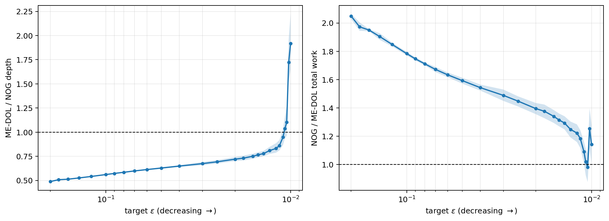
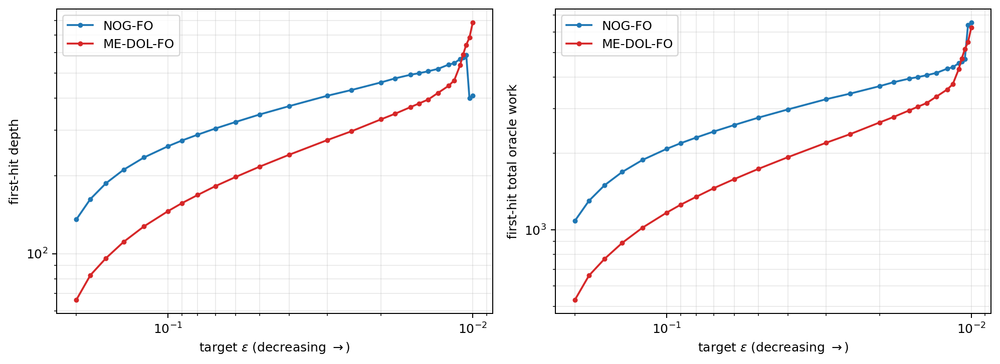
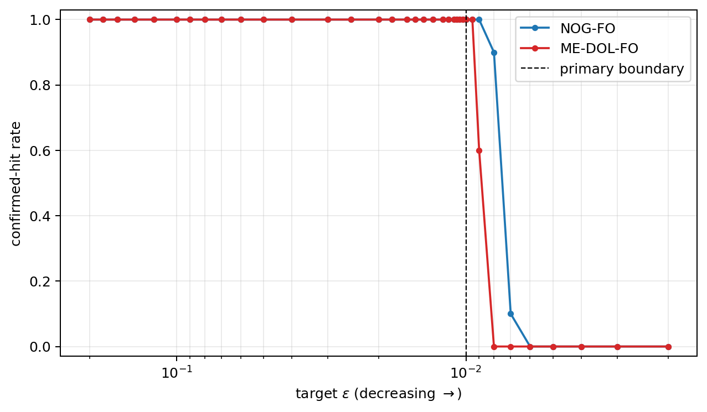
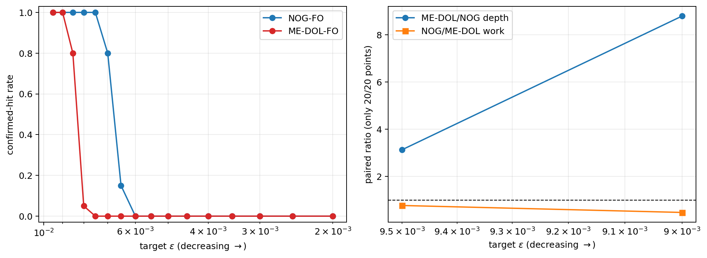

# NOG distributed first-order experiments

本仓库在真实 CPU processes/Gloo 环境中实现并比较 NOG-FO 与 ME-DOL-FO，研究
nonsmooth nonconvex stochastic optimization 中精度要求 $\epsilon$ 对通信深度
（depth）和随机一阶 oracle 工作量（work）的影响。

> 本文件是 FO 实验主结果入口。项目级导航见[根目录 README](../README.md)。

相关 FO 文档：

- [完整实验设定、流程、结果与理论对照](EXPERIMENT_DETAILED_EXPLANATION.md)
- [实验计划与完成记录](PLAN.md)
- [历史 v2、v5--v7 结果归档](https://github.com/diaozb/NOG/tree/archive/legacy-experiments)

本文档以 **theory validation v4** 为唯一主结果。v4 的 confirmatory 区间为
$\epsilon=0.2\text{--}0.01$；同一冻结协议还留下了 $\epsilon<0.01$ 的探索性结果，
原始预算下只有 $\epsilon=0.0095$ 是双方均 20/20 命中的完整延伸点；后续独立扩预算
实验又使 $\epsilon=0.0090$ 达到双方 20/20。更小目标仍存在删失，必须与主结果
分开解释。

## 结论摘要

- 在 27 个 primary $\epsilon$ 和每点 20 个独立 formal seeds 上，两种方法全部
  20/20 confirmed hits。
- paired-seed `ME-DOL/NOG depth` 从 0.488x 增长到 1.919x，随 $\epsilon$ 变小严格
  上升，Spearman $\rho=1.000$。
- paired-seed `NOG/ME-DOL work` 均值为 1.489x，范围 0.980x--2.049x，CV=0.208。
  因此 work 处于相同常数量级，但不能表述为严格不变。
- 在原始探索性延伸点 $\epsilon=0.0095$，双方为 20/20 hits；`ME-DOL/NOG depth`
  为 3.135x，`NOG/ME-DOL work` 为 0.772x。
- 在只增加最大 rounds 的扩预算延伸中，$\epsilon=0.0090$ 也达到双方 20/20；
  depth ratio 为 8.792x，work ratio 为 0.478x。
- 预注册 work-ratio 上限为 2.000x，而 $\epsilon=0.2$ 的正式值为 2.049x，超出约
  2.5%。所以预注册总 verdict 是 **not fully supported**，不能改写成全部门槛通过。
- 这些结果是在固定 $d$、$\delta$ 和单一问题族上的有限区间定性 scaling evidence，
  不是对 worst-case 渐进指数的精确验证。



## 指标与统计口径

| 名称 | 定义 |
|---|---|
| hit | stationarity proxy 连续两个高精度 checkpoints 不超过目标 $\epsilon$ |
| depth | 第一次 confirmed hit 对应的通信/算法深度 |
| total work | 到 confirmed hit 为止累计的 stochastic first-order oracle evaluations |
| ME/NOG depth | 先在相同 formal seed 内计算 `ME depth / NOG depth`，再跨 seeds 求均值 |
| NOG/ME work | 先在相同 formal seed 内计算 `NOG work / ME work`，再跨 seeds 求均值 |
| capped value | 未命中时用预注册最大预算对应的 depth/work；它是删失描述，不是真实 first hit |

表中的绝对 depth/work 是跨 seed 均值，比例是 paired-seed ratios 的均值，因此比例
不一定严格等于两个绝对均值相除。完整逐 seed 数据见
[formal_per_seed.csv](../results/theory_validation_v4/analysis/formal_per_seed.csv)。

## v4 问题与运行设置

### 问题、评估与分布式环境

| 项目 | v4 设置 |
|---|---|
| problem | `SyntheticMaxSinL1` |
| dimension $d$ | 100 |
| number of data points | 4096 |
| constraint radius $R$ | 1 |
| L1 coefficient $\lambda$ | 0.001 |
| feature scale / common bias / phase | 1.0 / 0.25 / `zero` |
| smoothing radius $\delta$ | 0.1 |
| evaluation bank | `eval_smooth_B=256`, `eval_data_B=512` |
| evaluation cost | 131,072 SFO calls/checkpoint，固定 evaluation bank |
| workers | `m=8` real CPU processes |
| backend / topology | Gloo / complete topology / exact mean |
| partition / RNG | total batch fixed、shuffled partitions / rank schedule |
| evaluation interval | 24 rounds |
| confirmed hit | 连续 2 个 checkpoints 达标 |
| CPU concurrency | 最多 4 tasks × 8 workers = 32 worker processes |

### Seed、预算与冻结参数

Pilot seeds 为 100--104；formal seeds 为 0--19，两组严格不重叠。算法参数和 batch
schedule 在任何 formal 结果生成前冻结，formal seeds 不参与参数选择。

| method | 冻结参数 | 最大训练 rounds | 有效 censoring depth |
|---|---|---:|---:|
| NOG-FO | `M=2`, `eta=1.0`, `smooth_B=1` | 960 | 约 962（含初始化通信） |
| ME-DOL-FO | `epoch_length=6`, `theory_multiplier=100` | 3840 | 3840 |

NOG 的 global data batch 由 pilot-only matched-work 规则选择，并约束为当 $\epsilon$
变小时不下降：

- $\epsilon=0.2$ 到 0.0105：`data_B_total=8`；
- $\epsilon=0.01025$ 到 0.002：`data_B_total=16`。

ME-DOL 每层总 work 为 8；NOG 每层总 work 在两个区间分别为 8 和 16。因此
$\epsilon=0.0105\rightarrow0.01025$ 的 depth/work 跳变包含 NOG batch 切换效应，
不能解释成只由 $\epsilon$ 引起。

冻结与审计记录：

- [运行配置](../results/theory_validation_v4/config.yaml)
- [冻结参数、选择规则与输入哈希](../results/theory_validation_v4/frozen_parameters.json)
- [正式结果审计](../results/theory_validation_v4/audit/formal_result_audit.json)
- [结果包清单](../results/theory_validation_v4/package_manifest.json)

## v4 primary 结果：$\epsilon=0.2\text{--}0.01$

全部 27 个点均为双方 20/20 hits，所以下列绝对值是真实 first-hit 均值，不含预算
上限替代值。

| epsilon | NOG batch | NOG hit | ME hit | NOG depth | ME depth | ME/NOG depth | NOG work | ME work | NOG/ME work |
|---:|---:|---:|---:|---:|---:|---:|---:|---:|---:|
| 0.20000 | 8 | 20/20 | 20/20 | 135.8 | 66.3 | 0.49x | 1,086.4 | 530.4 | 2.05x |
| 0.18000 | 8 | 20/20 | 20/20 | 162.6 | 82.5 | 0.51x | 1,300.8 | 660.0 | 1.97x |
| 0.16000 | 8 | 20/20 | 20/20 | 187.2 | 96.0 | 0.51x | 1,497.6 | 768.0 | 1.95x |
| 0.14000 | 8 | 20/20 | 20/20 | 211.2 | 111.0 | 0.53x | 1,689.6 | 888.0 | 1.90x |
| 0.12000 | 8 | 20/20 | 20/20 | 235.6 | 127.5 | 0.54x | 1,884.8 | 1,020.0 | 1.85x |
| 0.10000 | 8 | 20/20 | 20/20 | 260.5 | 146.1 | 0.56x | 2,084.0 | 1,168.8 | 1.78x |
| 0.09000 | 8 | 20/20 | 20/20 | 274.1 | 156.9 | 0.57x | 2,192.8 | 1,255.2 | 1.75x |
| 0.08000 | 8 | 20/20 | 20/20 | 288.6 | 168.6 | 0.58x | 2,308.8 | 1,348.8 | 1.71x |
| 0.07000 | 8 | 20/20 | 20/20 | 304.9 | 182.4 | 0.60x | 2,439.2 | 1,459.2 | 1.67x |
| 0.06000 | 8 | 20/20 | 20/20 | 323.3 | 198.0 | 0.61x | 2,586.4 | 1,584.0 | 1.63x |
| 0.05000 | 8 | 20/20 | 20/20 | 345.7 | 217.2 | 0.63x | 2,765.6 | 1,737.6 | 1.59x |
| 0.04000 | 8 | 20/20 | 20/20 | 372.4 | 241.5 | 0.65x | 2,979.2 | 1,932.0 | 1.54x |
| 0.03000 | 8 | 20/20 | 20/20 | 408.4 | 275.1 | 0.67x | 3,267.2 | 2,200.8 | 1.49x |
| 0.02500 | 8 | 20/20 | 20/20 | 429.8 | 297.6 | 0.69x | 3,438.4 | 2,380.8 | 1.45x |
| 0.02000 | 8 | 20/20 | 20/20 | 459.9 | 330.9 | 0.72x | 3,679.2 | 2,647.2 | 1.39x |
| 0.01800 | 8 | 20/20 | 20/20 | 476.6 | 347.7 | 0.73x | 3,812.8 | 2,781.6 | 1.38x |
| 0.01600 | 8 | 20/20 | 20/20 | 492.4 | 369.0 | 0.75x | 3,939.2 | 2,952.0 | 1.34x |
| 0.01500 | 8 | 20/20 | 20/20 | 499.2 | 381.3 | 0.77x | 3,993.6 | 3,050.4 | 1.31x |
| 0.01400 | 8 | 20/20 | 20/20 | 508.0 | 394.8 | 0.78x | 4,064.0 | 3,158.4 | 1.29x |
| 0.01300 | 8 | 20/20 | 20/20 | 518.9 | 418.8 | 0.81x | 4,151.2 | 3,350.4 | 1.25x |
| 0.01200 | 8 | 20/20 | 20/20 | 538.9 | 446.1 | 0.83x | 4,311.2 | 3,568.8 | 1.22x |
| 0.01150 | 8 | 20/20 | 20/20 | 546.0 | 468.3 | 0.86x | 4,368.0 | 3,746.4 | 1.18x |
| 0.01100 | 8 | 20/20 | 20/20 | 566.2 | 535.8 | 0.95x | 4,529.6 | 4,286.4 | 1.09x |
| 0.01075 | 8 | 20/20 | 20/20 | 574.1 | 590.4 | 1.04x | 4,592.8 | 4,723.2 | 1.02x |
| 0.01050 | 8 | 20/20 | 20/20 | 587.2 | 642.9 | 1.10x | 4,697.6 | 5,143.2 | 0.98x |
| 0.01025 | 16 | 20/20 | 20/20 | 400.4 | 685.2 | 1.72x | 6,406.4 | 5,481.6 | 1.25x |
| 0.01000 | 16 | 20/20 | 20/20 | 408.9 | 783.0 | 1.92x | 6,542.4 | 6,264.0 | 1.14x |

机器可读结果：

- [formal_summary.csv](../results/theory_validation_v4/analysis/formal_summary.csv)：绝对
  depth/work、标准差、hit rate 与 capped values；
- [formal_ratios.csv](../results/theory_validation_v4/analysis/formal_ratios.csv)：primary
  paired ratios、标准差和 bootstrap CI；
- [formal_per_seed.csv](../results/theory_validation_v4/analysis/formal_per_seed.csv)：逐 seed
  第一次 reach 与删失上限；
- [formal_trends.json](../results/theory_validation_v4/analysis/formal_trends.json)：趋势、斜率和
  预注册 verdict；
- [完整 v4 中文报告](../results/theory_validation_v4/analysis/theory_validation_report.md)。



## v4 在 0.01 以下的结果

### 完整延伸点：$\epsilon=0.0095$

这个点沿用同一 v4 问题、冻结算法参数、formal seeds、评估口径和预算；双方均 20/20
命中，因此可以报告真实 first-hit 值。不过它在冻结文件中被预先标记为
`exploratory_censored` scope，不参与 primary 参数选择或主趋势 verdict，论文中应单列为
探索性延伸，不能无说明地并入 27 点 confirmatory 曲线。

| epsilon | NOG batch | NOG hit | ME hit | NOG depth | ME depth | ME/NOG depth | NOG work | ME work | NOG/ME work |
|---:|---:|---:|---:|---:|---:|---:|---:|---:|---:|
| 0.00950 | 16 | 20/20 | 20/20 | 418.7 ± 38.8 | 1,316.4 ± 658.8 | 3.135x | 6,699.2 ± 620.4 | 10,531.2 ± 5,270.7 | 0.772x |

这里的两个比例同样是 20 个 paired-seed ratios 的均值，而不是两个表中均值直接相除。

### 更小目标：预算删失结果

从 $\epsilon=0.0090$ 起至少一方未能在固定 v4 预算内全部命中。表中把 non-hit 计到
预注册预算上限，给出 capped mean；它们只能用于展示命中率和预算下界，不能当作双方
真实 first-hit ratio。

| epsilon | NOG hit | ME hit | NOG capped depth | ME capped depth | NOG capped work | ME capped work | 解释 |
|---:|---:|---:|---:|---:|---:|---:|---|
| 0.0090 | 20/20 | 12/20 | 451.4 | 2,497.8 | 7,222.4 | 19,982.4 | ME-DOL censored |
| 0.0080 | 18/20 | 0/20 | 659.7 | 3,840.0 | 10,555.2 | 30,720.0 | both censored |
| 0.0070 | 2/20 | 0/20 | 950.1 | 3,840.0 | 15,201.6 | 30,720.0 | both censored |
| 0.0060 | 0/20 | 0/20 | 962.0 | 3,840.0 | 15,392.0 | 30,720.0 | no finite ratio |
| 0.0050 | 0/20 | 0/20 | 962.0 | 3,840.0 | 15,392.0 | 30,720.0 | no finite ratio |
| 0.0040 | 0/20 | 0/20 | 962.0 | 3,840.0 | 15,392.0 | 30,720.0 | no finite ratio |
| 0.0030 | 0/20 | 0/20 | 962.0 | 3,840.0 | 15,392.0 | 30,720.0 | no finite ratio |
| 0.0020 | 0/20 | 0/20 | 962.0 | 3,840.0 | 15,392.0 | 30,720.0 | no finite ratio |



## v4 扩预算延伸实验

为判断原 v4 在 $\epsilon<0.01$ 的 non-hit 是否主要来自预算上限，扩预算实验保持
v4 的问题、算法参数、batch、evaluation bank、8 workers 和 formal seeds 0--19 不变，
只分两阶段增加最大 rounds。它是独立的 exploratory continuation，不会追溯性改变原
v4 primary verdict。

| 阶段 | NOG maximum rounds | ME-DOL maximum rounds | 任务与审计 |
|---|---:|---:|---|
| 原 v4 | 960 | 3,840 | 低 $\epsilon$ 出现删失 |
| Stage 1 | 3,840 | 15,360 | 40/40 完成，审计通过 |
| Stage 2 | 15,360 | 61,440 | 40/40 完成，审计通过 |

Stage 2 单任务超过 10 分钟，因此进程管理 `launch_timeout_seconds` 从 600 调整为 3,600；该字段不参与数值 process fingerprint，也不改变算法轨迹。

两个扩预算阶段都通过了原 v4 数值轨迹前缀验证：去除运行时间和当前代码新增的记录字段
后，40 个任务在旧预算覆盖的所有 checkpoints 上逐行一致。Stage 2 的最终结果如下。

| epsilon | NOG hit | ME hit | ME/NOG depth | NOG/ME work | 统计状态 |
|---:|---:|---:|---:|---:|---|
| 0.0095 | 20/20 | 20/20 | 3.135x | 0.772x | full |
| 0.0090 | 20/20 | 20/20 | 8.792x | 0.478x | full |
| 0.0085 | 20/20 | 16/20 | -- | -- | ME-DOL censored |
| 0.0080 | 20/20 | 1/20 | -- | -- | ME-DOL censored |
| 0.0075 | 20/20 | 0/20 | -- | -- | ME-DOL censored |
| 0.0070 | 16/20 | 0/20 | -- | -- | both censored |
| 0.0065 | 3/20 | 0/20 | -- | -- | both censored |
| 0.0060 | 0/20 | 0/20 | -- | -- | no finite ratio |
| 0.0055 | 0/20 | 0/20 | -- | -- | no finite ratio |
| 0.0050 | 0/20 | 0/20 | -- | -- | no finite ratio |
| 0.0045 | 0/20 | 0/20 | -- | -- | no finite ratio |
| 0.0040 | 0/20 | 0/20 | -- | -- | no finite ratio |
| 0.0035 | 0/20 | 0/20 | -- | -- | no finite ratio |
| 0.0030 | 0/20 | 0/20 | -- | -- | no finite ratio |
| 0.0025 | 0/20 | 0/20 | -- | -- | no finite ratio |
| 0.0020 | 0/20 | 0/20 | -- | -- | no finite ratio |

双方 20/20 命中的两个点可报告真实 first-hit 绝对值和 paired-seed ratios：

| epsilon | NOG depth | ME depth | ME/NOG depth | NOG work | ME work | NOG/ME work |
|---:|---:|---:|---:|---:|---:|---:|
| 0.0095 | 418.7 ± 38.8 | 1,316.4 ± 658.8 | 3.135x ± 1.461 | 6,699.2 ± 620.4 | 10,531.2 ± 5,270.7 | 0.772x ± 0.349 |
| 0.0090 | 451.4 ± 68.7 | 3,823.2 ± 3,316.7 | 8.792x ± 8.102 | 7,222.4 ± 1,099.7 | 30,585.6 ± 26,533.6 | 0.478x ± 0.388 |

扩预算消除了 $\epsilon=0.0090$ 的原始删失：ME-DOL hit 从原 v4 的 12/20 提高到
20/20。但即使达到 Stage 2 上限，$\epsilon=0.0085$ 的 ME-DOL 仍只有 16/20 hit，
$\epsilon=0.0080$ 只有 1/20，说明进一步收紧目标后不能再报告无偏的有限比例。
合适的论文表述是：完整延伸到 $\epsilon=0.0090$ 时，depth ratio 继续增大，而 work
仍处于同一常数量级；更小目标只能作为预算删失和 hit-rate 结果。



机器可读文件与复现说明：

- [Stage 2 完整报告](../results/theory_validation_v4_extended_budget/stage2/analysis/extended_budget_report.md)
- [Stage 2 逐 seed 数据](../results/theory_validation_v4_extended_budget/stage2/analysis/extended_per_seed.csv)
- [Stage 2 绝对值汇总](../results/theory_validation_v4_extended_budget/stage2/analysis/extended_summary.csv)
- [Stage 2 paired/capped 比例](../results/theory_validation_v4_extended_budget/stage2/analysis/extended_ratios.csv)
- [Stage 2 正式结果审计](../results/theory_validation_v4_extended_budget/stage2/formal_result_audit.json)
- [Stage 1 报告](../results/theory_validation_v4_extended_budget/stage1/analysis/extended_budget_report.md)
- [完整紧凑结果包](../results/theory_validation_v4_extended_budget/)
- [复现命令](../results/theory_validation_v4_extended_budget/REPRODUCE.md)


## 理论参照与结论边界

| method | theory depth | theory work | v4 primary observed log-log slope: depth | work |
|---|---:|---:|---:|---:|
| NOG | $O(d^{1/3}\delta^{-1}\epsilon^{-5/3})$ | $O(\delta^{-1}\epsilon^{-3})$ | 0.372 | 0.429 |
| ME-DOL | $O(\delta^{-1}\epsilon^{-3})$ | $O(\delta^{-1}\epsilon^{-3})$ | 0.636 | 0.636 |

观测斜率明显小于 worst-case theory exponent。适合论文的表述是：

> 在当前固定问题和有限 $\epsilon$ 区间中，ME-DOL/NOG depth ratio 随精度要求增强而
> 上升，而两者 work 保持同一常数量级；$\epsilon=0.0095$ 以及扩预算后的
> $\epsilon=0.0090$ 完整点延续了该方向。

不应表述为已经精确验证 $\epsilon^{-5/3}$ 或 $\epsilon^{-3}$，也不应把删失点写成测得
的有限比例。

## 复现 v4

依赖见 `requirements.txt`。仓库已有按该文件配置的 `NOG` Conda 环境时，从仓库根目录
依次运行：

```bash
conda run -n NOG python -m src.distributed.theory_validation_runner pilot-batch-grid
conda run -n NOG python -m src.distributed.theory_validation_freeze
conda run -n NOG python -m src.distributed.theory_validation_runner formal
conda run -n NOG python -m src.distributed.theory_validation_audit
conda run -n NOG python -m src.distributed.theory_validation_analysis
conda run -n NOG python -m src.distributed.theory_validation_report
conda run -n NOG python -m src.distributed.theory_validation_package
```

流程依次执行 pilot-only batch calibration、冻结、formal、审计、统计、报告和紧凑打包。
Runner 支持 fingerprint/SHA256 一致的原子 partial 恢复。Raw trajectories 因体积较大不
提交 Git；冻结文件和 analysis manifest 保存了所有输入哈希。详细说明见
[v4 REPRODUCE.md](../results/theory_validation_v4/REPRODUCE.md)。

主要实现：

- [theory_validation_runner.py](../src/distributed/theory_validation_runner.py)：32-process
  调度、pilot/formal 和 resume；
- [theory_validation_freeze.py](../src/distributed/theory_validation_freeze.py)：pilot-only
  选择、单调 batch schedule 和冻结哈希；
- [theory_validation_audit.py](../src/distributed/theory_validation_audit.py)：artifact 与
  work-accounting 审计；
- [theory_validation_analysis.py](../src/distributed/theory_validation_analysis.py)：
  censoring-aware 统计、paired ratios、bootstrap 和趋势；
- [theory_validation_report.py](../src/distributed/theory_validation_report.py)：结果表和图；
- [theory_validation_package.py](../src/distributed/theory_validation_package.py)：紧凑结果包。

## 历史与探索性版本

早期 v2、v5--v7、原始运行轨迹及旧截图已移入
[`archive/legacy-experiments`](https://github.com/diaozb/NOG/tree/archive/legacy-experiments)
分支。它们只用于审计与追溯，不参与本 README 的主结论，也不应与 v4 拼接为同配置曲线。
其中 v2 使用不同的问题实例与统计口径；v5--v7 使用新的参数、seeds、batch schedule
或预算，不能替换 v4 的正式数值。

实验计划与完成记录见 [PLAN.md](PLAN.md)。
